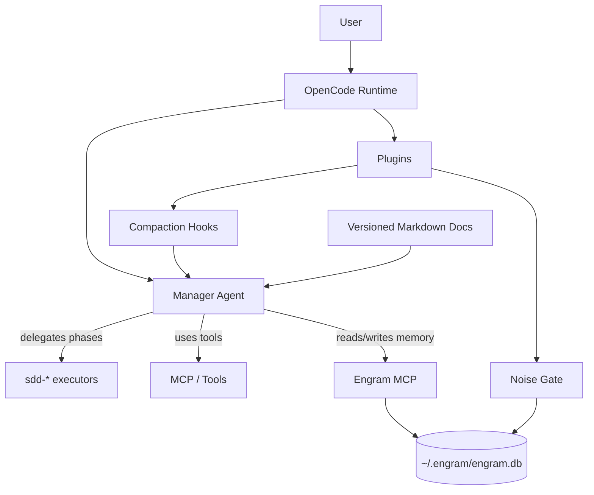
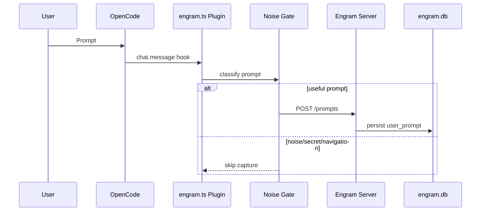
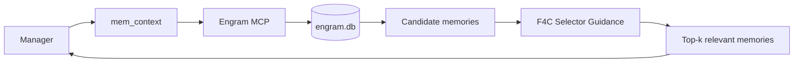
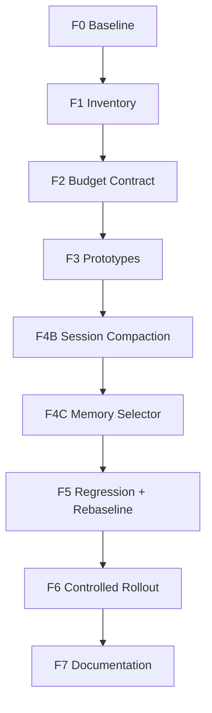
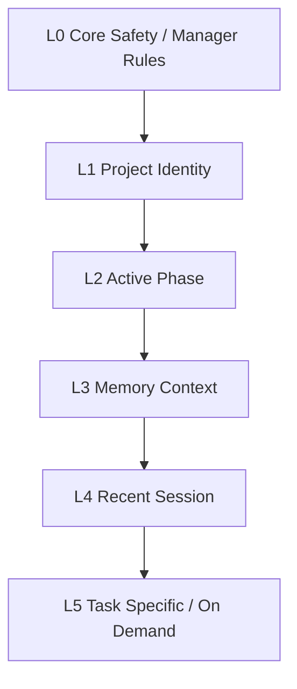
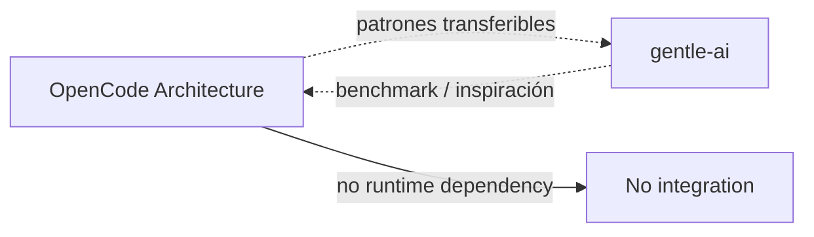

# OpenCode Architecture — Runtime, Memory & Context Control

Este repositorio documenta, valida y evoluciona una arquitectura real de OpenCode con Manager, Engram, plugins, MCP tools, memoria persistente y reducción inteligente de tokens.

> Objetivo central: que el modelo reciba **contexto limpio, mínimo, trazable y validado**, sin perder calidad, seguridad ni continuidad entre sesiones.

⚠️ Este repo es la fuente versionada de análisis, decisiones, riesgos, reportes y roadmap. La configuración runtime real vive en rutas locales como `~/.config/opencode/`, `~/.engram/` y `~/.codex/`.

---

## Estado ejecutivo

| Área | Estado actual |
|---|---:|
| E6B Noise Gate | ✅ COMPLETE — T1 a T7 PASS |
| Suite F mem_context read-only | ✅ COMPLETE — F-T1 a F-T6 PASS |
| F0 Token Audit Baseline | ✅ COMPLETE |
| F1 Context Inventory | ✅ COMPLETE |
| F2 Context Budget Contract | ✅ COMPLETE |
| F3 Readiness / Prototype | ✅ COMPLETE |
| F4B Session Compaction | ✅ Implementado como guidance en `engram.ts` |
| F4C mem_context Selector | ✅ Implementado como guidance en `engram.ts` |
| F4A Skills Selective Loading | ⏸️ Decision only — requiere aprobación para tocar config/skills |
| QW#2 Tool Schema Loading | 🧪 Prototype/proposal only |
| QW#3 Manager Protocol Compaction | ⏸️ Proposal only — no se tocó `opencode.json` |
| F5 Regression/Rebaseline | ✅ Harness ampliado + rebaseline documentado |
| F6 Rollout/Executive Package | ✅ Plan listo |

---

## Qué problema resuelve

El ecosistema OpenCode analizado tenía contexto inflado, memoria distribuida, duplicación entre prompts/plugins/skills, riesgo de capturar ruido o secretos, y una ventana de contexto usada como si fuera una base de datos.

La solución no es “recortar a ciegas”. La solución es arquitectura:

1. Manager decide y orquesta.
2. Engram guarda memoria persistente útil.
3. Noise Gate filtra prompts antes de persistir.
4. mem_context recupera memoria en modo read-only validado.
5. Fase F reduce tokens seleccionando mejor contexto.
6. Cada cambio pasa por regression gates.

---

## Arquitectura general



## Componentes principales

| Componente | Qué hace | Estado |
|---|---|---:|
| Manager | Orquestador primario: intake, diseño, SDD, QA, síntesis final | ✅ |
| Engram | Memoria persistente cross-session | ✅ |
| Noise Gate | Filtra ruido, secretos y navegación trivial | ✅ |
| mem_context | Recupera contexto de memoria read-only | ✅ |
| `engram.ts` | Plugin OpenCode que inyecta instrucciones y hooks de memoria | ✅ |
| Fase F | Reducción inteligente de tokens | 🔶 Activa |
| gentle-ai | Patrón/benchmark estratégico, no dependencia runtime | 🧭 |

---

## Cómo funciona el flujo de captura



## Cómo funciona mem_context



Suite F validó que `mem_context` es read-only, idempotente y no modifica DB.

---

## Fase F — reducción inteligente de tokens

Fase F busca reducir sesiones típicas de ~35k-45k tokens hacia un modo normal más cercano a ~9.5k-14k, sin degradar calidad.



### Qué se implementó

- **F4B:** `RECENT_SESSION_PACK` como instrucciones al hook `experimental.session.compacting`.
- **F4C:** selector de memorias como instrucciones al Manager vía `experimental.chat.system.transform`.

### Qué NO se implementó

- No F4A funcional: no se tocó `opencode.json` ni skills reales.
- No QW#2 en runtime activo: solo propuesta/prototipo.
- No QW#3: no se compactó Manager Protocol.
- No DB migration.
- No schema change.
- No dependencia OpenCode ↔ gentle-ai.

---

## Context layers



La idea: no todo contexto merece estar siempre cargado. Lo crítico queda fijo; lo recuperable se trae bajo demanda.

---

## Context packs

Los context packs son grupos lógicos de contexto: identidad del proyecto, fase activa, validaciones, riesgos, decisiones, memoria relevante, sesión reciente y especificación de tarea.

No son archivos físicos obligatorios; son contratos de ensamblaje para decidir qué entra al prompt.

---

## Sesión canonical vs legacy

| Tipo | Significado | Uso |
|---|---|---|
| Canonical | Sesión con `project=opencode-architecture` alineado con Engram | ✅ Usar para validaciones |
| Legacy | Sesión vieja con posible `session_project_mismatch` | ⚠️ Solo referencia histórica |

La sesión canonical evita drift y falsos errores de proyecto.

---

## Memoria: qué se guarda y qué no

Engram guarda decisiones, bugs con root cause, descubrimientos, patrones, preferencias y resúmenes de sesión.

No debe guardar ruido trivial, secretos, navegación irrelevante ni conversaciones completas.

Store real:

```text
~/.engram/engram.db
```

Store legacy que NO se usa:

```text
~/.codex/memories_1.sqlite
```

---

## Validaciones clave

| Gate | Resultado |
|---|---:|
| E6B Noise Gate | ✅ T1-T7 PASS |
| Suite F mem_context RO | ✅ F-T1-F-T6 PASS |
| F regression harness | ✅ ampliado para F4-F6 |
| Secret scan docs/scripts | ✅ sin patrones high-confidence |
| DB invariance harness | ✅ read-only |

---

## Relación con gentle-ai



gentle-ai se considera como patrón estratégico y posible destino de aprendizajes. No hay dependencia runtime ni modificación de gentle-ai en esta fase.

---

## Roadmap

| Fase | Estado | Descripción |
|---|---:|---|
| A-B | ✅ | Auditoría base, seguridad, observabilidad |
| C-D | ✅ | Tests de flujo, Manager/gentle boundary |
| E0-E6B | ✅ | Engram estabilizado + Noise Gate |
| Suite F | ✅ | mem_context read-only validado |
| F0-F3 | ✅ | Baseline, inventory, budget, prototypes |
| F4B/F4C | ✅ | Implementación guidance-only segura |
| F4A/QW#2/QW#3 | ⏸️ | Propuestas/decisiones, no rollout |
| F5 | ✅ | Harness + regression + rebaseline |
| F6 | ✅ | Rollout plan + executive package |
| F7 | ✅ | README/documentación central alineada |
| G | 🔮 | Hybrid retrieval |
| H | 🔮 | MCP consolidation |

---

## Cómo continuar

1. Reiniciar OpenCode para cargar `engram.ts` actualizado.
2. Ejecutar `scripts/F-regression-harness.ps1`.
3. Validar una compactación real y confirmar que produce `RECENT_SESSION_PACK`.
4. No aprobar F4A/QW#2/QW#3 hasta revisar sus propuestas.

---

## Documentación principal

| Necesidad | Documento |
|---|---|
| Índice general | `DOCUMENTATION-INDEX.md` |
| Fase F | `docs/opencode-architecture/phases/F-token-reduction/README.md` |
| Decisiones Fase F | `docs/opencode-architecture/phases/F-token-reduction/decision-log.md` |
| Riesgos Fase F | `docs/opencode-architecture/phases/F-token-reduction/risk-register.md` |
| Rollout | `docs/opencode-architecture/phases/F-token-reduction/F6A-controlled-rollout-plan.md` |
| Executive package | `docs/opencode-architecture/phases/F-token-reduction/F6B-executive-decision-package.md` |

---

## Glosario

| Término | Definición |
|---|---|
| Manager | Agente primario que decide, orquesta y sintetiza. |
| Engram | Memoria persistente cross-session. |
| Noise Gate | Filtro que evita guardar ruido/secretos. |
| mem_context | Tool de recuperación contextual de memoria. |
| Context layer | Capa de contexto con presupuesto y propósito. |
| Context pack | Grupo lógico de contexto ensamblable. |
| RECENT_SESSION_PACK | Resumen estructurado para continuidad post-compaction. |
| Session canonical | Sesión alineada al proyecto real. |
| Legacy session | Sesión antigua con posible mismatch. |
| Guidance-only | Cambio por instrucciones, sin alterar DB/schema/core. |
