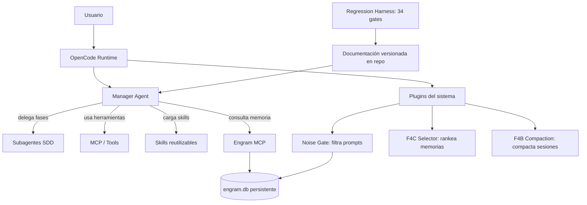
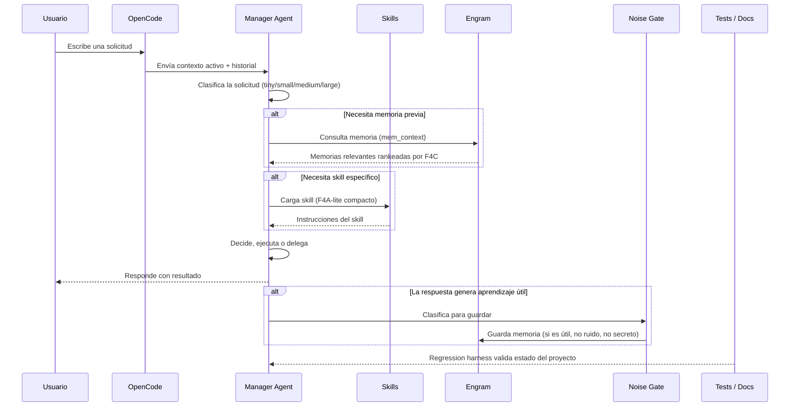
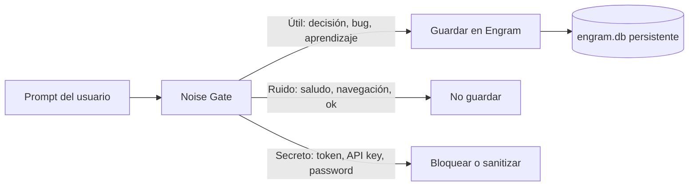
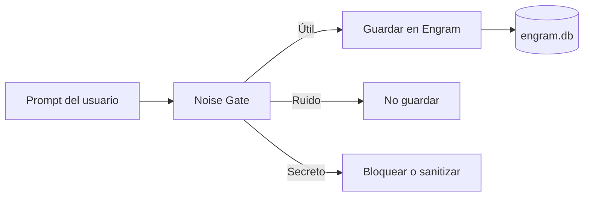
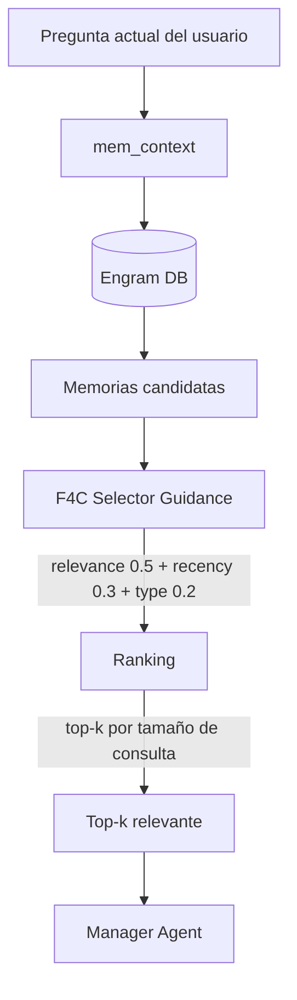
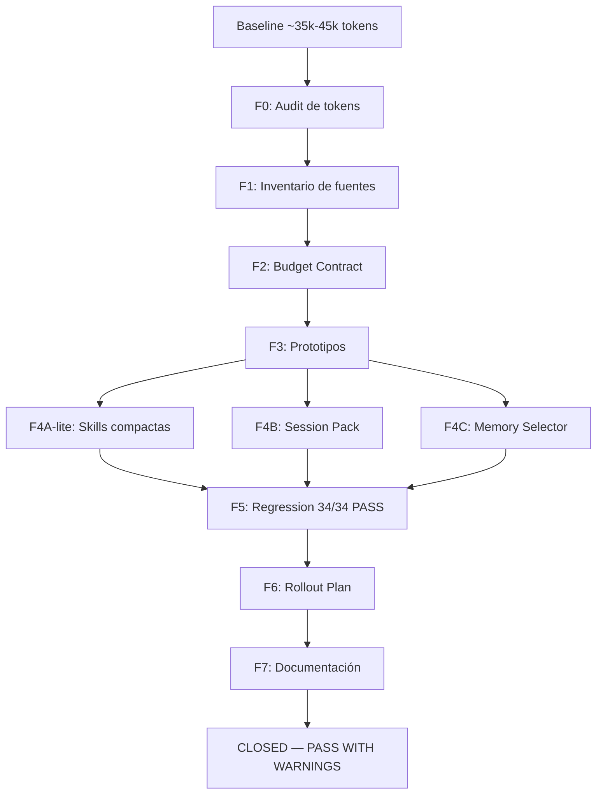
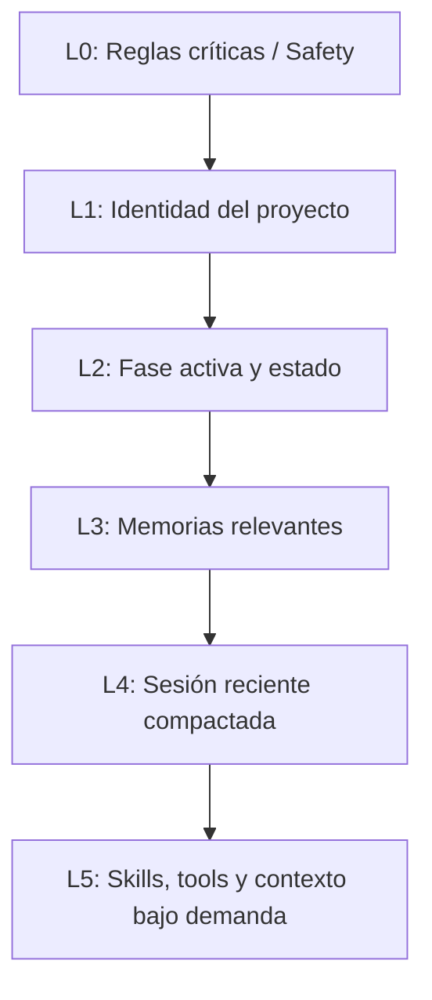
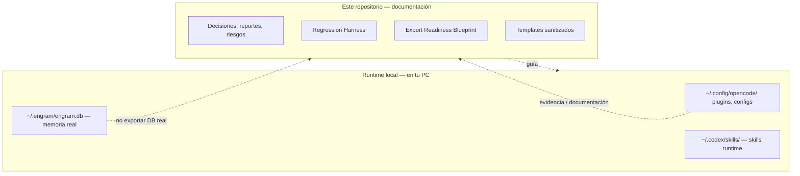
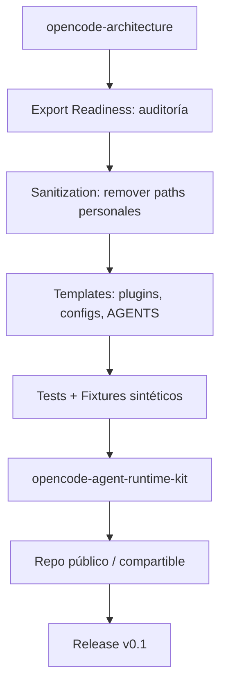
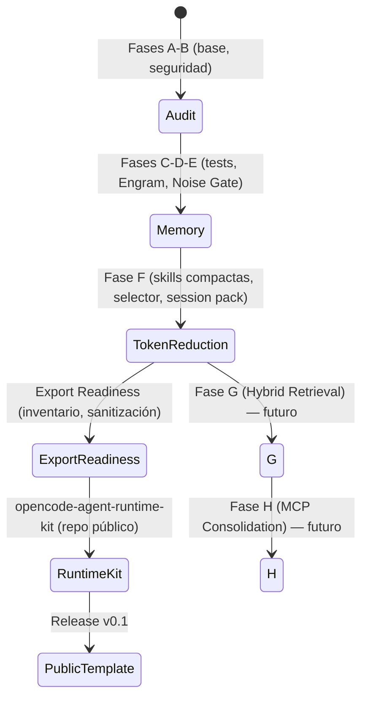

# OpenCode Architecture — Runtime, Memory & Context Control

> **Un asistente de código que recuerda lo importante, ignora el ruido, y usa el contexto justo.**

---

## 1. Resumen en 1 minuto

**¿Qué es esto?**  
Un repositorio que documenta, construye y valida una arquitectura real para que **OpenCode** (un asistente de IA para programación) funcione con memoria persistente, agentes especializados, skills reutilizables, filtros de calidad y control inteligente de contexto.

**¿Qué problema resuelve?**  
Los asistentes de IA tienen una ventana de contexto limitada. Si reciben demasiada información, se confunden. Si reciben poca, olvidan lo importante. Sin memoria, cada sesión empieza de cero. Con mala memoria, guardan ruido o secretos.

**¿Cómo lo resuelve?**  
Con una arquitectura de 4 pilares:

| Pilar | Explicación simple | Explicación técnica |
|---|---|---|
| **Manager Agent** | Un agente "jefe" que decide qué hacer, cuándo y cómo | Orquestador primario: intake, diseño, SDD, QA, síntesis final |
| **Engram** | Una memoria que guarda solo lo útil entre sesiones | Memoria persistente cross-session con estructura, no historial de chat |
| **Noise Gate** | Un filtro que evita guardar basura o secretos | Clasifica prompts antes de persistir: útil / ruido / secreto |
| **Fase F** | Una estrategia para que el contexto no se descontrole | Reducción inteligente de tokens seleccionando mejor, no recortando a ciegas |

**¿Qué valor entrega?**
- **Contexto limpio**: el modelo recibe solo lo que necesita, no todo lo que existe.
- **Memoria útil**: decisiones, bugs y aprendizajes persisten entre sesiones.
- **Sin secretos**: el Noise Gate bloquea tokens, claves y datos sensibles.
- **Validación continua**: cada cambio pasa por 34 gates de regresión.
- **Exportable**: ~90% del contenido puede compartirse como kit reutilizable.

**Estado actual:** Fase F cerrada operativamente. F4A-lite activo en runtime. F4C activo como guidance. F4B preparado para cuando ocurra compactación natural. Export Readiness completo para crear un repositorio público sanitizado.

---

## 2. Para personas no técnicas: ¿qué problema resuelve?

Imaginá un asistente que trabaja con vos en varios días distintos:

**Sin esta arquitectura:**
- Hoy te ayuda con un problema. Mañana no se acuerda de nada.
- Le pasás toda la historia de la conversación y se confunde con los detalles.
- Sin querer, guarda una clave de API o un dato personal en su memoria.
- Trabaja en dos proyectos y mezcla información entre ellos.
- Cada vez que arrancás, perdés tiempo explicando todo de nuevo.

**Con esta arquitectura:**
- El asistente **recuerda decisiones importantes** entre sesiones.
- **Ignora el ruido**: un "gracias" o "probá esto" no se guarda como memoria importante.
- **Bloquea secretos**: si escribís una clave de API, no la guarda.
- **Mantiene proyectos separados**: lo que pasa en un proyecto no contamina otro.
- **Usa el contexto justo**: no carga todo el historial, solo lo relevante para lo que estás haciendo.

**Ejemplo concreto:**

*Sin arquitectura:* pedís "revisá la arquitectura de autenticación". El asistente no sabe cuál, no encuentra las decisiones viejas, y termina sugiriendo algo que ya habías descartado la semana pasada.

*Con arquitectura:* el mismo pedido activa al Manager, que busca en Engram decisiones previas sobre autenticación, encuentra el skill de revisión de arquitectura, y responde con contexto de lo que ya se decidió. Sin cargar 50 páginas de historial.

---

## 3. Para personas técnicas: ¿qué hay en esta arquitectura?

| Componente | Explicación simple | Explicación técnica | Estado |
|---|---|---|---|
| **OpenCode Runtime** | El entorno donde corre el asistente | Runtime de OpenCode con sistema de plugins, skills, agents y MCP | ✅ Estable |
| **Manager Agent** | El agente que decide y orquesta | Agente primario configurado via AGENTS.md + system prompt. Intake, diseño, SDD, QA, síntesis final | ✅ Activo |
| **Subagentes SDD** | Agentes especializados para cada fase | sdd-explore, sdd-propose, sdd-spec, sdd-design, sdd-tasks, sdd-apply, sdd-verify, sdd-archive, sdd-onboard | ✅ 9 skills |
| **Engram MCP** | Servicio de memoria persistente | MCP server que expone `mem_save`, `mem_search`, `mem_context`, etc. | ✅ Activo |
| **engram.ts plugin** | Plugin que inyecta reglas de memoria | Plugin OpenCode via `experimental.chat.system.transform` y `experimental.session.compacting` | ✅ Instalado |
| **Noise Gate** | Filtro de prompts antes de persistir | Clasifica cada prompt como útil/ruido/secreto; E6B T1-T7 PASS | ✅ Validado |
| **mem_context** | Recuperación de memoria útil | Tool read-only que busca memorias relevantes sin modificar DB | ✅ Suite F PASS |
| **F4A-lite** | Descripciones de skills compactas | 36 SKILL.md con `description:` compactada. Ahorro real: 3,532 chars | ✅ **RUNTIME PASS** |
| **F4A-full** | Carga selectiva dinámica de skills | Modificaría `opencode.json` o rutas de skills. No implementado | ⏸️ Decision-only |
| **F4B Compaction Contract** | Contrato para compactación de sesión | RECENT_SESSION_PACK con version/active markers en hook de compactación | ⚠️ PARTIAL |
| **F4C Memory Selector** | Guidance para seleccionar memorias | Ranking relevance 0.5 + recency 0.3 + type 0.2, top-k, dedup, secret exclusion | ✅ **RUNTIME PASS** |
| **Context Packs** | Diseño de paquetes de contexto lógico | L0-L5 layers con budget y propósito definido | ✅ Diseñado |
| **Regression Harness** | Suite de validación read-only | 34 gates: artifacts, runtime hooks, security, docs, DB invariance | ✅ 34/34 PASS |
| **Export Readiness** | Preparación para repo público | Inventario, sanitización, blueprint, test strategy, migration plan | ✅ **COMPLETE** |

---

## 4. Estado actual del proyecto

| Área | Estado | ¿Qué significa? |
|---|---|---|
| E6B Noise Gate | ✅ COMPLETE | T1-T7 PASS — el filtro de prompts funciona correctamente |
| Suite F mem_context | ✅ COMPLETE | F-T1-F-T6 PASS — mem_context es read-only e idempotente |
| F0 Token Audit | ✅ COMPLETE | Baseline medido: ~35k-45k tokens por sesión |
| F1 Context Inventory | ✅ COMPLETE | Fuentes de contexto catalogadas |
| F2 Budget Contract | ✅ COMPLETE | Modos, capas L0-L5 y budgets definidos |
| F3 Readiness | ✅ COMPLETE | Prototipos de Skills, Session, Selector medidos |
| **F4A-lite** | ✅ **RUNTIME PASS** | 36 descripciones compactas activas en runtime. Ahorro real: 3,532 chars |
| **F4A-full** | ⏸️ **Decision-only** | No implementado. Requeriría cambiar `opencode.json`. No necesario por ahora |
| **F4B** | ⚠️ **PARTIAL** | Contrato instalado y endurecido. Pendiente compactación natural real |
| **F4C** | ✅ **RUNTIME PASS** | Guidance activo para selección de memoria. 9/9 checks PASS |
| QW#2 | 🧪 Prototype-only | Tool schema loading. Sin runtime activo |
| QW#3 | ⏸️ Proposal-only | Manager Protocol compaction. ROI más bajo |
| F5 Regression | ✅ COMPLETE | Harness 34/34 PASS + F4A-lite rebaseline |
| F6 Rollout | ✅ COMPLETE | Plan + executive package listos |
| F7 Documentation | ✅ COMPLETE | README, índices, documentación alineada |
| **Export Readiness** | ✅ **COMPLETE** | Inventario, sanitización, blueprint, tests, migration plan |
| **Fase F** | **CLOSED — PASS WITH WARNINGS** | Cerrada operativamente. F4B sigue PARTIAL hasta compactación natural |

> **¿Qué significa "PASS WITH WARNINGS"?**  
> No es una falla. Significa que Fase F está cerrada operativamente, pero hay un ítem (F4B) que no puede promoverse a PASS completo hasta que ocurra un evento natural: que OpenCode haga una compactación de sesión real y produzca un `RECENT_SESSION_PACK`. Forzar ese evento no es seguro ni necesario. F4B está instalado, endurecido y observable — solo falta el evento real.

---

## 5. Arquitectura general



**El flujo en lenguaje simple:**

1. El **usuario** escribe una solicitud en OpenCode.
2. OpenCode se la pasa al **Manager Agent** (el agente "jefe").
3. El Manager decide qué hacer: puede usar **skills** (instrucciones especializadas), delegar a **subagentes SDD**, ejecutar **tools** (MCP), o consultar **memoria** en Engram.
4. Engram guarda y recupera memoria útil. El **Noise Gate** filtra ruido y secretos antes de guardar.
5. Los **plugins** inyectan reglas adicionales: cómo seleccionar memoria (F4C), cómo manejar compactación (F4B).
6. Todo cambio se valida con el **regression harness** (34 tests) antes de considerarse completo.

---

## 6. Flujo principal: ¿qué pasa cuando el usuario escribe algo?



**Ejemplo concreto:**  
Si el usuario escribe "revisá si ya implementamos el patrón observer en el módulo de notificaciones", el Manager:
1. Busca en Engram decisiones previas sobre "observer" o "notificaciones".
2. Encuentra un skill de revisión de arquitectura con instrucciones específicas.
3. Recupera el diseño de contexto relevante (no todo el historial).
4. Responde con lo que ya se decidió y recomienda próximos pasos.
5. La decisión de revisión se guarda como memoria para futuras consultas.

---

## 7. Cómo funciona la memoria

Engram **no** es un historial de chat. Es una **memoria estructurada** que guarda:

- Decisiones de arquitectura
- Bugs con causa raíz
- Descubrimientos técnicos no obvios
- Patrones establecidos
- Preferencias del usuario
- Resúmenes de sesión

**No debe guardar** ruido trivial, secretos, navegación irrelevante ni conversaciones completas.



| Se guarda | No se guarda | Motivo |
|---|---|---|
| Decisiones de arquitectura | "gracias", "ok", "probá esto" | Solo lo que agrega valor futuro |
| Bugs con root cause | Navegación trivial entre archivos | El ruido contamina la memoria |
| Descubrimientos no obvios | Conversaciones completas | Los resúmenes son más útiles |
| Preferencias del usuario | Secretos, tokens, passwords | Seguridad ante todo |
| Resúmenes de sesión | Prompts repetitivos | Evitar duplicación |

**Store real:** `~/.engram/engram.db`  
**Store legacy (NO usado):** `~/.codex/memories_1.sqlite`

> **Para principiantes:** La memoria no guarda todo lo que decís. Solo guarda lo importante: decisiones, bugs, y cosas que aprendiste. Si decís "gracias" o "probá esto", eso no se guarda. Si ponés una clave de API, se bloquea automáticamente.

---

## 8. Qué es Noise Gate

**Para no técnicos:** Es un filtro que revisa cada mensaje antes de guardarlo en la memoria. Si el mensaje es útil (una decisión, un bug), lo guarda. Si es ruido (un saludo, una navegación), lo descarta. Si es un secreto (una clave, un token), lo bloquea.

**Para técnicos:** Noise Gate es un clasificador de prompts integrado en el plugin `engram.ts` via hook `chat.message`. Clasifica cada prompt en tres categorías:



| Categoría | Acción | Ejemplos |
|---|---|---|
| **Útil** (`shouldCapture=true`) | Guardar en Engram | Decisiones, bugs, descubrimientos, preferencias |
| **Ruido** (`shouldCapture=false`) | No guardar | Saludos, navegación, comandos triviales |
| **Secreto** (`shouldCapture=false`) | Bloquear y sanitizar | Tokens `ghp_*`, `sk-*`, passwords, emails |

**Validación:** E6B Noise Gate completó T1-T7 PASS, demostrando que:
- Captura prompts útiles correctamente.
- Filtra navegación trivial.
- Bloquea secretos (tokens, API keys).
- No introduce falsos positivos.
- Funciona desde sesión canonical.

---

## 9. Qué es mem_context

**Para no técnicos:** Es una herramienta que permite al asistente buscar en su memoria cosas relevantes para lo que estás haciendo ahora. No modifica la memoria, solo la consulta. Es como preguntarle "¿qué sabemos sobre este tema?".

**Para técnicos:** `mem_context` es un tool MCP que recupera observaciones de Engram en modo read-only. Fue validado por Suite F (F-T1 a F-T6 PASS) demostrando que:
- Es read-only (no modifica DB).
- Es idempotente (misma consulta, mismo resultado).
- Filtra por proyecto canonical.
- No inventa contexto.
- No activa componentes innecesarios.



El **F4C Selector** (ver sección 11) rankea las memorias candidatas usando:
- **Relevancia** (50%): qué tanto coincide con la consulta.
- **Recencia** (30%): qué tan reciente es la memoria (decae 5% por día).
- **Tipo** (20%): prioridad: decision > constraint > architecture > bugfix > discovery > config > other.

Luego selecciona top-k según el tamaño de la tarea: 5 (simple), 10 (normal), 20 (arquitectura), 30 (auditoría).

---

## 10. Fase F: reducción inteligente de tokens

**El problema:** Una sesión típica de OpenCode consumía ~35,000 a 45,000 tokens de contexto. Skills enteros, descripciones largas, historial sin filtrar, todo se cargaba siempre.

**La solución:** No es "recortar a ciegas". Es **seleccionar mejor** qué contexto merece estar siempre cargado y qué puede recuperarse bajo demanda.



**Resultados:**

| Iniciativa | Ahorro | Estado |
|---|---|---|
| **F4A-lite** — Descripciones compactas | **3,532 chars (~883-1,177 tokens)** | ✅ **RUNTIME PASS** |
| **F4B** — Session compaction | ~7,070 tokens/sesión potencial | ⚠️ PARTIAL (instalado, sin evento real) |
| **F4C** — Memory selector guidance | ~500-2,000 tokens/turno potencial | ✅ **RUNTIME PASS** |
| **QW#2** — Tool schema loading | ~2,000-4,000 tokens | 🧪 Prototype-only, sin runtime |
| **QW#3** — Manager protocol compaction | ~1,200-2,300 tokens | ⏸️ Proposal-only, sin runtime |

---

## 11. Estado detallado F4A / F4B / F4C

Este es el corazón de la Fase F. Es importante entender que **F4A tiene dos versiones** que NO deben confundirse:

| Workstream | Estado | ¿Qué significa? | Riesgo pendiente |
|---|---|---|---|
| **F4A-lite** | ✅ **RUNTIME PASS** | Se compactaron solo las `description:` de 36 skills. No se tocaron cuerpos, rutas ni `opencode.json`. Ahorro real: 3,532 chars activo en runtime. | 🟢 Bajo — solo cambia descripción visible |
| **F4A-full** | ⏸️ **Decision-only** | Carga selectiva dinámica de bloques de skills. Requeriría modificar `opencode.json`. **No implementado.** Ahorro adicional potencial: ~400-1,184 tokens. | 🟡 Medio — puede causar falsos negativos en skill matching |
| **F4B** | ⚠️ **PARTIAL** | Contrato RECENT_SESSION_PACK instalado en `engram.ts` con version/active markers. Endurecido y observable. Falta que OpenCode haga una compactación natural real para validar. | 🟡 Medio — evento natural pendiente |
| **F4C** | ✅ **RUNTIME PASS** | Guidance de selección de memoria (relevance 0.5 + recency 0.3 + type 0.2, decay 0.05, top-k, dedup, secret exclusion, explainability) activo en contexto del Manager. 9/9 checks PASS. | 🟢 Bajo — es guidance, no enforcement hard |

**¿Por qué F4A-lite vs F4A-full?**  
F4A-lite fue la versión segura y aprobada: solo editar la línea `description:` en el frontmatter de cada SKILL.md, sin tocar las instrucciones internas ni la configuración. F4A-full requeriría cambiar cómo OpenCode carga los skills (modificando `opencode.json` o rutas), lo cual tiene más riesgo y no está aprobado. **No confundir: F4A-lite está implementado y activo. F4A-full no.**

**Detalle del ahorro F4A-lite:**

| Métrica | Antes | Después | Ahorro |
|---|---|---|---|
| Caracteres totales en descriptions | 6,360 | 2,828 | **3,532 chars** |
| `hatch-pet` description | ~572 chars | 71 chars | ~501 chars |
| Skills modificadas | — | 36 | — |

**¿Qué significan los estados?**
- **RUNTIME PASS**: Implementado, validado post-restart de OpenCode, activo en runtime real. No es solo documentación.
- **PARTIAL**: Instalado y configurado, pero no puede validarse completamente hasta que ocurra un evento natural (compactación de OpenCode).
- **Decision-only / Prototype-only / Proposal-only**: Documentado como posible mejora futura, pero sin implementación runtime. Requieren aprobación explícita para avanzar.

---

## 12. Context layers

El contexto se organiza en capas. No todo merece estar siempre cargado.



| Capa | Contenido | Presupuesto | ¿Siempre cargado? |
|---|---|---|---|
| **L0** | Reglas de seguridad, Manager Protocol, anti-patrones | ~3-4k tokens | ✅ Sí |
| **L1** | Proyecto actual, fase activa, estado | ~0.5-1k tokens | ✅ Sí |
| **L2** | Documentación de la fase activa | ~1-2k tokens | ✅ Sí |
| **L3** | Memorias recuperadas por mem_context | ~1-3k tokens | ❌ Bajo demanda |
| **L4** | Resumen de sesión reciente (RECENT_SESSION_PACK) | ~1-2k tokens | ❌ Solo post-compactación |
| **L5** | Skills, tool schemas, contexto de tarea específica | ~2-5k tokens | ❌ Bajo demanda |

> **Para principiantes:** Imaginá capas como un cajón con compartimentos. Lo que más se usa (reglas, identidad del proyecto) está siempre visible. Lo que se necesita de vez en cuando (una decisión vieja, una skill específica) se busca solo cuando hace falta.

---

## 13. Runtime local vs repositorio

Este repositorio **no contiene toda la configuración runtime**. Es importante entender qué vive dónde:



| Vive en este repositorio | Vive en runtime local | No debe publicarse nunca |
|---|---|---|
| Documentación de decisiones | `~/.config/opencode/plugins/engram.ts` | `~/.engram/engram.db` |
| Reportes de validación | Skills en `~/.codex/skills/` | `~/.codex/memories_1.sqlite` |
| Risk register | Skills en `~/.config/opencode/skills/` | `~/.config/opencode/opencode.json` (personal) |
| Decision log | Skills en `Tools/.agents/skills/` | Backups locales con paths absolutos |
| Regression harness | Skills en `~/.agents/skills/` | Logs de sesiones con prompts |
| Blueprint para repo nuevo | `opencode.json` (config runtime) | Tokens, claves, emails personales |

> **Para principiantes:** Este repo es como el manual de instrucciones y el registro de lo que se hizo. El asistente en sí vive en tu computadora con su configuración y memoria. El manual explica cómo funciona, pero no contiene tu información personal.

---

## 14. Cómo se valida que no se rompió nada

El **regression harness** es una suite de 34 tests read-only que verifican que el sistema sigue funcionando correctamente. Se ejecuta con un solo comando:

```powershell
powershell -ExecutionPolicy Bypass -File scripts\F-regression-harness.ps1
```

**¿Qué revisa?**

| Gate | ¿Qué valida? | Checks |
|---|---|---|
| G1: Artifact Integrity | Que todos los documentos clave existen | 3 |
| G2: Budget & Prototypes | Que los budgets de tokens están documentados | 3 |
| G3: Runtime Hooks | Que F4B y F4C están instalados en el plugin | 9 |
| G4: Decision Boundaries | Que F4A-full no se implementó sin aprobación | 4 |
| G4B: F4A-lite | Que F4A-lite está correctamente implementado | 7 |
| G5: Security & DB | Que no hay secretos y DB no cambia | 3 |
| G6: Documentation | Que la documentación está completa | 4 |
| G7: gentle-ai Boundary | Que no hay dependencia runtime con gentle-ai | 1 |

**Resultado actual: 34/34 PASS — 0 FAIL — Read-only**

> **Para principiantes:** Es como una lista de verificación que el asistente revisa antes de decir "está listo". Cada check confirma que una parte importante del sistema sigue funcionando como debe. Si algo falla, se detecta antes de causar problemas.

---

## 15. Cómo continuar trabajando en este repositorio

1. **Usar sesiones canonical** — siempre trabajar con `project=opencode-architecture` para evitar `session_project_mismatch`.

2. **No tocar runtime sin decisión documentada** — cualquier cambio en `opencode.json`, plugins runtime, skills reales o DB requiere documentación previa y aprobación.

3. **Si ocurre compactación natural de OpenCode** — ejecutar `F4B-natural-compaction-checklist.md` para validar que RECENT_SESSION_PACK funciona correctamente. Si pasa, promover F4B a RUNTIME PASS.

4. **Para decisiones pendientes** — revisar el backlog en `docs/opencode-architecture/phases/F-token-reduction/F-phase-backlog.md` y la matriz ejecutiva en `F-next-decisions-matrix.md`.

5. **No implementar F4A-full, QW#2 ni QW#3 sin aprobación explícita.** Están documentados como propuestas, no como trabajo en curso. F4A-lite (el que sí está implementado) está completo y no requiere cambios.

6. **Para compartir el contenido** — seguir los documentos de export readiness (sección 16).

---

## 16. Camino hacia un repositorio compartible

El contenido de este repositorio tiene **~80% de contenido compartible/exportable** (skills, documentación, scripts, templates). El objetivo es crear un repositorio público llamado **`opencode-agent-runtime-kit`** con una versión sanitizada, testeable e instalable.



| Se puede exportar | No se puede exportar | Requiere sanitización | Requiere tests |
|---|---|---|---|
| 37 skills SKILL.md¹ | `~/.engram/engram.db` (DB real) | Paths `C:\Users\...` | Estructura de directorios |
| Documentación completa | `~/.codex/memories_1.sqlite` | Tokens y secretos en ejemplos | Frontmatter YAML de skills |
| Templates de plugins | `~/.config/opencode/opencode.json` personal | Emails personales | Detección de secretos |
| Regression harness | Backups locales con paths absolutos | Nombres de usuario | Compilación de plugins |
| Decision log sanitizado | Logs de sesiones personales | Rutas OneDrive | Regression harness |

> ¹ El inventario de exportación registra 37 skills exportables. El runtime visible incluye 38 skills totales (36 con descripciones compactas por F4A-lite + 2 no modificadas: `_shared` y `customize-opencode`). La diferencia es que una skill del runtime corresponde a un skill interno del sistema no incluido en el inventario exportable.

**El nuevo repo NO será una copia directa del runtime personal.** Será una versión:
- **Sanitizada** — sin paths personales, sin tokens, sin datos sensibles.
- **Testeable** — con 19 tests de estructura, sanitización y plugins.
- **Instalable** — con script `install.ps1` que copia skills y plugins al runtime.
- **Documentada** — README para técnicos y no técnicos, ejemplos, quickstart.

Documentos clave para la migración:
- `docs/opencode-architecture/export-readiness/SHAREABLE-REPO-BLUEPRINT.md` — estructura completa del repo destino
- `docs/opencode-architecture/export-readiness/SANITIZATION-CHECKLIST.md` — checklist para sanitizar antes de publicar
- `docs/opencode-architecture/export-readiness/NEW-REPO-MIGRATION-PLAN.md` — plan de migración en 10 fases
- `docs/opencode-architecture/export-readiness/SHAREABLE-TEST-STRATEGY.md` — 19 tests para el nuevo repo

---

## 17. Qué NO publicar en el repositorio nuevo

| Elemento | Riesgo | Acción |
|---|---|---|
| `~/.engram/engram.db` | 🔴 Crítico — contiene memorias personales | No incluir; excluir en `.gitignore` |
| `~/.codex/memories_1.sqlite` | 🔴 Crítico — datos legacy personales | No incluir; excluir en `.gitignore` |
| `~/.config/opencode/opencode.json` real | 🔴 Alto — configuración personal | No incluir; crear template anonimizado |
| Backups F4A-lite | 🟡 Medio — paths absolutos | No incluir; regenerables desde manifest |
| Rutas `C:\Users\harry\` | 🟡 Medio — expone identidad | Reemplazar por `$HOME` o `~` |
| Tokens / API keys en ejemplos | 🔴 Crítico — riesgo de seguridad | Reemplazar por `{redacted}` |
| Emails personales | 🟡 Medio — privacidad | Reemplazar por `user@example.com` |
| Logs de sesiones | 🔴 Alto — prompts y decisiones | No incluir nunca |
| Archivos `.env`, `.db`, `.sqlite`, `.bak`, `.log` | 🟡 Medio — datos sensibles misceláneos | Excluir en `.gitignore` |

**Regla de oro:** Si un archivo contiene tu nombre de usuario, paths de tu PC, tokens, claves, emails, o registros de conversaciones, **no debe estar en el repo público**. Usar templates y placeholders.

---

## 18. Roadmap



| Fase | Estado | Descripción |
|---|---|---|
| **A-B** | ✅ COMPLETE | Auditoría base, seguridad, observabilidad |
| **C-D** | ✅ COMPLETE | Tests de flujo, Manager/gentle boundary |
| **E (E0-E6B)** | ✅ COMPLETE | Engram estabilizado + Noise Gate validado |
| **Suite F** | ✅ COMPLETE | mem_context read-only validado (F-T1-F-T6) |
| **F0-F3** | ✅ COMPLETE | Baseline, inventory, budget, prototypes |
| **F4A-lite** | ✅ **RUNTIME PASS** | 36 descripciones compactas activas |
| **F4A-full** | ⏸️ Decision-only | No implementado, requiere aprobación |
| **F4B** | ⚠️ PARTIAL | Instalado + hardened; sin compactación real aún |
| **F4C** | ✅ **RUNTIME PASS** | Guidance activo para selección de memoria |
| **F5** | ✅ COMPLETE | Harness 34/34 PASS + rebaseline |
| **F6** | ✅ COMPLETE | Rollout plan + executive package |
| **F7** | ✅ COMPLETE | README/documentación alineada |
| **Export Readiness** | ✅ **COMPLETE** | Inventario, blueprint, tests, migration plan |
| **Fase F** | **CLOSED — PASS WITH WARNINGS** | Cerrada operativamente. F4B sigue PARTIAL |
| **G** | 🔮 Futuro | Hybrid Retrieval |
| **H** | 🔮 Futuro | MCP Consolidation |

**Nota importante:** La Fase F está "PASS WITH WARNINGS", no "FULL PASS". La diferencia es que F4B sigue PARTIAL. No promover a FULL PASS hasta que ocurra compactación natural real de OpenCode y se valide con el checklist.

---

## 19. Glosario para principiantes

| Término | Explicación simple | Explicación técnica |
|---|---|---|
| **OpenCode** | El asistente de IA que ayuda a programar | Runtime de IA con sistema de plugins, skills, agents y MCP |
| **Runtime** | El entorno donde "corre" el asistente | El proceso de OpenCode ejecutándose con su configuración |
| **Manager** | El agente "jefe" que decide qué hacer | Agente primario que orquesta intake, diseño, SDD, QA, síntesis final |
| **Skill** | Una instrucción especializada para una tarea | Archivo SKILL.md con frontmatter + instrucciones que OpenCode carga |
| **Agent / Subagente** | Un tipo especial de skill que puede actuar autónomamente | Agente con tools, skills y capacidad de delegación |
| **MCP** | Protocolo que permite al asistente conectarse con herramientas externas | Model Context Protocol — interfaz estandarizada para tools |
| **Engram** | La memoria persistente del asistente | Servicio MCP con DB SQLite que guarda observaciones estructuradas |
| **Noise Gate** | Filtro que evita guardar basura o secretos en la memoria | Clasificador de prompts integrado en plugin que decide si guardar |
| **mem_context** | Herramienta para buscar en la memoria | Tool MCP que recupera observaciones de Engram en modo read-only |
| **Token** | La unidad mínima de texto que el modelo procesa (no es una palabra exacta) | ~0.75 palabras en promedio; el límite de contexto se mide en tokens |
| **Contexto** | Todo lo que el modelo "ve" para responder | System prompt + historial + skills + memorias — todo junto |
| **Context Pack** | Un grupo lógico de información que se carga junto | L0-L5 layers con propósito y presupuesto definidos |
| **Regression Harness** | Una batería de tests que verifican que nada se rompió | Script PowerShell que ejecuta 34 gates read-only |
| **Sesión Canonical** | La sesión "oficial" alineada al proyecto correcto | Sesión con `project=opencode-architecture` sin mismatch |
| **Sesión Legacy** | Sesión de proyecto anterior que puede causar conflictos en memoria | Proyecto sin alinear a canonical, puede generar `session_project_mismatch` |
| **Guidance-only** | Un cambio que funciona por instrucciones, no por modificar el sistema | Se le "dice" al modelo qué hacer, no se modifica código interno |
| **Runtime PASS** | Algo que fue validado como activo en el runtime real | No es solo documentación — está funcionando y verificado post-restart |
| **PARTIAL** | Algo que está instalado pero no pudo validarse completamente | F4B: instalado y endurecido, pero falta evento natural para validar |
| **PASS WITH WARNINGS** | Una fase cerrada operativamente con un ítem pendiente no bloqueante | Fase F: cerrada, F4B sigue PARTIAL pero no impide el cierre |
| **Sanitización** | Proceso de remover datos personales antes de publicar | Reemplazar paths, tokens, emails por placeholders genéricos |
| **Template** | Una versión reutilizable y sanitizada de un archivo de configuración | `opencode.example.json` en vez de `opencode.json` real |
| **Compactación** | Proceso de resumir una sesión larga para ahorrar tokens | OpenCode comprime el historial en un RECENT_SESSION_PACK |
| **Enforcement** | Una regla que no puede ser ignorada porque está en el sistema | A diferencia de guidance, que es una instrucción que el modelo puede ignorar |

---

## 20. Quick links por audiencia

### Para entender el proyecto

| Necesidad | Documento |
|---|---|
| Vista general (este documento) | `README.md` |
| Fase F en detalle | `docs/opencode-architecture/phases/F-token-reduction/README.md` |
| Export Readiness: qué es compartible | `docs/opencode-architecture/export-readiness/EXPORT-READINESS-REPORT.md` |
| Todas las fases del proyecto | `DOCUMENTATION-INDEX.md` |
| Índice de Fase F | `docs/opencode-architecture/phases/F-token-reduction/DOCUMENTATION-INDEX.md` |

### Para validar que funciona

| Necesidad | Documento / comando |
|---|---|
| Ejecutar regression harness | `powershell -ExecutionPolicy Bypass -File scripts\F-regression-harness.ps1` |
| Reporte de regresión F5B | `docs/opencode-architecture/phases/F-token-reduction/F5B-regression-run-report.md` |
| Check F4B cuando ocurra compactación | `docs/opencode-architecture/phases/F-token-reduction/F4B-natural-compaction-checklist.md` |
| Token savings rebaseline | `docs/opencode-architecture/phases/F-token-reduction/F5C-token-savings-rebaseline.md` |

### Para decidir próximos pasos

| Necesidad | Documento |
|---|---|
| Decisiones pendientes | `docs/opencode-architecture/phases/F-token-reduction/decision-log.md` |
| Backlog controlado | `docs/opencode-architecture/phases/F-token-reduction/F-phase-backlog.md` |
| Matriz ejecutiva | `docs/opencode-architecture/phases/F-token-reduction/F-next-decisions-matrix.md` |
| Executive package | `docs/opencode-architecture/phases/F-token-reduction/F6B-executive-decision-package.md` |

### Para migrar al repositorio nuevo

| Necesidad | Documento |
|---|---|
| Blueprint del repo `opencode-agent-runtime-kit` | `docs/opencode-architecture/export-readiness/SHAREABLE-REPO-BLUEPRINT.md` |
| Sanitization checklist | `docs/opencode-architecture/export-readiness/SANITIZATION-CHECKLIST.md` |
| Migration plan (10 fases) | `docs/opencode-architecture/export-readiness/NEW-REPO-MIGRATION-PLAN.md` |
| Test strategy (19 tests) | `docs/opencode-architecture/export-readiness/SHAREABLE-TEST-STRATEGY.md` |
| Export decision package | `docs/opencode-architecture/export-readiness/EXPORT-DECISION-PACKAGE.md` |

---

> **OpenCode Architecture** — Documentación, validación y arquitectura para que OpenCode funcione con memoria, agentes, skills y control inteligente de contexto.  
> Repositorio: [github.com/harrysxavio/opencode-architecture](https://github.com/harrysxavio/opencode-architecture)  
> Estado: **Fase F — CLOSED — PASS WITH WARNINGS** · Export Readiness — COMPLETE · F4A-lite — RUNTIME PASS · F4B — PARTIAL · F4C — RUNTIME PASS
