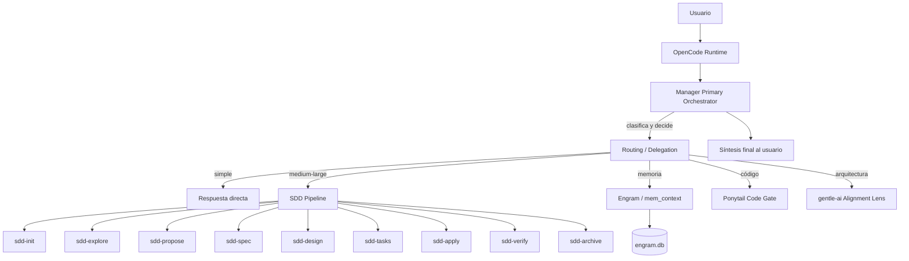
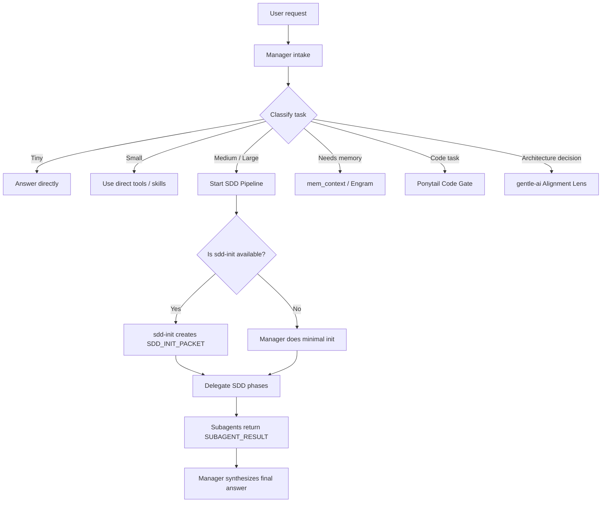
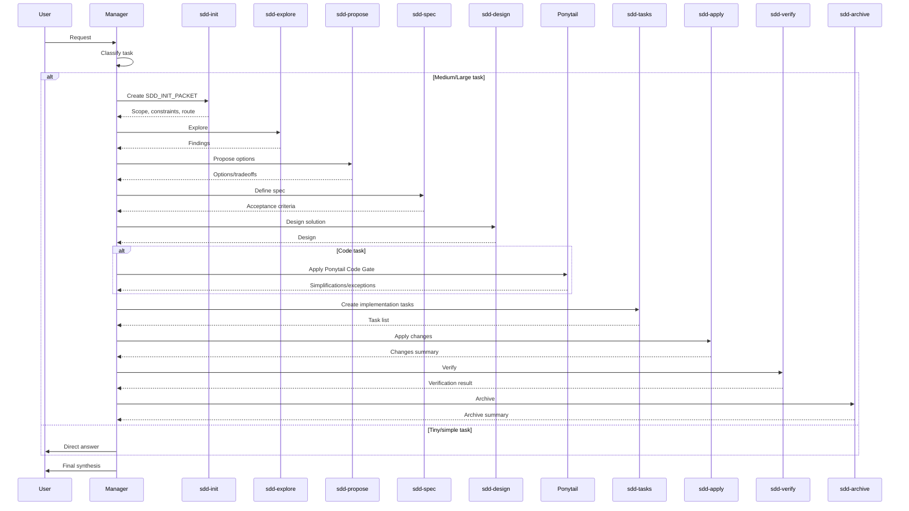
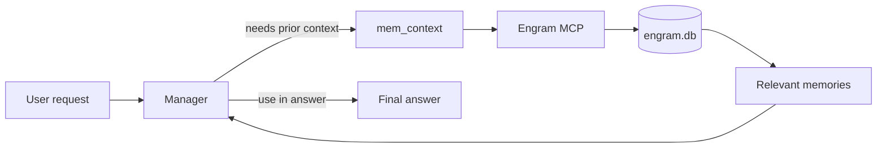
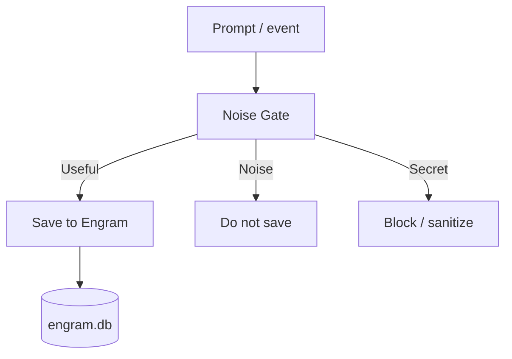
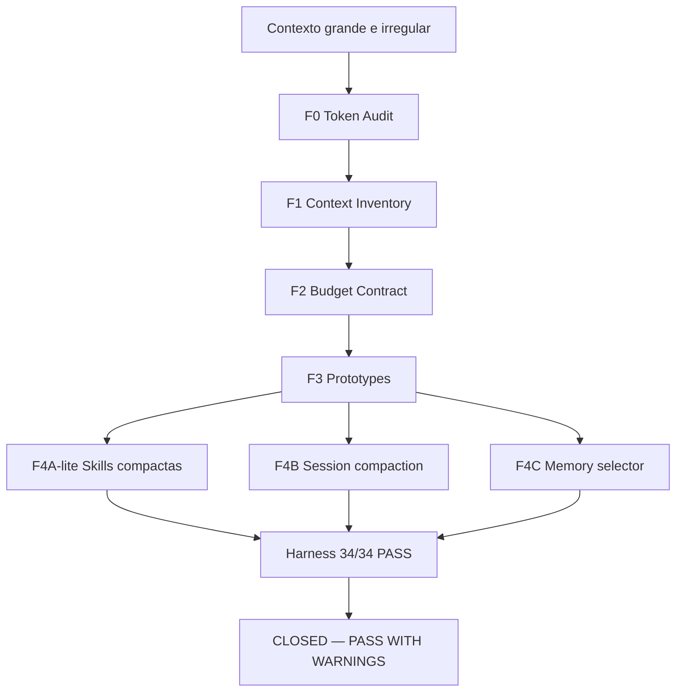
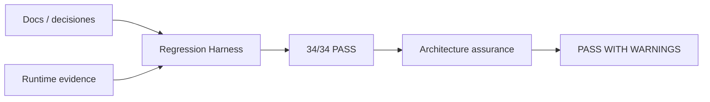
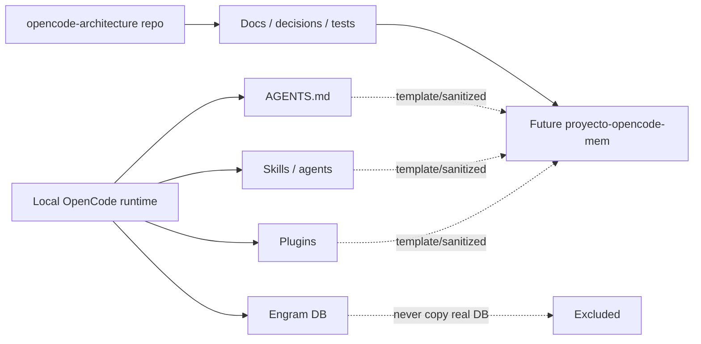
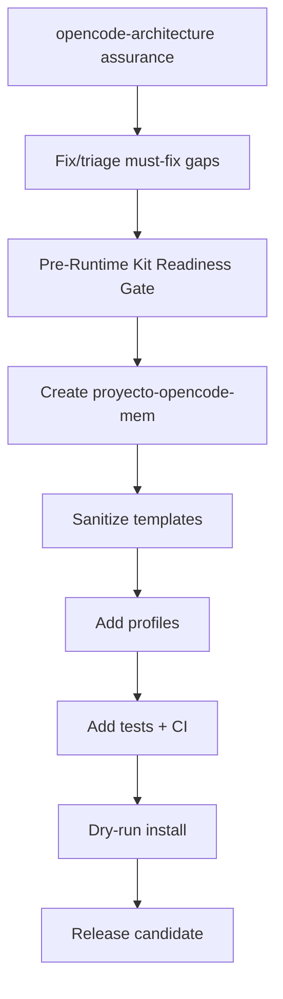

# OpenCode Architecture — Manager, Memory, Agents & Runtime Governance

> **Un sistema para que OpenCode trabaje con orden: un Manager que orquesta, subagentes que especializan, Engram que recuerda, Fase F que controla contexto, Ponytail que evita sobreingeniería y gentle-ai como lente estratégico alignment-only.**

---

## 1. Resumen en 1 minuto

**Qué es este proyecto:**  
`opencode-architecture` documenta, audita y valida una arquitectura real para operar OpenCode como un sistema gobernado: con memoria persistente, agentes especializados, skills bajo demanda, filtros de memoria, control de tokens, pruebas de regresión y planes de exportación.

**Qué problema resuelve:**  
Un asistente de IA sin arquitectura tiende a olvidar decisiones, cargar demasiado contexto, guardar ruido, mezclar proyectos o actuar como un monolito. Esta arquitectura evita eso definiendo responsabilidades claras, memoria útil, contexto mínimo suficiente y validación continua.

**Valor que entrega:**

- Un **Manager** como orquestador principal.
- **Subagentes SDD** como especialistas por fase.
- **Engram** como memoria persistente estructurada.
- **Noise Gate** para evitar guardar ruido o secretos.
- **mem_context** para recuperar contexto relevante.
- **Fase F** para reducir tokens sin perder información importante.
- **Ponytail Code Gate** para evitar código innecesario en tareas de código.
- **gentle-ai** como lente conceptual de arquitectura, no como dependencia runtime.
- Un camino claro hacia `proyecto-opencode-mem` como kit instalable y sanitizado.

**Estado actual:**  
La arquitectura está en estado **PASS WITH WARNINGS**. Eso significa: lo principal funciona y fue validado, pero quedan advertencias explícitas antes de avanzar al repo nuevo.

**Frase clave:**  
Esta arquitectura permite que OpenCode trabaje como un sistema ordenado: **Manager como orquestador, subagentes como especialistas, Engram como memoria, Fase F como control de tokens, Ponytail como criterio de código mínimo y gentle-ai como lente estratégico alignment-only.**

---

## 2. Explicación para personas no técnicas

Pensalo como una obra grande:

| Pieza | Analogía | Qué evita |
|---|---|---|
| **Manager** | Jefe de proyecto | Que todos hagan cualquier cosa sin orden. |
| **Subagentes** | Especialistas: electricista, arquitecto, inspector | Que una sola persona intente hacerlo todo. |
| **Engram** | Cuaderno de decisiones importantes | Empezar de cero cada día. |
| **Noise Gate** | Filtro antes de escribir en el cuaderno | Guardar saludos, ruido o secretos. |
| **mem_context** | Buscador del cuaderno | No tener que leer todo el historial. |
| **Ponytail** | Senior que pregunta: “¿esto hace falta?” | Sobreingeniería y código de más. |
| **gentle-ai** | Marco de criterio arquitectónico | Decidir sin una brújula conceptual. |
| **Fase F** | Control de carga mental | Tirarle todo al modelo y saturarlo. |

### Sin arquitectura vs con arquitectura

**Sin arquitectura:**  
El usuario pide “armá el repo instalable”. El asistente mezcla memoria vieja, no sabe qué componente está validado, puede asumir que Ponytail está instalado, puede tratar gentle-ai como runtime, y termina proponiendo algo riesgoso.

**Con arquitectura:**  
El Manager clasifica la tarea como grande, consulta Engram si hace falta, usa documentos de evidencia, activa SDD, distingue gentle-ai externo de `gentle-orchestrator` local, aplica Ponytail solo si hay código, valida con harness y entrega un resultado con warnings honestos.

---

## 3. Explicación para personas técnicas

| Componente | Rol simple | Rol técnico | Estado |
|---|---|---|---|
| **Manager** | Jefe de proyecto | Primary orchestrator: intake, clasificación, routing, delegación, memoria, QA, síntesis final | ✅ Confirmado primary único |
| **SDD subagents** | Especialistas por fase | 10 subagentes `sdd-*` con `mode: subagent`, hidden, executor override | ✅ Confirmados |
| **sdd-init** | Preparador del pipeline | Entry point SDD; detecta contexto y produce `SDD_INIT_PACKET` | ✅ Existe v3.0 |
| **gentle-orchestrator** | Coordinador local opcional | Subagent local definido en `opencode.json`, no primary, no gentle-ai externo | ✅ Subagent local |
| **gentle-ai alignment-only** | Lente conceptual | Referencia estratégica/documental; no plugin, no MCP, no runtime dependency | ✅ Boundary definido |
| **Engram** | Memoria útil | MCP de memoria persistente con `mem_save`, `mem_search`, `mem_context`, summaries | ✅ Funcional según arquitectura validada |
| **Noise Gate** | Filtro antes de guardar | Clasifica useful/noise/secret antes de persistir | ✅ Validado |
| **mem_context** | Recuperación de memoria | Tool read-only con ranking F4C y top-k por tipo de tarea | ✅ Suite F validada |
| **F4A-lite** | Skills más livianas | Compactación de `description:` en 36 skills; cuerpos intactos | ✅ RUNTIME PASS |
| **F4B** | Compactación de sesión | RECENT_SESSION_PACK contract instalado/endurecido; falta compactación natural real | ⚠️ PARTIAL |
| **F4C** | Selector de memoria | Guidance relevance 0.5 + recency 0.3 + type 0.2, decay 0.05 | ✅ RUNTIME PASS |
| **Ponytail Code Gate** | Evitar código innecesario | Guidance en AGENTS.md para code tasks; plugin/skills no instalados | ✅ Guidance implementado |
| **Skills** | Instrucciones especializadas | SKILL.md con frontmatter, cargadas bajo demanda | ✅ F4A-lite activo |
| **Regression Harness** | Suite de seguridad | 34 checks read-only sobre docs, hooks, seguridad, DB invariance | ✅ 34/34 PASS |
| **Export Readiness** | Camino al repo nuevo | Planes, blueprint, sanitización, tests y gaps para kit instalable | ✅ Completo con warnings |

---

## 4. Estado actual validado

| Área | Estado | Evidencia |
|---|---|---|
| Manager primary único | ✅ Confirmado | `manager-orchestration-contract.md`, `sdd-subagents-runtime-inventory.md` |
| 10 SDD subagents | ✅ Confirmados como subagent | `sdd-subagents-runtime-inventory.md` |
| `sdd-init` v3.0 | ✅ Confirmado | `.codex/skills/sdd-init/SKILL.md`, `.config/opencode/skills/sdd-init/SKILL.md`, `sdd-init-role-spec.md` |
| `gentle-orchestrator` | ✅ Subagent local | `opencode.json`, `gentle-sdd-boundary.md` |
| gentle-ai | ✅ alignment-only | `gentle-ai-activation-policy.md`, `gentle-ai-architecture-usage-audit.md` |
| Ponytail Code Gate | ✅ AGENTS.md guidance implemented | `ponytail-runtime-state-reconciliation.md`, AGENTS.md marker |
| Ponytail plugin | ❌ No instalado runtime | `ponytail-runtime-state-reconciliation.md` |
| Ponytail skills | ❌ No instalados | `ponytail-runtime-state-reconciliation.md` |
| Engram | ✅ Funcional según arquitectura validada | Engram protocol + harness checks + session summaries |
| Fase F | ✅ CLOSED — PASS WITH WARNINGS | `F-phase-final-closure-report.md` |
| F4A-lite | ✅ RUNTIME PASS | `F4A-lite-skills-selective-loading-implementation-report.md` |
| F4B | ⚠️ PARTIAL | Contract presente, pendiente compactación natural real |
| F4C | ✅ RUNTIME PASS | Memory selector guidance checks |
| Harness | ✅ 34/34 PASS | `scripts/F-regression-harness.ps1` |
| Manager SDD Orchestration Audit | ✅ PASS WITH WARNINGS | 15 docs + senior challenge |

**No maquillar warnings:**  
PASS WITH WARNINGS no significa “todo listo sin deuda”. Significa que la arquitectura está operativa y validada en lo central, pero quedan gaps que deben resolverse o trasladarse explícitamente al repo nuevo.

---

## 5. Arquitectura general



En lenguaje simple: el usuario habla con OpenCode; OpenCode pasa el pedido al Manager; el Manager decide si responde, busca memoria, activa SDD, aplica Ponytail o usa gentle-ai como lente conceptual; al final, el Manager sintetiza la respuesta.

---

## 6. Manager: rol principal

El Manager es el **primary orchestrator**. No está para hacerlo todo: está para ordenar, delegar, revisar y responder.

| Responsabilidad | Manager hace | Manager no hace | Delegado a |
|---|---|---|---|
| Intake | Entiende el pedido y pregunta si falta contexto | No implementa a ciegas | — |
| Clasificación | Decide Tiny/Small/Medium/Large, code/non-code, arquitectura/memoria | No salta clasificación | — |
| Routing | Elige ruta directa, memoria, SDD, Ponytail o alignment lens | No carga todo siempre | — |
| Memoria | Decide cuándo consultar y qué guardar | No guarda todo | Engram, Noise Gate, `mem_context` |
| SDD | Inicia y coordina fases | No compite con subagentes | `sdd-*` |
| Código | Aplica criterios de mínima complejidad cuando corresponde | No simplifica seguridad o validación | Ponytail Code Gate |
| Arquitectura | Usa lentes de evaluación y senior challenge | No convierte gentle-ai en runtime | gentle-ai alignment lens |
| QA | Valida, revisa, pide debugging si falla | No declara “listo” sin evidencia | Harness, review, verify |
| Síntesis | Entrega respuesta final al usuario | No deja que subagentes cierren la tarea | — |

El Manager no debe ser monolito. Su rol principal es **gobernar el flujo**.

---

## 7. Flujo de routing del Manager



Para no técnicos: el Manager funciona como jefe de proyecto. No hace todo solo; entiende, reparte, revisa y entrega.

---

## 8. SDD Pipeline y subagentes

SDD significa **Spec-Driven Development**: antes de cambiar algo serio, se entiende el problema, se propone, se especifica, se diseña, se divide en tareas, se aplica, se verifica y se archiva.

No se usa para tareas simples porque sería burocracia. Se activa para trabajo Medium/Large, arquitectura, automatizaciones, cambios con riesgo o implementación relevante.

| Subagente | Rol | Cuándo aparece | Output esperado |
|---|---|---|---|
| `sdd-init` | Inicializa contexto SDD | Inicio de tarea Medium/Large o proyecto nuevo | `SDD_INIT_PACKET` |
| `sdd-explore` | Explora estado actual | Antes de proponer cambios | Findings, archivos afectados, riesgos |
| `sdd-propose` | Propone opciones | Cuando hay alternativas | Opciones, tradeoffs, recomendación |
| `sdd-spec` | Define comportamiento testeable | Antes de diseñar | Requisitos, escenarios, criterios |
| `sdd-design` | Diseña solución técnica | Después de spec | Componentes, flujo, riesgos |
| `sdd-tasks` | Divide en tareas | Antes de implementar | Lista ordenada verificable |
| `sdd-apply` | Aplica cambios | Implementación aprobada | Archivos cambiados, desviaciones |
| `sdd-verify` | Verifica | Después de apply | Resultados de tests/checks |
| `sdd-archive` | Archiva | Después de verificar | Sync, memoria, cierre |
| `sdd-onboard` | Guía ciclo SDD completo | Onboarding o aprendizaje guiado | Recorrido estructurado |
| `gentle-orchestrator` | Coordinador local opcional | Tareas Large/estructurales si Manager lo decide | Envelope compacto al Manager |

`sdd-init` es el entry point del pipeline y genera `SDD_INIT_PACKET`.

---

## 9. Flujo SDD completo



---

## 10. `sdd-init`

`sdd-init` existe en runtime, versión 3.0, y fue confirmado como subagente/skill instalado. Es el entry point de SDD.

**Qué hace:** detecta stack, testing, restricciones, modo de persistencia y ruta SDD sugerida.  
**Qué no hace:** no implementa, no decide por el usuario, no responde como cierre, no modifica archivos sin autorización.

Formato esperado:

```markdown
## SDD_INIT_PACKET

- Request summary:
- Task type:
- Task size:
- Scope:
- Constraints:
- Known context:
- Missing context:
- Suggested SDD path:
- Required subagents:
- Risks:
- Clarifying questions, if any:
- Next recommended step:
```

---

## 11. Return envelope de subagentes

Los subagentes no cierran tareas directamente al usuario. Devuelven resultado al Manager, y el Manager sintetiza.

Contrato definido:

```markdown
## SUBAGENT_RESULT

- Subagent:
- Phase:
- Request id:
- Input summary:
- Actions taken:
- Files inspected:
- Files changed:
- Findings:
- Decisions needed:
- Risks:
- Tests run:
- Confidence:
- Next recommended step:
```

**Warning actual:** este envelope está definido, pero todavía no fue aplicado a todos los prompts SDD. Es uno de los gaps antes/durante `proyecto-opencode-mem`.

---

## 12. Engram y memoria

Engram no es historial completo. Es memoria estructurada para guardar lo que tiene valor futuro:

- Decisiones de arquitectura.
- Bugs con causa raíz.
- Descubrimientos técnicos no obvios.
- Patrones y convenciones.
- Preferencias del usuario.
- Resúmenes de sesión.

No debe guardar ruido ni secretos. El Manager decide cuándo consultar y cuándo persistir.



---

## 13. Noise Gate

Noise Gate filtra antes de guardar:

- Guarda lo útil.
- Descarta ruido.
- Bloquea o sanitiza secretos.
- Evita contaminar memoria entre proyectos.



---

## 14. Optimización de tokens — Fase F

El problema original era cargar demasiado contexto: skills largas, historial, tool schemas y memoria sin priorización. La solución no fue recortar a ciegas, sino cargar **el contexto correcto**.



| Workstream | Estado | Qué hace | Warning |
|---|---|---|---|
| **F4A-lite** | ✅ RUNTIME PASS | Compacta solo `description:` de 36 skills; ahorro real 3,532 chars (~883-1,177 tokens) | No confundir con F4A-full |
| **F4B** | ⚠️ PARTIAL | Contrato RECENT_SESSION_PACK instalado/endurecido | Falta compactación natural real |
| **F4C** | ✅ RUNTIME PASS | Ranking de memorias por relevancia/recencia/tipo | Guidance, no enforcement hard |
| **QW#2** | 🧪 Prototype-only | Tool schema loading | No runtime activo |
| **QW#3** | ⏸️ Proposal-only | Manager Protocol compaction | No runtime activo |
| **Harness** | ✅ 34/34 PASS | Valida docs, hooks, seguridad y DB invariance | No reemplaza tests nuevos Manager/SDD |

---

## 15. Skills

Un skill es un archivo `SKILL.md` con frontmatter e instrucciones especializadas. OpenCode los descubre y el Manager los carga cuando corresponde.

| Concepto | Qué es | Ejemplo | Estado |
|---|---|---|---|
| **Skill** | Instrucción especializada bajo demanda | `cognitive-doc-design`, `sdd-design` | ✅ Activo |
| **Subagente** | Skill/agente con rol executor y tools | `sdd-verify` | ✅ 10 SDD confirmados |
| **Plugin** | Código runtime que inyecta hooks | `engram.ts` | ✅ Engram activo |
| **Tool** | Función MCP invocable | `mem_context`, `mem_save` | ✅ Activo |
| **F4A-lite** | Compactación de descriptions visibles | 36 descriptions compactadas | ✅ RUNTIME PASS |

F4A-lite compactó descriptions para reducir tokens, pero no cambió cuerpos de skills ni `opencode.json`.

---

## 16. gentle-ai

Esta frontera es crítica:

- gentle-ai externo **NO** es dependencia runtime.
- gentle-ai **NO** se usa dentro del Manager por defecto.
- gentle-ai **NO** va en el perfil `full` futuro.
- gentle-ai es `alignment-only`: documentación, patrones, criterio, lente de evaluación.
- `gentle-orchestrator` local no es lo mismo que gentle-ai externo.
- Usar `sdd-*` no implica integrar gentle-ai externo.

**Frase obligatoria:**  
`Manager may use local SDD/gentle-inspired subagents as workflow components, but must not depend on the external gentle-ai runtime by default.`

| Elemento | Qué es | Runtime default | Manager lo usa | Estado |
|---|---|---:|---:|---|
| gentle-ai externo | Sistema/repo externo de referencia | ❌ No | ❌ No por defecto | alignment-only |
| gentle-ai alignment lens | Criterio conceptual de arquitectura | ❌ No | ✅ En decisiones arquitectónicas | Documental |
| gentle-orchestrator local | Subagente local OpenCode | ✅ Subagent | ⚠️ Solo si Manager decide | Confirmado |
| sdd-* subagents | Ejecutores de fases SDD | ✅ Subagent | ✅ Bajo demanda | Confirmados |
| sdd-init | Entry point SDD | ✅ Subagent/skill | ✅ Medium/Large si aplica | v3.0 confirmado |

---

## 17. Ponytail Code Gate

Ponytail Code Gate está implementado en `AGENTS.md` como guidance para tareas de código. No es always-on global, y `ultra` nunca es default.

| Parte | Estado |
|---|---|
| AGENTS.md Code Gate | ✅ Implementado |
| Ponytail plugin | ❌ No instalado |
| Ponytail skills | ❌ No instalados |
| Default mode | code-task default |
| Ultra | manual, nunca default |

**Aplica cuando hay:** implementación, refactor, revisión de código, nueva dependencia o nueva abstracción.

**No aplica cuando hay:** documentación pura, memoria, arquitectura conceptual sin código, CV/LinkedIn/contenido, resumen de estado.

Estado correcto: **guidance/documentary integration**, no plugin operational full.

---

## 18. Ejemplos de uso

### Ejemplo 1 — Pregunta simple

Usuario: “¿Qué es F4C?”  
Manager responde directo. No SDD, no Ponytail, no gentle lens.

### Ejemplo 2 — Tarea Medium/Large

Usuario: “Diseñá el repo instalable `proyecto-opencode-mem`.”  
Manager activa `sdd-init`, sigue SDD, puede usar Engram y gentle-ai alignment lens, y termina con plan + riesgos.

### Ejemplo 3 — Tarea de código

Usuario: “Implementá un refactor del módulo de auth.”  
Manager clasifica code task, aplica Ponytail Code Gate, luego SDD si el cambio es Medium/Large, con `ponytail: check` en tareas.

### Ejemplo 4 — Consulta con memoria

Usuario: “¿Qué decidimos sobre Ponytail?”  
Manager usa `mem_context`/Engram, responde con memoria relevante y Noise Gate decide si guardar algo nuevo.

### Ejemplo 5 — Decisión de arquitectura

Usuario: “¿Conviene hacer gentle-ai runtime dependency?”  
Manager usa gentle-ai alignment lens como revisión conceptual, pero no llama gentle-ai runtime.

---

## 19. Validación y tests actuales

No basta con documentar: se valida.



| Test / Harness | Qué valida | Estado |
|---|---|---|
| Regression harness | 34 gates read-only | ✅ 34/34 PASS |
| Manager primary único | Que no compitan subagentes como primary | ✅ Documentado/parte de plan |
| SDD subagents existentes | 10 subagentes discoverables | ✅ Confirmado |
| `sdd-init` existente | Skill/subagent v3.0 | ✅ Confirmado |
| gentle-ai boundary | No dependency runtime | ✅ G-T1 / GA plan |
| Ponytail marker | AGENTS.md guidance presente | ✅ Verificado |
| Engram / mem_context | Memoria read-only y selector | ✅ Suite F / F4C |
| F4A-lite | Descriptions compactas | ✅ RUNTIME PASS |
| F4B/F4C | Hooks/guidance | ⚠️ F4B PARTIAL, F4C PASS |
| Documentation indexes | Docs principales existen | ✅ Actualizados |

---

## 20. Tests recomendados / pendientes

### Tests ya validados

- Harness Fase F: 34/34 PASS.
- F4A-lite: RUNTIME PASS.
- F4C: RUNTIME PASS.
- F4B: markers presentes, pero PARTIAL.

### Tests diseñados pero no automatizados

- Manager/SDD tests A/B/C/D/E/F.
- GA-B1 a GA-B7 para gentle-ai boundary.
- PT-I1 a PT-I12 para Ponytail.

### Tests críticos pendientes

| ID | Objetivo | Tipo | Estado | Debe bloquear repo nuevo |
|---|---|---|---|---|
| A-T1 | Manager responde por defecto | Manual/funcional | Diseñado | Should fix before repo nuevo |
| A-T2 | SDD subagents no compiten como primary | Automatizable | Diseñado/parcialmente cubierto | Must fix before repo nuevo |
| B-T1 | 10 `sdd-*` discoverables | Automatizable | Diseñado/parcialmente cubierto | Must fix before repo nuevo |
| B-T3 | `gentle-orchestrator` como subagent | Automatizable | Diseñado/parcialmente cubierto | Must fix before repo nuevo |
| C-T6 | gentle-ai runtime no se invoca | Automatizable/parcial | Diseñado/cubierto por G-T1 | Must fix before repo nuevo |
| E-T1 | No self-invoke de subagentes | Automatizable | Diseñado | Must fix before repo nuevo |
| E-T2 | `gentle-orchestrator` no compite | Automatizable | Diseñado | Must fix before repo nuevo |
| GA-B1..GA-B7 | Boundary gentle-ai | Automatizable/parcial | Diseñado | Should fix before repo nuevo |
| PT-I1..PT-I12 | Integración Ponytail | Mixto | Diseñado | Can move to repo nuevo excepto PT-I3/PT-I10/PT-I12 |
| Manager/SDD D-T1 | `SUBAGENT_RESULT` real | Funcional | Pendiente | Should fix before repo nuevo |

---

## 21. Warnings / gaps antes del repo nuevo

| Gap | Severidad | Impacto | Acción recomendada |
|---|---|---|---|
| Paths absolutos no portables | 🔴 Alta | Templates fallan en otro equipo | **Must fix before repo nuevo**: definido en `PORTABILITY-MAP.md` + `OPENCODE-CONFIG-TEMPLATE-SPEC.md` |
| Return envelope no aplicado a prompts SDD | 🟡 Media | Output no estructurado | **Should fix**: implementar en templates según `SDD-RETURN-ENVELOPE-IMPLEMENTATION-PLAN.md` |
| Tests críticos no automatizados | 🟡 Media | Assurance manual | **Should fix**: `scripts/manager-sdd-assurance.ps1` cubre validación read-only automatizable |
| Ponytail plugin no instalado | 🟢 Baja | No enforcement automático | Can move: mantener guidance, plugin opcional |
| Ponytail skills no instalados | 🟢 Baja | Sin comandos `ponytail-*` | Can move: opcional |
| Post-restart Ponytail pendiente | 🟡 Media | No observado tras restart | Can move: guidance-only; validar post-restart luego |
| Contingencia GPT-5.5 | 🟡 Media | Quality gate puede no estar disponible | Definida en `GPT-5.5-FALLBACK-PLAN.md` |
| Ambigüedad Tiny/Medium | 🟡 Media | Saltar SDD por error | Definida en `MANAGER-TINY-AMBIGUITY-GUARD.md` |
| `sdd-init` standalone | 🟡 Media | Runtime limpio puede necesitar templates | Can move to repo nuevo |
| install/validate scripts SDD | 🟡 Media | Instalación manual riesgosa | Must/Should en repo nuevo |

---

## 22. Runtime local vs repo

Este repo documenta y valida. El runtime real vive localmente. El repo nuevo será un kit sanitizado.



No copiar DB real, memorias, `opencode.json` personal, `.codex/memories_1.sqlite`, backups con paths absolutos ni logs de sesión.

---

## 23. Camino hacia `proyecto-opencode-mem`



| Perfil | Incluye | No incluye |
|---|---|---|
| `minimal` | README, docs base, quickstart | Runtime plugins, SDD agents |
| `agents` | Manager template, agent docs | Engram DB real |
| `sdd` | 10 `sdd-*` skills + config template | gentle-ai runtime |
| `memory-enabled` | Engram templates, Noise Gate, mem_context docs | DB real o memorias reales |
| `ponytail-code-gate` | AGENTS.md guidance, test plan | Ponytail plugin por default |
| `gentle-alignment` | gentle-ai docs/patterns | Código runtime gentle-ai |
| `full` | Manager + SDD + Engram + Noise Gate + Ponytail guidance + harness | gentle-ai runtime, DB real, personal config |

`full` no incluye gentle-ai runtime. Ponytail plugin queda opcional, no default.

---

## 24. Quick links

### Para entender

- `README.md` — documento maestro.
- `docs/opencode-architecture/README-ARCHITECTURE-ASSURANCE-REFRESH-PLAN.md` — plan de actualización.
- `docs/opencode-architecture/ARCHITECTURE-ASSURANCE-REPORT.md` — assurance final.

### Para usar

- `docs/opencode-architecture/integrations/manager-routing-flow.md`
- `docs/opencode-architecture/integrations/manager-delegation-rules.md`

### Para validar

- `scripts/F-regression-harness.ps1`
- `scripts/manager-sdd-assurance.ps1`
- `docs/opencode-architecture/integrations/manager-sdd-test-plan.md`
- `docs/opencode-architecture/integrations/gentle-ai-boundary-test-plan.md`
- `docs/opencode-architecture/integrations/ponytail-integration-test-plan.md`

### Para agentes/subagentes

- `docs/opencode-architecture/integrations/sdd-subagents-runtime-inventory.md`
- `docs/opencode-architecture/integrations/sdd-init-role-spec.md`
- `docs/opencode-architecture/integrations/sdd-pipeline-flow.md`
- `docs/opencode-architecture/integrations/subagent-return-envelope.md`

### Para memoria

- `docs/opencode-architecture/phases/F-token-reduction/F4C-mem-context-selector-implementation-report.md`
- `docs/opencode-architecture/phases/F-token-reduction/F4B-contract-hardening.md`

### Para token optimization

- `docs/opencode-architecture/phases/F-token-reduction/F-phase-final-closure-report.md`
- `docs/opencode-architecture/phases/F-token-reduction/F5C-token-savings-rebaseline.md`
- `docs/opencode-architecture/phases/F-token-reduction/F4A-lite-skills-selective-loading-implementation-report.md`

### Para gentle-ai / Ponytail

- `docs/opencode-architecture/integrations/gentle-sdd-boundary.md`
- `docs/opencode-architecture/integrations/gentle-ai-activation-policy.md`
- `docs/opencode-architecture/integrations/ponytail-runtime-state-reconciliation.md`
- `docs/opencode-architecture/integrations/ponytail-post-restart-validation.md`

### Para exportar al repo nuevo

- `docs/opencode-architecture/export-readiness/SDD-AGENTS-EXPORT-PLAN.md`
- `docs/opencode-architecture/export-readiness/PRE-RUNTIME-KIT-READINESS-GATE.md`
- `docs/opencode-architecture/export-readiness/PRE-RUNTIME-KIT-READINESS-REPORT.md`
- `docs/opencode-architecture/export-readiness/PORTABILITY-MAP.md`
- `docs/opencode-architecture/export-readiness/OPENCODE-CONFIG-TEMPLATE-SPEC.md`
- `docs/opencode-architecture/export-readiness/MANAGER-EXTENSIONS-EXPORT-PLAN.md`
- `docs/opencode-architecture/export-readiness/SHAREABLE-REPO-BLUEPRINT.md`
- `docs/opencode-architecture/export-readiness/NEW-REPO-MIGRATION-PLAN.md`
- `docs/opencode-architecture/export-readiness/SHAREABLE-TEST-STRATEGY.md`

### Para riesgos/gaps

- `docs/opencode-architecture/export-readiness/pre-runtime-kit-gap-analysis.md`
- `docs/opencode-architecture/export-readiness/PRE-RUNTIME-KIT-READINESS-GATE.md`
- `docs/opencode-architecture/integrations/manager-sdd-senior-challenge.md`

---

## 25. Glosario

| Término | Significado |
|---|---|
| **Manager** | Agente primario que clasifica, delega, coordina memoria, valida y sintetiza. |
| **Primary** | Agente que responde por defecto al usuario. Aquí: Manager. |
| **Subagent** | Agente especializado invocado por el Manager o por un pipeline. |
| **Skill** | Archivo `SKILL.md` con instrucciones especializadas y frontmatter. |
| **Tool** | Función MCP invocable, por ejemplo `mem_context`. |
| **Plugin** | Código runtime que inyecta hooks o behavior en OpenCode. |
| **SDD** | Spec-Driven Development: init, explore, propose, spec, design, tasks, apply, verify, archive. |
| **sdd-init** | Entry point del pipeline SDD; produce `SDD_INIT_PACKET`. |
| **SDD_INIT_PACKET** | Paquete inicial con resumen, tipo, alcance, riesgos y ruta SDD sugerida. |
| **SUBAGENT_RESULT** | Envelope estándar para que subagentes devuelvan resultados al Manager. |
| **Engram** | Memoria persistente estructurada para decisiones, bugs, aprendizajes y resúmenes. |
| **mem_context** | Tool read-only para recuperar memoria relevante. |
| **Noise Gate** | Filtro que decide si guardar, descartar o bloquear un prompt/evento. |
| **F4A-lite** | Compactación segura de descriptions de skills. RUNTIME PASS. |
| **F4B** | Contrato de compactación de sesión. PARTIAL hasta compactación natural real. |
| **F4C** | Guidance de selección/ranking de memorias. RUNTIME PASS. |
| **gentle-ai alignment-only** | gentle-ai como referencia conceptual, no runtime. |
| **gentle-orchestrator** | Subagente local de OpenCode inspirado en SDD/gentle patterns, no gentle-ai externo. |
| **Ponytail Code Gate** | Guidance para evitar over-engineering en code tasks. Plugin/skills no instalados. |
| **Runtime PASS** | Validado en runtime real, no solo documentado. |
| **PASS WITH WARNINGS** | Cierre aceptado con advertencias explícitas pendientes. |
| **Export readiness** | Preparación para transformar este repo/runtime en kit sanitizado. |
| **Sanitization** | Remover paths personales, DB real, secretos, logs y datos privados antes de exportar. |

---

> **Estado actual:** Pre-Runtime Kit Readiness Gate — PASS WITH WARNINGS esperado tras harness.  
> **Siguiente decisión:** avanzar solo con `GO CONTROLADO PARA CREAR PROYECTO-OPENCODE-MEM` si `F-regression-harness.ps1` y `manager-sdd-assurance.ps1` pasan.
