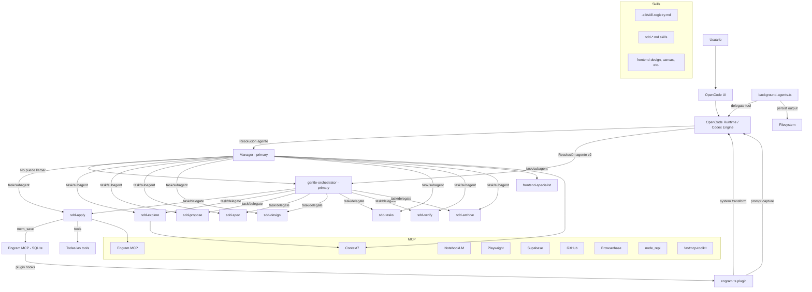

# Current State Map — Foto Actual del Ecosistema

## 1. Estructura del ecosistema

El ecosistema OpenCode se divide en **5 zonas** de configuración más **1 zona documental**:

### Zonas principales

```text
Zona A: ~/.config/opencode/           ← Config principal OpenCode (agentes, skills, MCP, plugins)
Zona B: ~/.codex/                      ← Core engine Codex (config.toml, AGENTS.md, engram-instructions)
Zona C: ~/.codex/skills/               ← Skills Codex Core (incluye .system/)
Zona D: ~/GitHub/Tools/.agents/skills/ ← Skills adicionales (bigquery-expert, etc.)
Zona E: ~/.agents/skills/              ← Skills globales (graphify)
Zona F: ~/GitHub/ARQUITECTURA OPENCODE/← Proyecto documental (skill-registry, esta documentación)
```

### Tabla de zonas

| Zona | Ruta | Rol | Estado | Evidencia | Comentario |
|------|------|-----|--------|-----------|------------|
| Config OpenCode | `~/.config/opencode/` | Config raíz: agentes, MCP, permisos, skills, plugins, inventory | ✅ Activo | opencode.json (235 líneas) | Contiene orquestadores, subagentes, MCP, comandos |
| Config Codex | `~/.codex/` | Config engine: modelo, plugins, MCP servers, features | ✅ Activo | config.toml (151 líneas) | Modelo gpt-5.5, 15+ plugins, 9 MCP servers |
| AGENTS.md Manager | `~/.config/opencode/AGENTS.md` | Prompt del Manager: persona + Engram protocol + Design skills | ✅ Activo | 259 líneas | ~7,000 tokens de contexto fijo |
| AGENTS.md Codex | `~/.codex/AGENTS.md` | Prompt de gentle-orchestrator + Engram protocol | ✅ Activo | 449 líneas | ~12,000 tokens, duplica Engram protocol |
| Skills OpenCode | `~/.config/opencode/skills/` | Skills SDD y generales | ✅ Activo | 27 skills | Incluye 8 SDD + frontend, canvas, etc. |
| Skills Codex | `~/.codex/skills/` | Skills Core + .system | ✅ Activo | Skills + .system/ | Incluye _shared, engram-agent, SDD, etc. |
| Plugins | `~/.config/opencode/plugins/` | Plugins activos | ✅ Activo | engram.ts, background-agents.ts, model-variants.ts | 3 plugins, ~68,000 líneas total |
| MCP global | `opencode.json + .jsonc` | MCP servers | ✅ Activo | 9+ servers | Engram, Context7, NotebookLM, Supabase, Playwright, etc. |
| Skill registry | `.atl/skill-registry.md` (proyecto) | Índice de skills | ✅ Activo | 48 skills indexadas | Auto-generado por gentle-ai skill-registry refresh |
| Inventory | `~/.config/opencode/inventory/` | Catálogo técnico | ⚠️ Potencialmente desactualizado | inventory.md (1635 líneas), inventory.json | Generado 2026-05-28 |
| Proyecto documental | `~/GitHub/ARQUITECTURA OPENCODE/` | Documentación arquitectura | ✅ Activo | skill-registry.md, esta docs/ | Repositorio git dedicado |

## 2. Archivos clave

| Archivo | Rol | Componente asociado | Estado | Evidencia | Riesgo |
|---------|-----|---------------------|--------|-----------|--------|
| `~/.config/opencode/opencode.json` | Config raíz: agentes, MCP, permisos, comandos | Manager, gentle-orchestrator, SDD subagentes, MCP | ✅ Activo | Líneas 4-51: agentes primarios; 52-171: subagentes SDD; 183-212: MCP | Dos agentes primarios |
| `~/.config/opencode/opencode.jsonc` | Config adicional: MCP extra + paths de skills | Playwright MCP, skill paths globales | ✅ Activo | Líneas 3-21: MCP; 23-29: skill paths | Solapamiento MCP con opencode.json |
| `~/.config/opencode/AGENTS.md` | Prompt Manager | Manager | ✅ Activo | 259 líneas | 7k tokens fijos; incluye Engram + Design |
| `~/.codex/AGENTS.md` | Prompt gentle-orchestrator | gentle-orchestrator | ✅ Activo | 449 líneas | 12k tokens; duplica Engram protocol |
| `~/.codex/config.toml` | Config engine Codex | Modelo, plugins, MCP, memories | ✅ Activo | 151 líneas | MCP duplicados vs opencode.json |
| `~/.codex/engram-instructions.md` | Instrucciones Engram inline | Codex engine | ✅ Activo | 96 líneas | Tercera fuente de instrucciones de memoria |
| `plugins/engram.ts` | Plugin Engram MCP | Sistema de memoria | ✅ Activo | ~19,136 líneas | Inyecta MEMORY_INSTRUCTIONS + captura prompts |
| `plugins/background-agents.ts` | Plugin background agents | Delegación async | ✅ Activo | ~49,010 líneas | delegate/delegation_read/delegation_list |
| `~/.codex/skills/_shared/sdd-phase-common.md` | Protocolo común SDD | SDD subagentes | ✅ Activo | 109 líneas | Executor boundary, retrieval, persistence |
| `~/.codex/skills/engram-agent/SKILL.md` | Skill Engram para subagentes | Subagentes SDD | ✅ Activo | 158 líneas | Retrieval protocol 2-step |
| `.atl/skill-registry.md` | Context index / skill registry | Proyecto | ✅ Activo | 57 líneas, 48 skills | Posible confusión con CONTEXT_INDEX.md |
| `inventory/inventory.md` | Catálogo técnico | Sistema | ⚠️ Cache | 1,635 líneas | Posible desactualizado |
| `inventory/inventory.json` | Catálogo técnico JSON | Sistema | ⚠️ Cache | JSON generado | Fecha: 2026-05-28 |
| `~/.config/opencode/agent/frontend-specialist.md` | Subagente frontend | Frontend | ✅ Activo | 544 líneas | Duplicado en agents/ |
| `~/.config/opencode/agents/frontend-specialist.md` | Subagente frontend (duplicado) | Frontend | ⚠️ Duplicado | 872 líneas | Contenido diferente |
| `design/DESIGN.md` | Design system global | Frontend | ✅ Activo | 299 líneas | Fallback global |

## 3. Componentes principales

| Componente | Qué hace | Quién lo llama | A quién llama | Persistencia | Riesgo | Estado |
|-----------|----------|---------------|--------------|-------------|--------|--------|
| **Manager** | Orquestador global: intake, diseño, SDD, review, debugging | UI OpenCode (default) | subagentes SDD, frontend-specialist, tools, MCP | Engram: saves + session_summary | Alto: ~7k prompt, prohibe llamar gentle-orch | ✅ Activo |
| **gentle-orchestrator** | Orquestador SDD: coordina fases, nunca ejecuta inline | UI OpenCode (explícito) | subagentes SDD vía task/delegate | Engram: solo vía subagentes | Alto: compite con Manager como primary | ✅ Activo |
| **sdd-apply** | Implementa cambios | Manager o gentle-orch | Tools directas (no delega) | Engram: mem_save + mem_update | Bajo: executor puro | ✅ Activo |
| **sdd-archive** | Archiva cambios completados | Manager o gentle-orch | Tools directas (no delega) | Engram: mem_save | Bajo: executor puro | ✅ Activo |
| **sdd-design** | Diseño técnico | Manager o gentle-orch | Tools directas (no delega) | Engram: mem_save | Bajo: executor puro | ✅ Activo |
| **sdd-explore** | Exploración | Manager o gentle-orch | Tools directas (no delega) | Engram: mem_save | Bajo: executor puro | ✅ Activo |
| **sdd-init** | Bootstrap SDD | Manager o gentle-orch | Tools directas (no delega) | Engram: mem_save | Bajo: executor puro | ✅ Activo |
| **sdd-onboard** | Onboarding SDD | Manager o gentle-orch | Tools directas (no delega) | Engram: mem_save | Bajo: executor puro | ✅ Activo |
| **sdd-propose** | Propuesta de cambio | Manager o gentle-orch | Tools directas (no delega) | Engram: mem_save | Bajo: executor puro | ✅ Activo |
| **sdd-spec** | Especificaciones | Manager o gentle-orch | Tools directas (no delega) | Engram: mem_save | Bajo: executor puro | ✅ Activo |
| **sdd-tasks** | Planificación de tareas | Manager o gentle-orch | Tools directas (no delega) | Engram: mem_save | Bajo: executor puro | ✅ Activo |
| **sdd-verify** | Verificación | Manager o gentle-orch | Tools directas (no delega) | Engram: mem_save | Bajo: executor puro | ✅ Activo |
| **frontend-specialist** | Implementación frontend | Manager | Tools directas, skills design | N/A | Medio: subagente especializado | ✅ Activo |
| **engram.ts plugin** | Memoria persistente, prompt capture, system injection | Codex engine runtime | MCP Engram, SQLite | SQLite sessions + memories | Alto: ~19k líneas, inyecta contexto | ✅ Activo |
| **background-agents.ts** | Delegación async persistida | Codex engine runtime | delegate tool, filesystem | Archivos en disco | Medio: ~49k líneas, escribe fuera de undo | ✅ Activo |
| **Engram MCP** | MCP server de memoria | Todos los agentes | SQLite | SQLite memories_1.sqlite | Alto: 4KB sin observaciones | ⚠️ Vacío |
| **Skill registry** | Índice de 48 skills | gentle-orchestrator, subagentes | Filesystem | Archivo .md | Bajo: índice, no estado | ✅ Activo |
| **Inventory** | Catálogo técnico | Usuario (comando inventory) | Filesystem | .md + .json | Bajo: cache, puede estar stale | ⚠️ Cache |

## 4. Dependencias entre componentes



## 5. Resumen cuantitativo

| Métrica | Valor | Fuente |
|---------|-------|--------|
| Agentes primarios | 2 (Manager + gentle-orchestrator) | opencode.json:4-51 |
| Subagentes SDD | 8 core + 2 auxiliares (init, onboard) = 10 total | opencode.json:52-171 |
| Agentes especializados | 5 (frontend, security, BQ, SQL, data-memory) | agent/ y agents/ |
| Skills instaladas | 48 (según skill-registry) | .atl/skill-registry.md |
| MCP servers configurados | 9+ | opencode.json + opencode.jsonc + config.toml |
| Plugins activos | 3 (engram, background-agents, model-variants) | plugins/ |
| Plugins OpenAI | 15+ (superpowers, documents, etc.) | config.toml:41-78 |
| Líneas de plugin Engram | ~19,136 | plugins/engram.ts |
| Líneas de plugin background | ~49,010 | plugins/background-agents.ts |
| Líneas de inventory.md | ~1,635 | inventory/inventory.md |
| Proyectos git trusteados | 8 | config.toml:14-38 |
| Skills duplicadas paths | 3 paths configurados | opencode.jsonc:23-29 |
