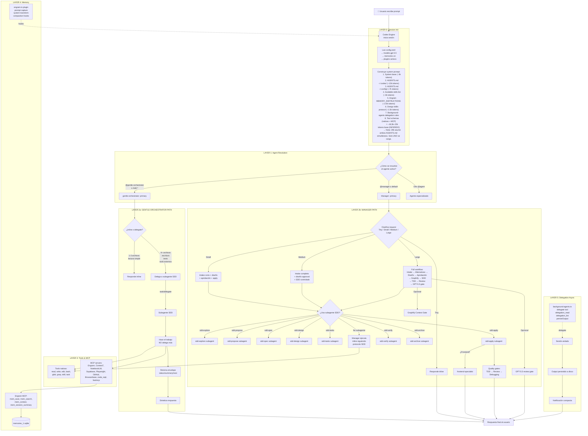

# Request-Response Flow — Flujo Actual de Petición a Respuesta

> ⚠️ **Corrección Fase B0/B1**: El diagrama siguiente muestra ambos AGENTS.md (#2 y #3) como fuentes simultáneas de contexto. En realidad, solo el AGENTS.md del agente ACTIVO se carga. La suma de ~29k asume ambos simultáneamente — el rango corregido es **~18,500–22,000 tokens** (INFERIDO). Pendiente de medición real con Test 8.

## 1. Diagrama Mermaid del flujo actual

## 2. Flujo paso a paso

### Paso 0: Inicio de sesión
| Actor | Entrada | Decisión | Salida | Evidencia | Riesgo |
|-------|---------|----------|--------|-----------|--------|
| Codex Engine | Config persistida | Cargar config.toml + AGENTS.md + plugins | Sesión iniciada | config.toml líneas 1-5, 90-96 | — |
| Engram plugin | Hook session.created | Crear o reusar sesión | session_id | engram.ts líneas 240-253 | — |
| Engine | Fuentes de contexto | Construir system prompt con todas las capas | ~18,5k–22k tokens sistema (INFERIDO) ⚠️ | Inferido de suma de fuentes; corregido de ~29k (asumía ambos AGENTS.md simultáneos) | 🔴 ALTO: contexto fijo masivo — pendiente de medición real con Test 8 |

### Paso 1: Resolución de agente
| Actor | Entrada | Decisión | Salida | Evidencia | Riesgo |
|-------|---------|----------|--------|-----------|--------|
| OpenCode runtime | Prompt del usuario + config | ¿Hay @mention o comando? | Agente seleccionado | opencode.json líneas 4-51 | 🔴 ALTO: dos primaries, resolución ambigua |

### Paso 2: Agente activo — Manager
| Actor | Entrada | Decisión | Salida | Evidencia | Riesgo |
|-------|---------|----------|--------|-----------|--------|
| Manager | Prompt del usuario | Clasificar como Tiny/Small/Medium/Large | Estrategia a seguir | Manager prompt (protocolo líneas 50-80) | 🟡 MEDIO: clasificación manual, no automática |

### Paso 3: Ejecución Manager
| Actor | Entrada | Decisión | Salida | Evidencia | Riesgo |
|-------|---------|----------|--------|-----------|--------|
| Manager | Clasificación | ¿Usar subagente SDD o inline? | Delegación o ejecución directa | Manager prompt (Operating Model) | 🟡 MEDIO: puede delegar a subagentes que no existen (review-gpt55, debug-gpt55) |

### Paso 4: Subagente SDD
| Actor | Entrada | Decisión | Salida | Evidencia | Riesgo |
|-------|---------|----------|--------|-----------|--------|
| Subagente SDD | Contexto + skills | Ejecutar fase, NO delegar | Envelope con status/summary/next | sdd-phase-common.md líneas 3-6 | 🟢 BAJO: executor boundary claro |

### Paso 5: Memoria
| Actor | Entrada | Decisión | Salida | Evidencia | Riesgo |
|-------|---------|----------|--------|-----------|--------|
| Engram plugin | Hook post-mensaje | Capturar prompt | SQLite | engram.ts líneas 349-381 | 🟡 MEDIO: guarda prompts completos |
| Manager/Subagente | Decisión/bug/fix | mem_save | Observación SQLite | AGENTS.md líneas 78-106 | 🔴 ALTO: memoria guardada pero DB vacía |

### Paso 6: Cierre de sesión
| Actor | Entrada | Decisión | Salida | Evidencia | Riesgo |
|-------|---------|----------|--------|-----------|--------|
| Manager | Fin de sesión | mem_session_summary | Resumen persistido | AGENTS.md líneas 134-156 | 🟡 MEDIO: no verificado si se ejecuta |

### Paso 7: Respuesta final
| Actor | Entrada | Decisión | Salida | Evidencia | Riesgo |
|-------|---------|----------|--------|-----------|--------|
| Agente activo | Resultados de subagentes + tools | Sintetizar respuesta | Mensaje al usuario | — | 🟢 BAJO |

## 3. Tabla consolidada de flujo

| Paso | Actor | Entrada | Decisión | Salida | Evidencia | Riesgo |
|------|-------|---------|----------|--------|-----------|--------|
| 0 | Codex Engine | Config persistida | Iniciar sesión, cargar contexto | ~18,5k–22k tokens (INFERIDO) | Inferido de suma de fuentes (corregido de ~29k) | 🔴 Contexto fijo masivo — pendiente Test 8 |
| 1 | Runtime | Prompt usuario | ¿@mention? ¿comando? | Agente seleccionado | opencode.json:4-51 | 🔴 Dos primaries |
| 2a | Manager | Prompt usuario | Tiny/Small/Medium/Large | Estrategia | Manager prompt | 🟡 Clasificación manual |
| 2b | gentle-orch | Prompt usuario | ¿Inline o delegate? | Acción | gentle-orch prompt | 🟢 Claro |
| 3 | Manager/gentle | Estrategia | ¿Subagente? ¿cuál? | Delegación | sdd-apply prompt:19-21 | 🟡 Subagentes faltantes |
| 4 | Subagente SDD | Contexto + skill | Ejecutar inline, no delegar | Envelope | sdd-phase-common.md:3-6 | 🟢 Executor boundary |
| 5 | Engram plugin | Post-mensaje | Capturar prompt | SQLite | engram.ts:349-381 | 🟡 Prompts completos |
| 6 | Manager | Decisión relevante | mem_save | Observación | AGENTS.md:78-106 | 🔴 DB vacía |
| 7 | Manager | Fin sesión | mem_session_summary | Resumen | AGENTS.md:134-156 | 🟡 No verificado |
| 8 | Agente activo | Resultados | Sintetizar | Respuesta | — | 🟢 |

## 4. Puntos de alto consumo de tokens

| Punto | Componente | Tokens estimados | Naturaleza |
|-------|-----------|-----------------|------------|
| System prompt completo | Codex Engine | ~18,500–22,000 (INFERIDO) ⚠️ | Fijo por sesión. Corregido de ~29k (asumía ambos AGENTS.md). Pendiente Test 8. |
| Tool schemas MCP | OpenCode runtime | ~2,000-8,000 | Fijo según MCP activos |
| Skill content cargado | skill() tool | ~2,000-10,000+ | Variable por trigger |
| Output de subagentes | task/delegate | ~1,000-20,000+ | Variable por tarea |
| Memoria recuperada | mem_search + mem_get_observation | ~500-5,000+ | Variable por query |
| Archivos leídos | read tool | ~500-50,000+ | Variable por archivo |
