# Conflicts and Open Questions — Conflictos y Preguntas Abiertas

## 1. Conflictos detectados entre auditorías y entre archivos

| ID | Conflicto/Pregunta | Por qué importa | Evidencia A | Evidencia B | Riesgo | Cómo validarlo |
|----|-------------------|-----------------|-------------|-------------|--------|----------------|
| C001 | ¿Cuál agente primario responde por defecto realmente? | Determina qué flujo se ejecuta | Manager es primary (opencode.json:34-51) | gentle-orch es primary (opencode.json:4-33) | 🔴 ALTO: el usuario puede estar usando el orquestador equivocado sin saberlo | Enviar mensaje simple sin @mention y ver cuál responde |
| C002 | ¿opencode.json y opencode.jsonc se fusionan o uno sobreescribe? | Determina qué MCP y skills están realmente activos | .json tiene MCP (líneas 183-212) | .jsonc tiene MCP adicional (líneas 3-21) | 🟡 MEDIO: MCPs pueden no estar activos como se espera | Consultar runtime de OpenCode sobre merge behavior |
| C003 | ¿Engram escribe observaciones realmente? | La memoria cross-session puede no funcionar | Protocolo Engram definido en AGENTS.md (líneas 72-166) | memories_1.sqlite reportado con 4KB y sin tabla observations | 🔴 ALTO: toda la memoria persistente puede ser ficticia | Ejecutar mem_save y verificar DB |
| C004 | ¿Engram guarda prompts completos, observaciones útiles o ambos? | Determina si hay ruido en memoria | engram.ts lines 343-381: captura prompts | AGENTS.md lines 96-106: formato de observación | 🟡 MEDIO: posible guardado de ruido | Revisar DB y ver qué se guarda realmente |
| C005 | ¿Existe CONTEXT_INDEX.md o se confunde con skill-registry.md? | Duplicidad conceptual de índices | frontend-specialist referencia CONTEXT_INDEX.md | .atl/skill-registry.md existe con 48 skills | 🟡 MEDIO: confusión sobre qué archivo usar | Buscar CONTEXT_INDEX.md en todos los paths de skills |
| C006 | ¿inventory.md está actualizado o es caché desactualizada? | Decisiones basadas en inventario incorrecto | inventory.md existe con 1,635 líneas | Fecha de generación: 2026-05-28 | 🟡 MEDIO: datos de inventario pueden estar stale | Regenerar y comparar diff |
| C007 | ¿Graphify está instalado o realmente en uso? | Determina si hay valor de contexto graph | Skill graphify instalada en .agents/skills/graphify/ | No hay graphify-out/ en ningún proyecto visible | 🟢 BAJO: no hay impacto hasta que se use | Verificar si se ejecutó alguna vez |
| C008 | ¿OpenSpec está implementado o solo referenciado? | Determina modo de persistencia SDD activo | persistence-contract.md referencia modo openspec | No hay directorios openspec/ visibles | 🟡 MEDIO: modo de persistencia SDD no determinado | Buscar openspec/ en todos los proyectos |
| C009 | ¿Los subagentes SDD persisten artefactos realmente? | SDD puede no estar generando trazabilidad | sdd-phase-common.md define protocolo de persistencia | Engram DB vacía, sin openspec/ | 🔴 ALTO: SDD puede ejecutarse sin dejar rastro | Ejecutar SDD dry-run y verificar artefactos |
| C010 | ¿Cuánto contexto fijo se inyecta realmente por request? | Determina eficiencia de tokens | INFERIDO: ~18,500–22,000 (corregido de ~29k) | Pendiente Test 8 | 🟡 MEDIO: inversión en optimización sin datos base | Test 8: "Dime 1 frase" — pendiente de input exacto |
| C011 | ¿Cuántos MCP/tools están visibles al modelo por defecto? | Determina superficie de error y tokens | 9+ MCP configurados entre 3 archivos | No se sabe cuáles están activos simultáneamente | 🔴 ALTO: puede haber MCP duplicados e inactivos consumiendo tokens | Listar MCP activos en runtime |
| C012 | ¿Cuánto cuesta una petición simple (Tiny) en tokens? | Baseline para medir overhead mínimo | Estimación: ~20k-30k tokens | Sin medición real | 🟡 MEDIO: no hay baseline para optimización | Enviar "hola" y medir tokens de respuesta |
| C013 | ¿cuál frontend-specialist es el activo? | Duplicado con contenido diferente | agent/frontend-specialist.md: 544 líneas | agents/frontend-specialist.md: 872 líneas | 🟡 MEDIO: comportamiento frontend impredecible | Verificar cuál gana en runtime |
| C014 | ¿model_instructions_file reemplaza o complementa AGENTS.md? | Determina orden de carga de instrucciones | config.toml:4: `model_instructions_file = "engram-instructions.md"` | AGENTS.md cargado por defecto | 🟡 MEDIO: posible duplicación de instrucciones | Consultar documentación de Codex |
| C015 | ¿Hay budget/rate limit considerations para gpt-5.5? | Costo operativo del sistema | Modelo gpt-5.5 configurado | ~18,500–22,000 tokens fijos estimados por sesión (corregido de ~29k) | 🟡 MEDIO: costo puede ser significativo | Monitorear uso de API, ejecutar Test 8 |

## 2. Mapa de conflictos entre componentes

```mermaid
graph TD
    OC[opencode.json] -->|primary ×2| C1[Conflicto: Dos orquestadores]
    OC -->|MCP duplicados| C2[Conflicto: MCP repetidos entre configs]
    
    AG1[AGENTS.md .config] -->|Engram protocol| D1[Duplicación instrucciones]
    AG2[AGENTS.md .codex] -->|Engram protocol| D1
    PLUG[engram.ts plugin] -->|MEMORY_INSTRUCTIONS| D1
    
    ENG_DB[memories_1.sqlite] -->|4KB vacía| C3[Conflicto: Memoria no funcional]
    PROTO[Protocolo Engram] -->|define saves| C3
    
    SR[.atl/skill-registry.md] -->|context index?| C4[Confusión: Context Index]
    CI[CONTEXT_INDEX.md] -->|no existe| C4
    
    OPENSPEC[openspec/] -->|referenciado| C5[No implementado]
    PERSIST[persistence-contract.md] -->|modo openspec| C5
    
    FE1[agent/frontend-specialist.md] -->|544 líneas| C6[Duplicado]
    FE2[agents/frontend-specialist.md] -->|872 líneas| C6
    
    INV[inventory.md] -->|2026-05-28| C7[Cache desactualizada]
    
    MCP_CONFIG[MCP servers ×9] -->|schemas| C8[Superficie MCP extensa]
    TOKENS[~29k tokens fijos] -->|sin medición| C9[Overhead no medido]
```

## 3. Preguntas abiertas (sin conflicto, sin responder)

| ID | Pregunta | Contexto | Impacto |
|----|----------|----------|---------|
| Q001 | ¿El usuario usa gentle-orchestrator explícitamente o Manager es el default real? | La UI de OpenCode puede tener un selector de agente | Determina prioridad de resolución |
| Q002 | ¿Los proyectos en config.toml (trusted) tienen sus propios AGENTS.md que se mergean? | 8 proyectos trusteados listados | Pueden agregar más contexto fijo |
| Q003 | ¿El plugin superpowers@openai-curated inyecta contexto al system prompt? | Configurado en config.toml:50-51 | Puede agregar tokens no contabilizados |
| Q004 | ¿Hay sesiones activas de SDD en algún proyecto que no sea ARQUITECTURA OPENCODE? | Solo se auditó este proyecto | SDD puede estar funcionando en otros proyectos |
| Q005 | ¿El usuario ha ejecutado gentle-ai doctor alguna vez? | Herramienta de diagnóstico disponible | Puede revelar problemas de configuración |
| Q006 | ¿Hay algún plan de rate limiting para gpt-5.5? | Modelo premium, ~18,500–22,000 tokens fijos estimados (corregido de ~29k) | Costo operativo pendiente de medición Test 8 |
| Q007 | ¿El usuario quiere mantener ambos orquestadores o eliminar uno? | Decisión arquitectónica fundamental | Define todo el roadmap |
| Q008 | ¿El usuario prefiere SDD completo para cambios pequeños o solo para cambios Medium/Large? | Manager clasifica, pero la preferencia del usuario puede diferir | Afecta frecuencia de uso de SDD |

## 4. Conflictos resueltos o actualizados por Fase B0/B1

| ID | Conflicto | Estado anterior | Estado actual | Evidencia |
|----|-----------|----------------|---------------|-----------|
| C001 | ¿Cuál agente primario responde? | Sin resolver | **PARCIALMENTE RESUELTO** — Manager validado como primary real por observación directa durante B1. Sin validación logs runtime. | Manager ejecutó B1 completo. gentle-orch no intervino. Ver `baselines/T1-primary-baseline.md` |
| C003 | ¿Engram escribe observaciones? | Sin resolver | **VALIDADO NO FUNCIONAL** — DB sin tabla observations | memories_1.sqlite: solo tablas _sqlx_migrations, stage1_outputs, jobs |
| C010 | ¿Cuánto contexto fijo realmente? | ~29k estimado | **CORREGIDO** — rango revisado ~18,500–22,000 (INFERIDO). T8 ejecutado en sesión limpia: baseline funcional validado, tokens reales NO DISPONIBLES. | Baselines/T8-token-baseline.md |
| C012 | ¿Cuánto cuesta una petición Tiny? | ~20k-30k | **CORREGIDO** — rango revisado ~18,500–22,000 (INFERIDO). T8: sin sobreorquestación. Tokens reales NO DISPONIBLES. | Baselines/T8-token-baseline.md |
| C013 | ¿Cuál frontend-specialist es activo? | Sin resolver | **VALIDADO DUPLICADO** — ambos existen con contenido diferente | agent/ (22KB) y agents/ (14.9KB) confirman duplicado |
| R11 | Secretos expuestos | 🔴 P0 — No resuelto | ✅ **RESUELTO (B-Security)** | GitHub PAT actualizado. Browserbase eliminado. Backups limpios. Git sin fugas. |

## 5. Próximas acciones para resolver conflictos (actualizado Fase B1)

| Prioridad | Conflicto | Estado | Acción | Método | Fase |
|-----------|-----------|--------|--------|--------|------|
| 🔴 P1 | C001: Agente primario real | ✅ **Validado** — Manager responde | Ejecutar T1 con input exacto para reporte completo | Test manual | B1 ✅ → Cierre |
| 🔴 P1 | C003: Engram funcional | ❌ No resuelto | Diagnosticar por qué no hay tabla observations | Revisar engram.ts MCP connection | E |
| 🔴 P1 | C009: SDD persiste artefactos | ❌ No resuelto | Ejecutar SDD dry-run mínimo | Task a subagente SDD | C |
| 🔴 P1 | T8: Token baseline | ✅ **Completado** | Baseline funcional validado en sesión limpia. Sin sobreorquestación. Tokens reales NO DISPONIBLES. | Test ejecutado | B1 ✅ |
| 🟡 P2 | C002: Merge de configs | ❌ No resuelto | Consultar runtime OpenCode | Read de docs o test | C |
| 🟡 P2 | C005: Context index | ✅ Resuelto | CONTEXT_INDEX.md existe en otros proyectos | Ya validado | ✔️ |
| 🟡 P2 | C006: Inventory actualizado | ❌ No resuelto | Regenerar inventory y comparar | Ejecutar script | P3 |
| 🟡 P2 | Duplicación frontend-specialist | ⚠️ Detectado | Decidir cuál mantener | agent/ (22KB) vs agents/ (14.9KB) | D |
| 🟡 P2 | Session summaries evidencia | ❌ No resuelto | Ejecutar mem_session_summary y verificar DB | — | C |
| 🟢 P3 | C007: Graphify usado | ✅ Verificado sin graphify-out/ | No requiere acción | glob | ✔️ |
| 🟢 P3 | C008: OpenSpec implementado | ❌ No verificado | Buscar openspec/ en todos los proyectos | glob | P3 |

---

## 6. Actualización Fase C — conflictos nuevos o refinados

| ID | Conflicto/Pregunta | Estado Fase C | Evidencia | Próxima acción |
|---|---|---|---|---|
| C001 | ¿Cuál agente primario responde? | ✅ Resuelto operativamente: Manager responde por defecto | T1/T8 + Fase C ejecutada por Manager | Fase D debe formalizar config |
| C003 | ¿Engram escribe observaciones realmente? | ⚠️ Sigue abierto | T2 recupera memoria útil, pero B0 mostró DB sin `observations` | Fase E: diagnosticar storage real |

## Resoluciones Fase E

| Conflicto | Estado | Resolución | Evidencia |
|---|---|---|---|
| C003 — Engram observations | RESUELTO | Engram sí escribe observations en `C:\Users\harry\.engram\engram.db`; `.codex\memories_1.sqlite` era store equivocado | E0/E1, id=395 |
| C004 — prompts completos/ruido | ABIERTO | `user_prompts` tiene 302 rows; falta gate/política runtime | E0 DB schema/counts |
| P3 — session summaries | RESUELTO PARCIAL | `mem_session_summary` funciona como observation `session_summary`, no como `sessions.summary` | id=396 |
| Config duplicada Engram | ABIERTO | Siguen 3 procesos y 2 versiones de binario | E0 processes/binaries |
| Project drift | ABIERTO | `engram doctor` detectó 14 mismatches | E0 doctor |
| C009 | ¿SDD persiste artefactos realmente? | ⚠️ Sigue abierto | T5 no invocó pipeline por regla runtime actual | Fase D/Fase C-ext: probar SDD end-to-end tras resolver regla |
| C011 | ¿MCP bajo demanda funciona? | ✅ Parcialmente resuelto para Context7 | T4 activó Context7 solo con intención explícita | Fase G: consolidar MCP duplicados |
| C016 | Conflicto ADR-003 vs regla runtime Manager | 🔴 NUEVO / ALTO | T5: arquitectura estratégica permite gentle-orch; prompt runtime lo prohíbe | Fase D debe corregir prompt/config de forma controlada |

### Estado C016 después de D3

| Conflicto | Estado | Evidencia | Pendiente |
|---|---|---|---|
| ADR-003 vs regla runtime Manager | RESUELTO | D-T1, D-T5-read-only, D-T5-pipeline-dry-run y D-T3 PASSED | Mantener tests de regresión en próximos cambios |

### Nuevo riesgo observado en D-T1

| ID | Riesgo | Estado | Evidencia | Próxima acción |
|---|---|---|---|---|
| C017 | Overhead real mayor al estimado | VALIDADO | D-T1 reportó 40,017 input tokens y 40,091 total | Investigar en Fase F; no bloquear D4 |

### Estado Fase D

Fase D resuelve C016: Manager puede invocar gentle-orchestrator como SDD Pipeline subagent sin loop observado. C017 queda abierto como riesgo de tokens para Fase F.
