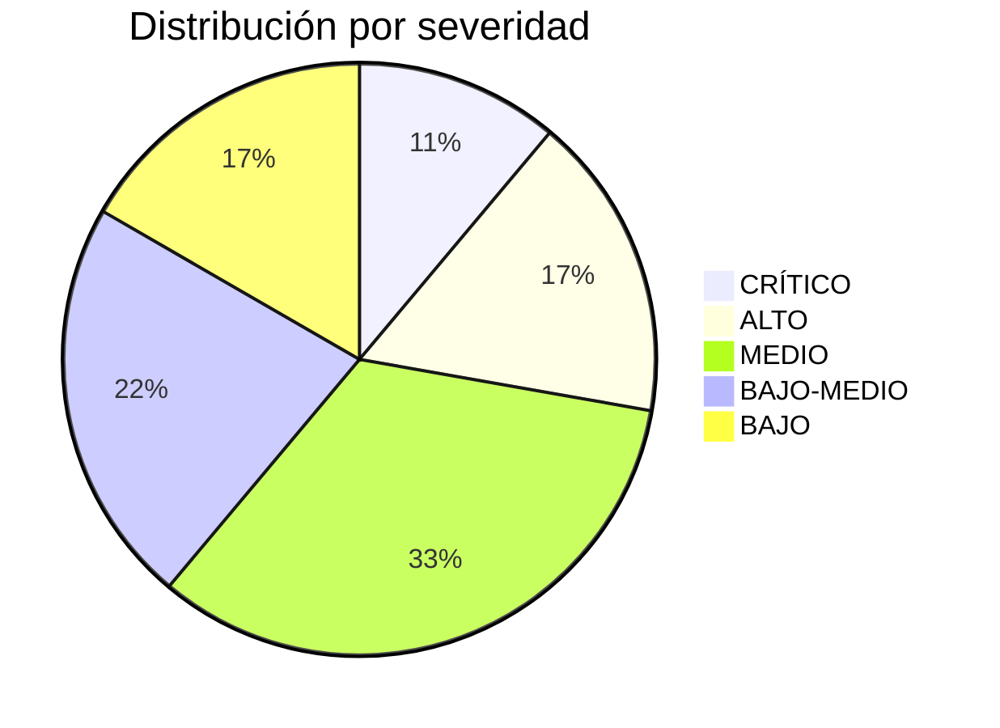
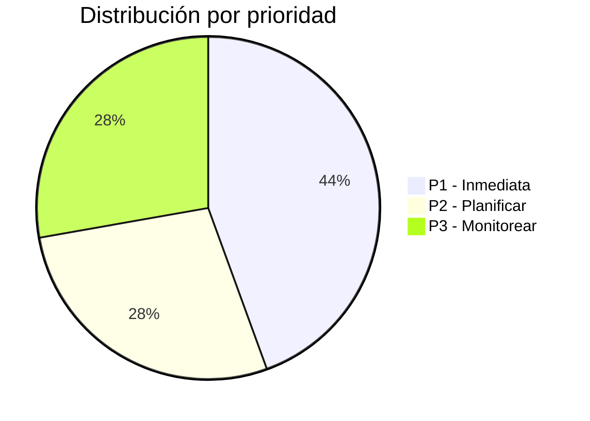

# Risk Register — Registro de Riesgos

## Matriz de riesgos

| # | Riesgo | Severidad | Probabilidad | Impacto | Evidencia | Mitigación propuesta | Prioridad |
|---|--------|-----------|-------------|---------|-----------|---------------------|-----------|
| R01 | **Doble orquestador primario**: Manager y gentle-orchestrator ambos mode: "primary" sin regla de resolución clara | 🔴 **CRÍTICO** | Alta (80%) | El orquestador incorrecto responde, flujo incorrecto, posible loop | opencode.json:4-51 ambos primary | ADR-001: Elegir Manager como único primary por defecto; gentle como SDD pipeline explícito invocable | P1 |
| R02 | **Memoria Engram sin gobernanza suficiente**: store real funciona, pero hay duplicación, prompt capture y project drift | 🟡 **MEDIO** | Alta (80%) | Memoria ruidosa, recuperación inconsistente, prompts guardados sin gate | E0/E1: `~/.engram/engram.db` funciona; 302 user_prompts; 3 procesos | ADR-004: consolidar configuración/instrucciones y filtro de guardado | P1 |
| R03 | **Contexto fijo excesivo**: ~18,500–22,000 tokens estimados por sesión antes del primer mensaje (corregido de ~29k, que asumía ambos AGENTS.md simultáneos) | 🔴 **ALTO** | Muy alta (95%) | Latencia + costo elevado, peor experiencia de usuario | Suma estimada de 6+ fuentes de contexto (corregida en B0 al validar que solo UN AGENTS.md se carga) | ADR-006: Token budget. Desduplicar. Mover a lazy-load. Reducir fixed overhead objetivo a ~8,5k-9,5k. Pendiente medición Test 8. | P1 |
| R04 | **Duplicación de instrucciones de memoria**: Engram protocol en 3 fuentes | 🟠 **MEDIO** | Muy alta (95%) | ~2,500 tokens redundantes, posible contradicción | AGENTS.md (.config):72-166, (.codex):355-449, engram.ts:64-141 | Desduplicar: una sola fuente de instrucciones de memoria | P1 |
| R05 | **Guardado de ruido en memoria**: Prompt capture guarda prompts completos sin filtro | 🟠 **MEDIO** | Alta (80%) | Memoria contaminada con datos transitorios, difícil retrieval semántico | engram.ts:343-381 captura todo input | Implementar filtro de guardado: solo observaciones útiles, no prompts completos | P2 |
| R06 | **MCP surface demasiado grande**: 9+ MCP servers configurados, varios duplicados | 🟠 **MEDIO** | Alta (80%) | ~2-8k tokens extra en schemas, superficie de error ampliada, riesgos de seguridad | opencode.json + .jsonc + config.toml tienen MCP duplicados | ADR-007: MCP bajo demanda. Activar solo los necesarios para cada request | P1 |
| R07 | **Subagentes referenciados que no existen**: review-gpt55, debug-gpt55 | 🟠 **MEDIO** | Media (60%) | Quality gates de GPT-5.5 no disponibles | Manager prompt menciona pero no hay agentes configurados | Decidir si implementar o eliminar referencias. Usar Judgment Day como alternativa | P2 |
| R08 | **Manager puede hacer demasiado**: Sin límite claro de inline execution | 🟡 **BAJO-MEDIO** | Media (50%) | Manager ejecuta inline tareas complejas, inflando contexto | Manager prompt permite inline cuando no hay subagente | Fortalecer regla: si 4+ archivos o lógica nueva, delegar siempre | P2 |
| R09 | **Falta de observabilidad**: No hay medición de tokens, tiempo, decisiones | 🟡 **BAJO-MEDIO** | Muy alta (90%) | No se puede optimizar sin datos | No se encontró logging de métricas de flujo | Fase B del roadmap: agregar observabilidad mínima (request_id, agent, tools, tokens) | P1 |
| R10 | **Falta de tests de flujo**: Sin pruebas que validen el comportamiento real | 🟡 **BAJO-MEDIO** | Alta (80%) | Cambios pueden romper el flujo sin detectarse | No hay test files visibles | Fase C del roadmap: crear escenarios de prueba reproducibles | P2 |
| R11 | **Secretos expuestos en config**: GitHub token y Browserbase API key en texto plano | 🟢 **MITIGADO** | RESUELTA | ✅ B-Security completada. GitHub PAT actualizado. Browserbase eliminado. 5 backups eliminados. Git history sin fugas. Sin rastros del token viejo. | config.toml (actualizado), git log, ~/.codex/ (limpio) | ✅ **MITIGADO — No requiere acción adicional** | 🟢 RESUELTA |
| R12 | **Inventory desactualizado**: inventory.json del 2026-05-28 puede no reflejar estado actual | 🟡 **BAJO** | Alta (80%) | Decisiones basadas en datos incorrectos | Fecha en metadatos de inventory | Regenerar inventory periódicamente o bajo demanda | P3 |
| R13 | **Context index inexistente**: CONTEXT_INDEX.md no existe pero se referencia | 🟢 **BAJO** | Media (50%) | Confusión sobre qué archivo usar como índice de contexto | frontend-specialist lo referencia pero no existe | Aclarar: skill-registry.md es el índice. Decidir si crear CONTEXT_INDEX.md separado | P3 |
| R14 | **openspec no implementado**: Modo de persistencia SDD referenciado pero sin directorios | 🟢 **BAJO** | Alta (80%) | Sin fallback a filesystem para artefactos SDD | persistence-contract.md menciona modo openspec | Decidir si implementar openspec/ o usar solo Engram | P3 |
| R15 | **Graphify sin uso**: Instalado pero sin graphify-out/ en ningún proyecto | 🟢 **BAJO** | Baja (20%) | Recurso instalado sin beneficio | Skill existe, sin directorio de salida | No requiere acción hasta que se necesite | P3 |
| R16 | **Loops de instrucciones**: Manager prohibe llamar a gentle-orch, pero el runtime podría elegir a gentle-orch como primary | 🔴 **ALTO** | Media (60%) | Sistema en estado inconsistente, posible comportamiento impredecible | Manager prompt vs opencode.json mode config | ADR-001: resolver ambigüedad de primario | P1 |
| R17 | **Context drift**: Diferentes fuentes de contexto pueden desviar el comportamiento del modelo | 🟡 **BAJO-MEDIO** | Media (50%) | Comportamiento inconsistente entre sesiones | Múltiples AGENTS.md + plugins + skills | Consolidar contexto en una fuente de verdad por capa | P2 |
| R18 | **Delegación async fuera de undo**: background-agents.ts escribe a disco sin posibilidad de revertir | 🟡 **BAJO-MEDIO** | Alta (80%) | Cambios no deshacibles si la delegación es destructiva | background-agents.ts:609-612, 843-876, 1302-1303 | Documentar tradeoff. Usar con cuidado en operaciones destructivas | P3 |

## 2. Priorización de riesgos

### Críticos (P0/P1 — acción inmediata)
| # | Riesgo | Mitigación | Fase | Estado |
|---|--------|-----------|------|--------|
| R01 | Doble orquestador primario | ADR-001: Unificar primary | D | ⏳ Pendiente |
| R02 | Memoria Engram sin gobernanza suficiente | ADR-004: Consolidar/gobernar | E | 🔄 E0/E1/E2/E3 completado; E4 pendiente |
| R03 | Contexto fijo excesivo | ADR-006: Token budget | F | ⏳ Pendiente |
| R04 | Duplicación instrucciones memoria | Desduplicar | E+F | ⏳ Pendiente |
| R06 | MCP surface grande | ADR-007: MCP bajo demanda | G | ⏳ Pendiente |
| R09 | Falta de observabilidad | Fase B1: logging mínimo | B1 | 🔄 En ejecución |
| R16 | Loops de instrucciones | ADR-001: resolver primary | D | ⏳ Pendiente |

### Mitigados (resueltos)
| # | Riesgo | Resolución |
|---|--------|-----------|
| **R11** | **Secretos expuestos** | ✅ **B-Security completada. Token GitHub actualizado, Browserbase eliminado, backups limpios.** |

### Medios (P2 — planificar próximas)
| # | Riesgo | Mitigación |
|---|--------|-----------|
| R05 | Guardado de ruido en memoria | Filtro de guardado |
| R07 | Subagentes que no existen | Decidir implementar o eliminar |
| R08 | Manager sin límite inline | Fortalecer reglas |
| R10 | Falta de tests de flujo | Fase C: test plan |
| R17 | Context drift | Consolidar fuentes |

### Bajos (P3 — monitorear)
| # | Riesgo | Mitigación |
|---|--------|-----------|
| R12 | Inventory desactualizado | Regenerar periódicamente |
| R13 | Context index inexistente | Decidir sobre CONTEXT_INDEX.md |
| R14 | openspec no implementado | Decidir modo de persistencia |
| R15 | Graphify sin uso | No requiere acción |
| R18 | Delegación async fuera de undo | Documentar tradeoff |

## 3. Distribución de riesgos

## 4. Mapa de riesgos por componente

| Componente | Riesgos asociados |
|-----------|-------------------|
| Manager | R01 (doble primary), R03 (contexto), R08 (inline sin límite), R16 (loops) |
| gentle-orchestrator | R01 (doble primary), R16 (loops) |
| Engram / memoria | R02 (gobernanza), R04 (duplicación), R05 (ruido) |
| MCP servers | R06 (surface grande), R11 (secretos expuestos) |
| Subagentes SDD | R07 (faltantes), R14 (openspec no impl) |
| Config general | R03 (contexto), R09 (observabilidad), R10 (tests), R12 (inventory) |
| Documentación | R13 (context index), R17 (context drift) |
| Plugins | R18 (delegación fuera de undo) |
