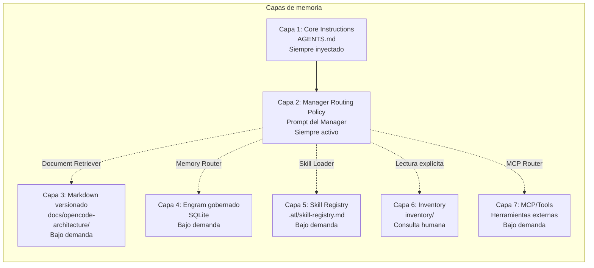

# Target Architecture — Arquitectura Objetivo

> ✅ **Decisión estratégica aprobada (2026-06-09)**: Manager único primary. gentle-orchestrator como SDD Pipeline. Ver ADRs 001-009 para detalles de cada decisión.

## 1. Principios arquitectónicos

1. **Manager como único primary**: Responde por defecto a todos los requests. NO hay ambigüedad de orquestador.
2. **Manager como router, no ejecutor universal**: Decide, clasifica, delega. NO ejecuta trabajo que deba hacer un subagente.
3. **gentle-orchestrator como SDD Pipeline especializado**: NO es primary. Manager lo invoca explícitamente para cambios estructurados Medium/Large.
4. **Engram para memoria gobernada**: Solo decisiones, bugs, aprendizajes y estado útil. Nada de ruido.
5. **Markdown versionado como fuente de verdad**: Arquitectura, ADRs, roadmaps, decisiones de diseño. NO como contexto inyectado siempre.
6. **Skill registry como índice de capacidades**: NO es memoria semántica. NO reemplaza documentación.
7. **Inventory como catálogo técnico generado**: NO es contexto permanente. NO se inyecta automáticamente.
8. **MCP bajo demanda**: NO como superficie siempre activa. Activar por intención justificada.
9. **Subagentes con contexto mínimo**: Reciben solo lo necesario para su fase. Retornan envelope compacto.
10. **Medir antes de optimizar**: No hay optimización sin datos. Test 8 (baseline) es requisito.
11. **Gobernanza de memoria**: Guardar, actualizar, invalidar y no guardar tienen reglas claras. Política documentada en ADR-004.
12. **Reducir tokens fijos**: Mover información a carga bajo demanda. Desduplicar. Compactar.

## 2. Diagrama de flujo de request (nueva arquitectura)

```mermaid
flowchart TD
    USR[Usuario] --> OC[OpenCode Runtime]
    OC --> MGR["MANAGER<br/>(único primary)"]
    
    MGR --> CLASS{"Clasificación<br/>de intención"}
    
    CLASS -->|"Tiny"| TINY[Responder directo<br/>Sin memoria<br/>Sin MCP<br/>Sin SDD]
    CLASS -->|"Small"| SMALL[Lectura mínima<br/>Acción directa<br/>Verificar]
    
    CLASS -->|"Needs Memory"| MEM[Memory Governance Flow]
    MEM --> MEM_Q{"¿Necesita<br/>contexto previo?"}
    MEM_Q -->|"Sí"| MEM_SRC{"¿Qué fuente?"}
    MEM_SRC -->|"Decisiones"| ENG[Engram mem_search]
    MEM_SRC -->|"Arquitectura"| DOC[Markdown docs/]
    MEM_SRC -->|"Skills"| REG[Skill registry]
    MEM_SRC -->|"Catálogo"| INV[Inventory]
    MEM_Q -->|"No"| SKIP[Saltar búsqueda]
    
    CLASS -->|"Needs Docs"| DOC2[Document Retriever]
    DOC2 --> DOC_READ[Leer Markdown versionado<br/>docs/, ADRs, DESIGN.md]
    
    CLASS -->|"Needs Tool/MCP"| MCP_R[Tool/MCP Router]
    MCP_R --> MCP_Q{"¿MCP justificado?"}
    MCP_Q -->|"Sí"| MCP_ON[Activar MCP específico]
    MCP_Q -->|"No"| TOOLS[Usar tools nativas<br/>read, write, edit, bash]
    
    CLASS -->|"Needs Specialist"| SUB[Subagente especializado]
    SUB --> SUB_EXE[task&#40;frontend-specialist&#41;<br/>task&#40;release-security-gate&#41;<br/>task&#40;bigquery-data-quality&#41;]
    
    CLASS -->|"Needs Structured<br/>Change"| SDD[SDD Pipeline]
    SDD --> GENTLE[Invocar gentle-orchestrator]
    GENTLE --> SDD_PHASES["Pipeline SDD completo<br/>explore → propose → spec<br/>→ design → tasks<br/>→ apply → verify → archive"]
    SDD_PHASES --> ENV_RET[Envelope compacto<br/>status, summary, evidence]
    
    TINY --> SYNTH
    SMALL --> SYNTH
    ENG --> SYNTH
    DOC --> SYNTH
    REG --> SYNTH
    INV --> SYNTH
    SKIP --> SYNTH
    DOC_READ --> SYNTH
    MCP_ON --> SYNTH
    TOOLS --> SYNTH
    SUB_EXE --> SYNTH
    ENV_RET --> SYNTH
    
    SYNTH["MANAGER<br/>Sintetiza resultados"]
    SYNTH --> QG{Quality Gate}
    QG -->|"Aplica"| QG_EXE[TDD / Review<br/>Judgment Day / GPT-5.5]
    QG_EXE --> RESP
    QG -->|"No aplica"| RESP
    
    RESP[Respuesta final al usuario]
    RESP --> SAVE_DEC{"Memory Save<br/>Decision"}
    SAVE_DEC -->|"¿Es guardable?"| YES_SAVE[mem_save gobernado]
    SAVE_DEC -->|"No"| NO_SAVE[Descartar]
```



## 2b. Diagrama de capas de memoria



## 3. Resumen de decisiones estratégicas

| Decisión | ADR | Valor |
|----------|-----|-------|
| Manager único primary | ADR-001 | Fin de la ambigüedad de orquestador |
| Manager como router, no ejecutor | ADR-002 | Contexto controlado, delegación clara |
| gentle-orch como SDD Pipeline | ADR-003 | Pipeline SDD preservado, sin competencia |
| Engram como memoria gobernada | ADR-004 | Biblioteca de decisiones, no basurero |
| Skill registry = context index | ADR-005 | Un solo índice, sin duplicación |
| Token budget: ~8,500–9,500 objetivo | ADR-006 | -50-60% de contexto fijo |
| Delegación por complejidad | ADR-008 | task sync default, envelope compacto |
| Observabilidad + tests | ADR-009 | Medir antes de optimizar |

## 4. Responsabilidades objetivo por componente

| Componente | Responsabilidad objetivo | NO debe hacer | Entrada | Salida | Métrica de éxito |
|-----------|------------------------|---------------|---------|--------|-----------------|
| **Manager** | Router principal: clasificar, decidir ruta, delegar, sintetizar, controlar memoria, quality gates | NO ejecutar implementación compleja inline. NO ser ejecutor universal. | Prompt usuario + contexto | Respuesta final o delegación | % de requests clasificados correctamente. Tiempo de respuesta. |
| **Memory Governance** | Capacidad lógica del Manager. Decidir si recuperar memoria, qué buscar, cuánto recuperar. Gobernar guardado. | NO guardar ruido. NO recuperar sin query. NO recuperar más de 3 observaciones por defecto. | Intención del request + contexto | Memorias relevantes o decisión de no recuperar | Relevancia de memorias recuperadas. Ratio señal/ruido. |
| **Document Retriever** | Capacidad del Manager. Leer Markdown versionado bajo demanda según intención. | NO leer todo el doc sin necesidad. NO leer docs no relevantes. | Query de búsqueda + paths conocidos | Contenido relevante del documento | % de docs correctamente identificados para la tarea. |
| **Tool/MCP Router** | Capacidad del Manager. Activar MCP solo cuando el request lo requiera. Mantener tool surface mínima por defecto. | NO activar MCP sin necesidad. NO exponer tools que no se usarán. | Clasificación del request + capacidades MCP conocidas | MCP activados o decisión de no activar | Reducción de tokens de schemas. Latencia promedio. |
| **SDD Pipeline (gentle-orch)** | Ejecutar pipeline SDD completo cuando Manager lo invoque explícitamente. NO es primary. | NO responder como default. NO ejecutar inline fuera de SDD. | Orden de Manager + contexto mínimo | Artefactos SDD + verificación + envelope compacto | % de fases completadas. Calidad de artefactos. |
| **Subagentes SDD** | Ejecutar su fase específica, NO delegar, retornar envelope. | NO delegar, NO expandir scope, NO modificar fases ajenas. | Contexto de fase + inputs de fase anterior | Envelope con status/summary/next | Tiempo por fase. % de retornos exitosos. |
| **Subagentes especializados** | Ejecutar tareas especializadas (frontend, seguridad, BQ, SQL). | NO orquestar, NO desviarse de su especialidad. | Instrucciones específicas + contexto mínimo | Output especializado | Calidad del output especializado. |
| **Engram** | Memoria persistente gobernada. Solo datos útiles y gobernados. | NO guardar prompts completos. NO guardar ruido. NO ser única fuente de verdad. | mem_save con gobernanza | Observaciones persistentes | Ratio de observaciones útiles. Frecuencia de retrieval exitoso. |
| **Markdown docs** | Fuente de verdad para arquitectura, ADRs, roadmaps, planes. | NO ser contexto inyectado siempre. NO reemplazar código. | Lectura bajo demanda | Información estructurada | % de decisiones documentadas vs implementadas. |
| **Skill registry** | Índice de skills con triggers y paths. Context index oficial. | NO ser memoria semántica. NO reemplazar documentación. | gentle-ai skill-registry refresh | Lista de skills indexadas | Tiempo desde instalación hasta indexación. |
| **Inventory** | Catálogo técnico generado para consulta humana. | NO inyectarse como contexto automático. | generate-static-inventory.mjs | Catálogo actualizado | Frecuencia de actualización vs cambios reales. |

## 5. Política de memoria del Manager

### Antes de buscar memoria

1. ¿La respuesta requiere contexto previo?
2. ¿Ese contexto debería estar en Engram, Markdown, ADRs, skill registry o inventory?
3. ¿Cuál es la query mínima? (máximo 5 palabras)
4. ¿Cuántos resultados máximo se aceptan? (default: 3)
5. ¿Qué evidencia necesito?
6. ¿Qué debo descartar como ruido?

### Antes de guardar memoria

1. ¿Esto será útil en futuras sesiones?
2. ¿Es una decisión, preferencia, hallazgo, patrón o estado de proyecto?
3. ¿Ya existe una memoria parecida? → buscar primero
4. ¿Debo actualizar una memoria existente en vez de crear otra? → usar topic_key
5. ¿Contradice algo anterior? → marcar como supersedes
6. ¿Debe tener fecha de expiración?
7. ¿Es sensible? → no guardar
8. ¿Pertenece a Engram o a Markdown?
9. ¿Se puede resumir en menos de 150 palabras?
10. ¿Qué trigger futuro debería recuperarla?

### Formato de memoria

```json
{
  "memory_type": "decision | preference | project_state | technical_finding | reusable_pattern | architecture_rule",
  "scope": "global | opencode | project",
  "topic_key": "tema/estable",
  "title": "Título corto y searchable",
  "summary": "Máximo 150 palabras",
  "evidence": ["ruta/al/archivo.md"],
  "retrieval_triggers": ["trigger1", "trigger2"],
  "supersedes": [],
  "valid_until": null,
  "sensitivity": "low | medium | high",
  "status": "proposed | approved | deprecated"
}
```

## 6. Diferencias clave vs arquitectura actual (post-decisión estratégica)

| Aspecto | Antes de ADRs 001-009 | Después de ADRs 001-009 |
|---------|----------------------|------------------------|
| Orquestador primario | 2 (Manager + gentle-orch) — ambiguo | 1 (Manager) — explícito |
| gentle-orchestrator | Primary competidor | SDD Pipeline invocable por Manager |
| Manager llama a gentle-orch? | ❌ NO (prohibido) | ✅ SÍ (cuando el flujo SDD lo requiere) |
| Contexto fijo estimado | ~18,500–22,000 tokens | ~8,500–9,500 tokens (objetivo ADR-006) |
| Instrucciones de memoria | 3 fuentes duplicadas | 1 fuente consolidada (plugin) |
| Memoria Engram | Sin gobernanza, DB vacía | Gobernada, ciclo de vida, filtros |
| Markdown versionado | Sin rol definido | Fuente de verdad arquitectónica |
| Skill registry | Context index implícito | Context index oficial |
| MCP | Siempre activos (9+ servers) | Bajo demanda, solo tools nativas por defecto |
| Design skills protocol | Siempre inyectado | Skill bajo demanda |
| Observabilidad | No existe | Logging mínimo por request (ADR-009) |
| Tests de flujo | No existen | 8 escenarios definidos (T1-T8) |
| Secretos en config | 2 expuestos | 0 — variables de entorno (B-Security) |
| Subagentes faltantes | Referenciados (review-gpt55, debug-gpt55) | Eliminados como referencias, no se implementan |
| data-memory-curator | Sin rol en arquitectura objetivo | Evaluar evolución a memory-curator general |
| Inventory | Cache sin refresh | Regeneración periódica |
| Documentación | Dispersa | docs/opencode-architecture/ centralizada + ADRs |
