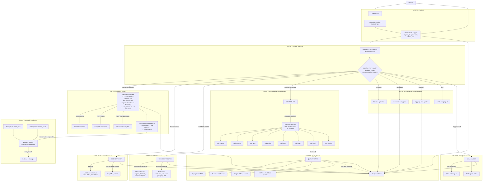
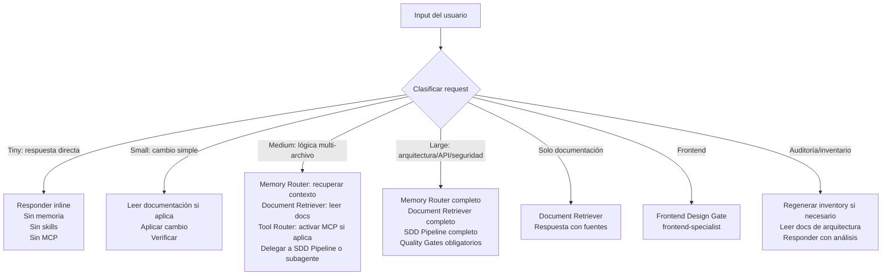

# Target Architecture — Arquitectura Objetivo

## 1. Principios arquitectónicos

1. **Un solo orquestador primario por defecto**: Manager como router/decisor principal.
2. **Manager como router, no ejecutor universal**: Decide, clasifica, delega. No ejecuta trabajo que deba hacer un subagente.
3. **gentle-orchestrator como SDD Pipeline especializado**: No compite como primary. Se invoca explícitamente para SDD.
4. **Engram para memoria gobernada**: Solo decisiones, bugs, aprendizajes y estado útil. Nada de ruido.
5. **Markdown versionado como fuente de verdad**: Arquitectura, ADRs, planes, diagramas, especificaciones cerradas.
6. **Skill registry como índice de capacidades**: No es memoria semántica ni reemplaza documentación.
7. **Inventory como catálogo técnico generado**: No es contexto permanente ni se inyecta automáticamente.
8. **MCP bajo demanda**: No como superficie siempre activa. Activar por intención.
9. **Subagentes con contexto mínimo**: Reciben solo lo necesario, devuelven outputs compactos.
10. **Medir antes de optimizar**: No hay optimización sin datos.
11. **Gobernanza de memoria**: Guardar, actualizar, invalidar y no guardar tienen reglas claras.
12. **Reducir tokens fijos, aumentar contexto recuperado por intención**.

## 2. Diagrama de arquitectura objetivo

## 3. Responsabilidades objetivo por componente

| Componente | Responsabilidad objetivo | NO debe hacer | Entrada | Salida | Métrica de éxito |
|-----------|------------------------|---------------|---------|--------|-----------------|
| **Manager** | Router principal: clasificar, decidir ruta, delegar, sintetizar | No ejecutar implementación compleja inline. No ser ejecutor universal. | Prompt usuario + contexto | Respuesta final o delegación | % de requests clasificados correctamente. Tiempo de respuesta. |
| **Memory Router** | Decidir si recuperar memoria, qué buscar, cuánto recuperar. Gobernar guardado. **DECISIÓN PROPUESTA: capacidad lógica dentro del Manager, no subagente separado.** | No guardar ruido. No recuperar sin query. No recuperar más de 3 observaciones por defecto. | Intención del request + contexto | Memorias relevantes o decisión de no recuperar | Relevancia de memorias recuperadas. Ratio señal/ruido. |
| **Document Retriever** | Leer Markdown versionado bajo demanda según intención. | No leer todo el doc sin necesidad. No leer docs no relevantes. | Query de búsqueda + paths conocidos | Contenido relevante del documento | % de docs correctamente identificados para la tarea. |
| **Tool/MCP Router** | Activar MCP solo cuando el request lo requiera. Mantener tool surface mínima por defecto. | No activar MCP sin necesidad. No exponer tools que no se usarán. | Clasificación del request + capacidades MCP conocidas | MCP activados o decisión de no activar | Reducción de tokens de schemas. Latencia promedio. |
| **SDD Pipeline (gentle-orch)** | Ejecutar pipeline SDD completo cuando Manager lo invoque explícitamente. No es primary. | No responder como default. No ejecutar inline fuera de SDD. | Orden de Manager + contexto mínimo | Artefactos SDD + verificación | % de fases completadas. Calidad de artefactos. |
| **data-memory-curator** | Subagente existente para sincronizar capas de memoria. **No incluido en diagrama objetivo — pendiente de decidir si se integra con Memory Router o se depreca.** | No orquestar, no desviarse de su especialidad. | Instrucciones específicas | Output de sincronización | — |
| **Subagentes SDD** | Ejecutar su fase específica, NO delegar, retornar envelope. | No delegar, no expandir scope, no modificar fases ajenas. | Contexto de fase + inputs de fase anterior | Envelope con status/summary/next | Tiempo por fase. % de retornos exitosos. |
| **Subagentes especializados** | Ejecutar tareas especializadas (frontend, seguridad, BQ, SQL). | No orquestar, no desviarse de su especialidad. | Instrucciones específicas + contexto mínimo | Output especializado | Calidad del output especializado. |
| **Engram** | Memoria persistente gobernada. Solo datos útiles y gobernados. | No guardar prompts completos. No guardar ruido exploratorio. No ser la única fuente de verdad. | mem_save con gobernanza | Observaciones persistentes | Ratio de observaciones útiles. Frecuencia de retrieval exitoso. |
| **Markdown docs** | Fuente de verdad para arquitectura, ADRs, roadmaps, planes. | No ser contexto inyectado siempre. No reemplazar código. | Lectura bajo demanda | Información estructurada | % de decisiones documentadas vs implementadas. |
| **Skill registry** | Índice de skills con triggers y paths. | No ser memoria semántica. No reemplazar documentación. | gentle-ai skill-registry refresh | Lista de skills indexadas | Tiempo desde instalación hasta indexación. |
| **Inventory** | Catálogo técnico generado para consulta humana. | No inyectarse como contexto automático. | generate-static-inventory.mjs | Catálogo actualizado | Frecuencia de actualización vs cambios reales. |

## 4. Flujo de decisión del Manager objetivo

## 5. Diferencias clave vs arquitectura actual

| Aspecto | Actual | Objetivo |
|---------|--------|----------|
| Orquestador primario | 2 (Manager + gentle-orch) | 1 (Manager) |
| gentle-orchestrator | Primary competidor | SDD Pipeline invocable |
| Contexto fijo | ~18,500–22,000 tokens (estimación revisada, no ~29k) | ~15,000-18,000 tokens |
| Instrucciones de memoria | 3 fuentes duplicadas | 1 fuente consolidada |
| MCP | Siempre activos | Bajo demanda |
| Design skills protocol | Siempre inyectado | Skill bajo demanda |
| Memoria Engram | Sin gobernanza, DB vacía | Gobernada, solo datos útiles |
| Observabilidad | No existe | Logging mínimo por request |
| Tests de flujo | No existen | Escenarios reproducibles |
| Subagentes faltantes | Referenciados pero no existen | Implementados o documentados como no disponibles |
| Secretos en config | 2 expuestos | Variables de entorno |
| Inventory | Cache sin refresh | Regeneración periódica |
| Documentación | Dispersa | docs/ centralizada con ADRs |
