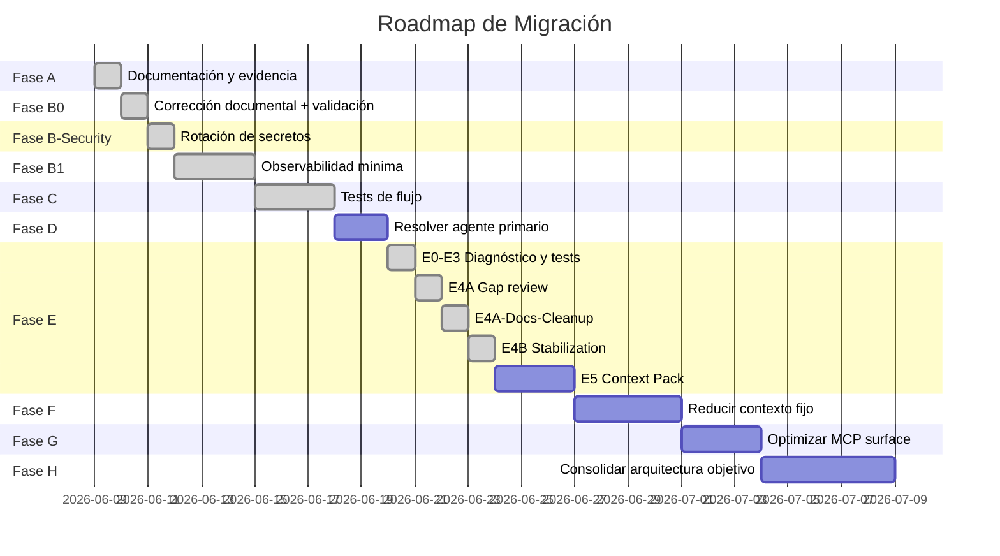

# Migration Roadmap — Roadmap de Migración

> No propone una reescritura grande. Usa fases incrementales, cada una con criterio de salida claro.

## Fase A — Documentación y Evidencia

| Aspecto | Detalle |
|---------|---------|
| **Objetivo** | Tener foto actual consolidada, clasificada y validada |
| **Cambios permitidos** | Solo archivos .md en `docs/opencode-architecture/` |
| **Archivos probables** | `docs/opencode-architecture/*.md`, `docs/opencode-architecture/adr/*.md` |
| **Riesgo** | 🟢 Bajo: solo documentación |
| **Prueba de aceptación** | Todos los docs creados, hallazgos clasificados, ADRs propuestos |
| **Duración estimada** | 1-2 sesiones |

### Tareas

1. ✅ Crear estructura de carpetas (completado en este documento)
2. ✅ Documentar foto actual (01-current-state-map)
3. ✅ Documentar flujo (02-request-response-flow)
4. ✅ Documentar responsabilidades (03-agent-responsibility-map)
5. ✅ Documentar memoria (04-memory-context-map)
6. ✅ Documentar tokens (05-token-cost-map)
7. ✅ Documentar tools/MCP/skills (06-tools-mcp-skills-map)
8. ✅ Registrar evidencia (07-evidence-register)
9. ✅ Registrar conflictos (08-conflicts-and-open-questions)
10. ✅ Registrar riesgos (09-risk-register)
11. ✅ Proponer arquitectura objetivo (10-target-architecture)
12. ✅ Proponer modelo de optimización (11-memory-and-token-optimization-model)
13. ✅ Diseñar roadmap (este documento)
14. ✅ Diseñar plan de pruebas (13-validation-test-plan)
15. ✅ Escribir ADRs
16. ⬜ **Revisión y aprobación por el usuario**

## Fase B-Security — Rotación y Externalización de Secretos ✅ COMPLETADA

> Ejecutada y resuelta antes de Fase B1. R11 mitigado.

| Aspecto | Detalle |
|---------|---------|
| **Objetivo** | Eliminar secretos expuestos en texto plano de config.toml |
| **Cambios realizados** | GitHub PAT actualizado. Browserbase eliminado del config. 5 backups eliminados. |
| **Archivos afectados** | `config.toml` (~/.codex/) — línea 112 actualizada, sección browserbase eliminada |
| **Riesgo** | 🟢 Resuelto. Sin secretos expuestos. |
| **Prueba de aceptación** | ✅ Sin secretos en texto plano. Git history limpio. Backups eliminados. |

### Tareas ejecutadas

1. ✅ GitHub PAT actualizado (nuevo token proporcionado por usuario).
2. ✅ Browserbase API key eliminado del config (ya no necesario).
3. ✅ 5 backups con secretos eliminados de `~/.codex/`.
4. ✅ Git history revisado — sin fugas.
5. ✅ Sin rastros del token viejo en `~/.codex/`.
6. ⬜ Variables de entorno: no implementado (decisión del usuario: personal project, token directo en config).

---

## Fase B1 — Observabilidad Mínima ✅ COMPLETADA

| Aspecto | Detalle |
|---------|---------|
| **Objetivo** | Medir flujo real sin cambiar lógica del sistema |
| **Cambios permitidos** | Solo documentación y scripts read-only. NO cambiar lógica agente/prompt/config |
| **Archivos probables** | `docs/opencode-architecture/18-observability-design.md`, `docs/opencode-architecture/baselines/` |
| **Riesgo** | 🟢 Bajo: solo documentación y scripts read-only |
| **Prueba de aceptación** | Test 8 (token baseline), Test 1 (primary real), Test 5 (SDD routing) ejecutados y documentados |

### Métricas a capturar por request (diseño — ver 18-observability-design.md)

```json
{
  "request_id": "uuid",
  "timestamp": "ISO-8601",
  "input_type": "tiny | small | memory | docs | mcp | sdd | noisy",
  "agent_selected": "manager | gentle-orchestrator | unknown",
  "primary_resolution_method": "runtime | logs | inferred | not_validated",
  "manager_decision": "tiny | small | medium | large | not_available",
  "routing_path": ["manager", "memory", "docs", "mcp", "subagent", "sdd"],
  "tools_called": [],
  "mcp_called": [],
  "skills_loaded": [],
  "subagents_called": [],
  "memory_read": false,
  "memory_written": false,
  "documents_read": [],
  "estimated_fixed_context_tokens": null,
  "estimated_dynamic_context_tokens": null,
  "estimated_output_tokens": null,
  "total_estimated_tokens": null,
  "execution_time_ms": null,
  "errors": [],
  "final_response_summary": ""
}
```

## Fase C — Tests de Flujo

| Aspecto | Detalle |
|---------|---------|
| **Objetivo** | Crear escenarios reproducibles que validen el comportamiento del sistema |
| **Cambios permitidos** | Solo scripts de test (no modificar agentes/config) |
| **Archivos probables** | `tests/flows/` con scripts o prompts de prueba |
| **Riesgo** | 🟢 Bajo: scripts de prueba |
| **Prueba de aceptación** | 8 escenarios del plan (13-validation-test-plan) ejecutables y documentados |

### Escenarios mínimos

1. Request simple (Tiny) — verificar overhead mínimo
2. Request con memoria — verificar recuperación
3. Request con documento — verificar lectura de docs
4. Request con MCP — verificar tool routing
5. Request SDD — verificar pipeline
6. Request ruidoso — verificar clasificación
7. Contradicción de memoria — verificar invalidation
8. Token baseline — medir overhead real

## Fase D — Resolver Agente Primario

| Aspecto | Detalle |
|---------|---------|
| **Objetivo** | Eliminar ambigüedad Manager vs gentle-orchestrator |
| **Cambios permitidos** | Modificar `opencode.json` (cambiar mode de gentle-orch) + prompts |
| **Archivos probables** | `opencode.json`, AGENTS.md, gentle-orch prompt |
| **Riesgo** | 🟡 Medio: cambiar configuración de agente |
| **Prueba de aceptación** | Solo Manager responde como default. gentle-orch responde solo con mención explícita |

### Decisión propuesta (ADR-001)
- **Manager**: mantener como único `mode: "primary"` por defecto.
- **gentle-orchestrator**: cambiar a `mode: "subagent"` o eliminar su modo primary. Mantenerlo como agente invocable explícitamente para SDD.
- Si se elimina el primary de gentle-orch, actualizar su prompt para reflejar que es un SDD Pipeline invocable, no un orquestador general.

## Fase E — Gobernanza de Memoria (en curso)

| Aspecto | Detalle |
|---------|---------|
| **Objetivo** | Diagnosticar, estabilizar y gobernar Engram como memoria persistente real |
| **Cambios permitidos** | opencode.json, opencode.jsonc (pin binario + project name), documentación, contratos |
| **Archivos probables** | `opencode.json`, `opencode.jsonc`, docs de test-runs, README raíz, docs/contratos |
| **Riesgo** | 🟢 Bajo-Medio |
| **Prueba de aceptación (global)** | E4B-T1 a T7 PASSED. E5 contratos definidos. E6 noise gate definido |

### Subfases ejecutadas (E0–E4B)

| Subfase | Estado | Resultado |
|---------|--------|-----------|
| **E0** — Diagnóstico Engram | ✅ | Store real identificado (`~/.engram/engram.db`); `.codex/memories_1.sqlite` NO es store semántico |
| **E1** — Pruebas controladas | ✅ | 7 tests (E-T1 a E-T7) con scope TEST-E-MEMORY-GOVERNANCE: todos PASSED |
| **E2** — Root cause analysis | ✅ | Engram **sí persiste**; problema real es gobernanza/config duplicada/ruido/drift |
| **E3** — Change plan | ✅ | Propuesta mínima de reparación documentada |
| **E4A** — Gap review | ✅ | Revisión read-only de brechas: Context Pack, Read Escalation, métricas, Hybrid Retrieval |
| **E4A-Docs-Cleanup** | ✅ | README raíz reescrito; docs README convertido a índice mínimo |
| **E4A-Docs-Cleanup-v2** | ✅ | README raíz enriquecido como entrada completa del proyecto |
| **E4B** — Engram stabilization | ✅ **Completada** | Pin a v1.16.1 + `--project=opencode-architecture`. Tests T1-T7 PASSED. Doctor OK |

### Subfases pendientes

| Subfase | Estado | Objetivo |
|---------|--------|----------|
| **E5** | **▶️ En curso** | Context Pack, Intake/Noise Cleaner, Memory Retriever/Writer/Validator, Read Escalation, Quality Metrics, Tests E5-T1 a T7 |
| **E6** | ⏳ Pendiente | Prompt capture / noise gate

## Fase F — Reducir Contexto Fijo

| Aspecto | Detalle |
|---------|---------|
| **Objetivo** | Mover instrucciones largas a docs/skills bajo demanda |
| **Cambios permitidos** | AGENTS.md (recortar), prompts de agente, mover contenido a skills/docs |
| **Archivos probables** | AGENTS.md (.config), AGENTS.md (.codex), nuevas skills bajo demanda |
| **Riesgo** | 🟡 Medio: prompts más cortos pueden perder comportamiento |
| **Prueba de aceptación** | Reducción de ~29k a ~15-18k tokens fijos. Comportamiento no degradado |

### Tareas

1. Mover Design Skills Protocol de AGENTS.md a skill bajo demanda (`frontend-design-gate` skill).
2. Reducir available skills list a solo triggers relevantes al proyecto actual (no los 48 globales).
3. Mover secciones de AGENTS.md (.codex) que no son críticas a docs/.
4. Compactar AGENTS.md (.config): remover secciones que viven en plugin.
5. Desduplicar y consolidar instrucciones de memoria (continuación de Fase E).

## Fase G — Optimizar MCP/Tool Surface

| Aspecto | Detalle |
|---------|---------|
| **Objetivo** | Activar herramientas por necesidad, no siempre |
| **Cambios permitidos** | Config de MCP en opencode.json, opencode.jsonc, config.toml |
| **Archivos probables** | `opencode.json`, `opencode.jsonc`, `config.toml` |
| **Riesgo** | 🟡 Medio: MCP que no se active puede causar errores si se necesita |
| **Prueba de aceptación** | MCP se activan solo cuando el request lo requiere. Reducción de tokens de schemas. |

### Tareas

1. Consolidar MCP duplicados (Engram x3, Playwright x3, Context7 x2).
2. Decidir estrategia de activación: ¿plugin que activa MCP según intención? ¿o configuración manual?
3. Mover secretos expuestos (GitHub token, Browserbase key) a variables de entorno.
4. Evaluar si todos los MCP son necesarios o algunos pueden eliminarse.

## Fase H — Consolidar Arquitectura Objetivo

| Aspecto | Detalle |
|---------|---------|
| **Objetivo** | Implementar cambios arquitectónicos con tests de validación |
| **Cambios permitidos** | Config, prompts, plugins, skills (todo) |
| **Archivos probables** | Todos los relevantes |
| **Riesgo** | 🔴 Alto: cambios significativos |
| **Prueba de aceptación** | Arquitectura objetivo implementada y validada con tests de flujo |

### Tareas

1. Implementar cambios de ADRs aprobados.
2. Implementar observabilidad permanente.
3. Implementar modelo de memoria gobernada.
4. Implementar lazy-load de skills completo.
5. Implementar MCP bajo demanda.
6. Ejecutar test plan completo.
7. Documentar lecciones aprendidas y actualizar docs.

## 2. Resumen de fases



## 3. Tabla consolidada de fases

| Fase | Objetivo | Cambios permitidos | Archivos probables | Riesgo | Prueba de aceptación |
|------|----------|-------------------|-------------------|--------|---------------------|
| **A** | Documentación y evidencia | Solo .md en docs/ | docs/opencode-architecture/*.md | 🟢 Bajo | Todos los docs creados, hallazgos clasificados |
| **B0** | Corrección documental + validación read-only | Solo .md en docs/ + comandos read-only | docs/opencode-architecture/*.md | 🟢 Bajo | Contradicciones corregidas, validaciones registradas |
| **B-Security** | Rotación y externalización de secretos | config.toml | ~/.codex/config.toml | 🟢 **Completado** | ✅ Sin secretos expuestos. Git history limpio. |
| **B1** | Observabilidad mínima | Solo documentación + scripts read-only | docs/opencode-architecture/18-observability-design.md, baselines/ | 🟢 **Completado** | ✅ Tests 8, 1, 5 ejecutados y documentados. Sin sobreorquestación en Tiny. |
| **C** | Tests de flujo | Solo reportes Markdown + ejecución controlada | docs/opencode-architecture/test-runs/C-flow-tests-2026-06-09/ | 🟢 **Completado** | ✅ T2/T3/T4/T6/T7 PASSED; T5 PARTIAL |

### Resultado Fase C (2026-06-09)

| Test | Estado | Implicación |
|---|---|---|
| T2 | PASSED | Memory Flow operativo, persistence pendiente |
| T3 | PASSED | Markdown docs funcionan como fuente de verdad |
| T4 | PASSED | Context7 bajo demanda funciona |
| T5 | PARTIAL | Fase D debe resolver conflicto Manager ↔ gentle-orchestrator |
| T6 | PASSED | Manager maneja ruido sin sobreorquestar |
| T7 | PASSED | Contradicción ficticia manejada sin contaminar memoria real |
| **D** | Resolver agente primario | opencode.json | .config/opencode/opencode.json | 🟢 **Completado** | ✅ gentle-orchestrator.mode = subagent. D-T1, D-T3, D-T5 PASSED |
| **E** | Gobernanza de memoria Engram | opencode.json, opencode.jsonc, docs | Config OpenCode, docs/ | 🟢 **En curso** | ✅ E0-E4B completados. E5 contratos definidos. E6 noise gate pendiente |
| **E5** | Context Pack (en curso) | Documentación + contratos | docs/ | 🟡 Medio | Contrato Context Pack definido, Memory Writer/Validator operacional |
| **F** | Token optimization | AGENTS.md, skills, prompts | AGENTS.md, skills/ | 🟡 Medio | ~18.5–22k → ~8.5-9.5k tokens fijos |
| **G** | Config consolidation | opencode.json, .jsonc, config.toml | Config OpenCode | 🟡 Medio | gentle-orch mode: subagent. Config única. |
| **H** | Consolidar arquitectura | Todo | Todos | 🔴 Alto | Arquitectura objetivo implementada y testeada |

## 4. Dependencias entre fases


> **Nota**: B0, B-Security y B1 deben ejecutarse secuencialmente (validar, asegurar, medir). A partir de C, las fases pueden solaparse si los recursos lo permiten.

---

## Estado D — Manager ↔ gentle transition (2026-06-09)

| Paso | Estado | Evidencia |
|---|---|---|
| D0 auditoría | ✅ Completado | `test-runs/D-manager-gentle-transition-2026-06-09/D0-pre-change-audit.md` |
| D1/D2 plan y diff | ✅ Aprobado | `D1-change-plan.md`, `D2-diff-review.md` |
| D3 implementación | ✅ Aplicado | `gentle-orchestrator.mode = subagent`; JSON válido |
| D4 tests post-cambio | ✅ Completado | D-T1, D-T5-read-only, D-T5-pipeline-dry-run y D-T3 PASSED |

Fase D completada. Fase E (E0-E4B) completada. Próximo paso recomendado: **Fase E5 — Context Pack**. Fase F queda NO-GO hasta completar E5 y estabilizar contrato de contexto.
