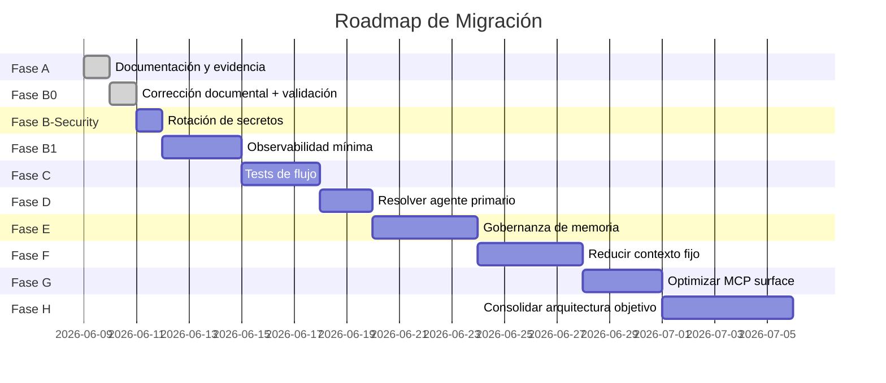

# Migration Roadmap — Roadmap de Migración

> No propone una reescritura grande. Usa fases incrementales, cada una con criterio de salida claro.

## Fase A — Documentación y Evidencia

| Aspecto | Detalle |
|---------|---------|
| **Objetivo** | Tener foto actual consolidada, clasificada y validada |
| **Cambios permitidos** | Solo archivos .md en `docs/opencode-architecture/` |
| **Archivos probables** | `docs/opencode-architecture/*.md`, `docs/opencode-architecture/adr/*.md` |
| **Riesgo** | 🟢 Bajo: solo documentación |
| **Prueba de aceptación** | Todos los docs creados, hallazgos clasificados, ADRs propuestos |
| **Duración estimada** | 1-2 sesiones |

### Tareas

1. ✅ Crear estructura de carpetas (completado en este documento)
2. ✅ Documentar foto actual (01-current-state-map)
3. ✅ Documentar flujo (02-request-response-flow)
4. ✅ Documentar responsabilidades (03-agent-responsibility-map)
5. ✅ Documentar memoria (04-memory-context-map)
6. ✅ Documentar tokens (05-token-cost-map)
7. ✅ Documentar tools/MCP/skills (06-tools-mcp-skills-map)
8. ✅ Registrar evidencia (07-evidence-register)
9. ✅ Registrar conflictos (08-conflicts-and-open-questions)
10. ✅ Registrar riesgos (09-risk-register)
11. ✅ Proponer arquitectura objetivo (10-target-architecture)
12. ✅ Proponer modelo de optimización (11-memory-and-token-optimization-model)
13. ✅ Diseñar roadmap (este documento)
14. ✅ Diseñar plan de pruebas (13-validation-test-plan)
15. ✅ Escribir ADRs
16. ⬜ **Revisión y aprobación por el usuario**

## Fase B-Security — Rotación y Externalización de Secretos

> ⚠️ **Corrección Fase B0**: R11 (secretos expuestos) clasificado como 🔴 ALTO. Debe mitigarse ANTES de observabilidad, memoria, MCP o cambios arquitectónicos.

| Aspecto | Detalle |
|---------|---------|
| **Objetivo** | Eliminar secretos expuestos en texto plano de config.toml |
| **Cambios permitidos** | Solo modificar config.toml (mover a env vars) y .gitignore. NO cambiar lógica de agentes/MCP/plugins |
| **Archivos probables** | `config.toml`, `.gitignore`, documentación de entorno |
| **Riesgo** | 🟡 Medio: cambiar configuración puede romper MCP que dependen de los valores actuales |
| **Prueba de aceptación** | GitHub token y Browserbase API key no están en texto plano en ningún archivo de configuración |

### Tareas

1. Revocar/rotar GitHub PAT (config.toml línea 112).
2. Revocar/rotar Browserbase API key (config.toml línea 126).
3. Mover ambos a variables de entorno (`GITHUB_TOKEN`, `BROWSERBASE_API_KEY`).
4. Actualizar referencias en config.toml para usar variables de entorno.
5. Verificar que no hay impresión de secretos en logs, prompts o docs.
6. Revisar historial Git por commits con secretos (si aplica a repos compartidos).
7. Documentar en README las variables de entorno requeridas.

---

## Fase B1 — Observabilidad Mínima

| Aspecto | Detalle |
|---------|---------|
| **Objetivo** | Medir flujo real sin cambiar lógica del sistema |
| **Cambios permitidos** | Solo añadir logging/métricas. NO cambiar lógica agente/prompt |
| **Archivos probables** | Plugin de observabilidad, hooks en engram.ts o background-agents.ts |
| **Riesgo** | 🟡 Medio: agregar código a plugins existentes |
| **Prueba de aceptación** | Cada request produce métricas: request_id, agent, tools, memory, tokens, tiempo |

### Métricas a capturar por request

```json
{
  "request_id": "uuid",
  "timestamp": "ISO datetime",
  "agent_selected": "manager | gentle-orchestrator | frontend-specialist",
  "manager_decision": "tiny | small | medium | large",
  "tools_called": ["read", "write", "edit", "bash", "task", "skill", ...],
  "mcp_called": ["engram", "context7", "notebooklm", ...],
  "memory_read": true/false,
  "memory_written": true/false,
  "context_sources": ["AGENTS.md (.config)", "AGENTS.md (.codex)", "skills list", "engram plugin"],
  "estimated_context_tokens": 29000,
  "execution_time_ms": 12345,
  "final_response_summary": "Texto de la respuesta o summary"
}
```

## Fase C — Tests de Flujo

| Aspecto | Detalle |
|---------|---------|
| **Objetivo** | Crear escenarios reproducibles que validen el comportamiento del sistema |
| **Cambios permitidos** | Solo scripts de test (no modificar agentes/config) |
| **Archivos probables** | `tests/flows/` con scripts o prompts de prueba |
| **Riesgo** | 🟢 Bajo: scripts de prueba |
| **Prueba de aceptación** | 8 escenarios del plan (13-validation-test-plan) ejecutables y documentados |

### Escenarios mínimos

1. Request simple (Tiny) — verificar overhead mínimo
2. Request con memoria — verificar recuperación
3. Request con documento — verificar lectura de docs
4. Request con MCP — verificar tool routing
5. Request SDD — verificar pipeline
6. Request ruidoso — verificar clasificación
7. Contradicción de memoria — verificar invalidation
8. Token baseline — medir overhead real

## Fase D — Resolver Agente Primario

| Aspecto | Detalle |
|---------|---------|
| **Objetivo** | Eliminar ambigüedad Manager vs gentle-orchestrator |
| **Cambios permitidos** | Modificar `opencode.json` (cambiar mode de gentle-orch) + prompts |
| **Archivos probables** | `opencode.json`, AGENTS.md, gentle-orch prompt |
| **Riesgo** | 🟡 Medio: cambiar configuración de agente |
| **Prueba de aceptación** | Solo Manager responde como default. gentle-orch responde solo con mención explícita |

### Decisión propuesta (ADR-001)
- **Manager**: mantener como único `mode: "primary"` por defecto.
- **gentle-orchestrator**: cambiar a `mode: "subagent"` o eliminar su modo primary. Mantenerlo como agente invocable explícitamente para SDD.
- Si se elimina el primary de gentle-orch, actualizar su prompt para reflejar que es un SDD Pipeline invocable, no un orquestador general.

## Fase E — Gobernanza de Memoria

| Aspecto | Detalle |
|---------|---------|
| **Objetivo** | Definir qué se guarda, dónde y cuándo. Reparar pipeline Engram |
| **Cambios permitidos** | Modificar engram.ts (filtros), AGENTS.md (desduplicar protocolo) |
| **Archivos probables** | `plugins/engram.ts`, AGENTS.md (.config y .codex) |
| **Riesgo** | 🟡 Medio: modificar plugin activo |
| **Prueba de aceptación** | mem_save persiste observaciones. Session summary persiste. DB tiene datos útiles |

### Tareas

1. Diagnosticar por qué `memories_1.sqlite` está vacía (no tiene tabla observations, solo tablas internas de pipeline).
2. Reparar pipeline de guardado (puede ser MCP, permisos o configuración).
3. Consolidar instrucciones Engram: Markdown versionado (engram-instructions.md) como fuente de verdad; plugin engram.ts como mecanismo runtime; remover de AGENTS.md.
4. Implementar filtro de guardado: no guardar prompts completos automáticamente.
5. Validar que `mem_session_summary` funciona correctamente.
6. Establecer política de guardado según sección 4 de 04-memory-context-map.md.

## Fase F — Reducir Contexto Fijo

| Aspecto | Detalle |
|---------|---------|
| **Objetivo** | Mover instrucciones largas a docs/skills bajo demanda |
| **Cambios permitidos** | AGENTS.md (recortar), prompts de agente, mover contenido a skills/docs |
| **Archivos probables** | AGENTS.md (.config), AGENTS.md (.codex), nuevas skills bajo demanda |
| **Riesgo** | 🟡 Medio: prompts más cortos pueden perder comportamiento |
| **Prueba de aceptación** | Reducción de ~29k a ~15-18k tokens fijos. Comportamiento no degradado |

### Tareas

1. Mover Design Skills Protocol de AGENTS.md a skill bajo demanda (`frontend-design-gate` skill).
2. Reducir available skills list a solo triggers relevantes al proyecto actual (no los 48 globales).
3. Mover secciones de AGENTS.md (.codex) que no son críticas a docs/.
4. Compactar AGENTS.md (.config): remover secciones que viven en plugin.
5. Desduplicar y consolidar instrucciones de memoria (continuación de Fase E).

## Fase G — Optimizar MCP/Tool Surface

| Aspecto | Detalle |
|---------|---------|
| **Objetivo** | Activar herramientas por necesidad, no siempre |
| **Cambios permitidos** | Config de MCP en opencode.json, opencode.jsonc, config.toml |
| **Archivos probables** | `opencode.json`, `opencode.jsonc`, `config.toml` |
| **Riesgo** | 🟡 Medio: MCP que no se active puede causar errores si se necesita |
| **Prueba de aceptación** | MCP se activan solo cuando el request lo requiere. Reducción de tokens de schemas. |

### Tareas

1. Consolidar MCP duplicados (Engram x3, Playwright x3, Context7 x2).
2. Decidir estrategia de activación: ¿plugin que activa MCP según intención? ¿o configuración manual?
3. Mover secretos expuestos (GitHub token, Browserbase key) a variables de entorno.
4. Evaluar si todos los MCP son necesarios o algunos pueden eliminarse.

## Fase H — Consolidar Arquitectura Objetivo

| Aspecto | Detalle |
|---------|---------|
| **Objetivo** | Implementar cambios arquitectónicos con tests de validación |
| **Cambios permitidos** | Config, prompts, plugins, skills (todo) |
| **Archivos probables** | Todos los relevantes |
| **Riesgo** | 🔴 Alto: cambios significativos |
| **Prueba de aceptación** | Arquitectura objetivo implementada y validada con tests de flujo |

### Tareas

1. Implementar cambios de ADRs aprobados.
2. Implementar observabilidad permanente.
3. Implementar modelo de memoria gobernada.
4. Implementar lazy-load de skills completo.
5. Implementar MCP bajo demanda.
6. Ejecutar test plan completo.
7. Documentar lecciones aprendidas y actualizar docs.

## 2. Resumen de fases



## 3. Tabla consolidada de fases

| Fase | Objetivo | Cambios permitidos | Archivos probables | Riesgo | Prueba de aceptación |
|------|----------|-------------------|-------------------|--------|---------------------|
| **A** | Documentación y evidencia | Solo .md en docs/ | docs/opencode-architecture/*.md | 🟢 Bajo | Todos los docs creados, hallazgos clasificados |
| **B0** | Corrección documental + validación read-only | Solo .md en docs/ + comandos read-only | docs/opencode-architecture/*.md | 🟢 Bajo | Contradicciones corregidas, validaciones registradas |
| **B-Security** | Rotación y externalización de secretos | config.toml, .gitignore, env vars | config.toml, .gitignore | 🟡 Medio | Sin secretos en texto plano en config |
| **B1** | Observabilidad mínima | Solo añadir logging/métricas | Plugin observabilidad | 🟡 Medio | Cada request produce métricas |
| **C** | Tests de flujo | Solo scripts de test | tests/flows/* | 🟢 Bajo | 8 escenarios ejecutables |
| **D** | Consolidar MCP y skills | opencode.json, MCP, skills | Config MCP, skills/ | 🟡 Medio | MCP consolidados, skills bajo demanda |
| **E** | Reparar memoria Engram | engram.ts, AGENTS.md | plugins/engram.ts, AGENTS.md | 🟡 Medio | mem_save persiste observaciones |
| **F** | Token optimization | AGENTS.md, skills, prompts | AGENTS.md, skills/ | 🟡 Medio | ~18.5–22k → ~8.5-9.5k tokens fijos |
| **G** | Config consolidation | opencode.json, .jsonc, config.toml | Config OpenCode | 🟡 Medio | gentle-orch mode: subagent. Config única. |
| **H** | Consolidar arquitectura | Todo | Todos | 🔴 Alto | Arquitectura objetivo implementada y testeada |

## 4. Dependencias entre fases


> **Nota**: B0, B-Security y B1 deben ejecutarse secuencialmente (validar, asegurar, medir). A partir de C, las fases pueden solaparse si los recursos lo permiten.
