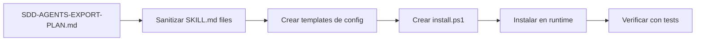
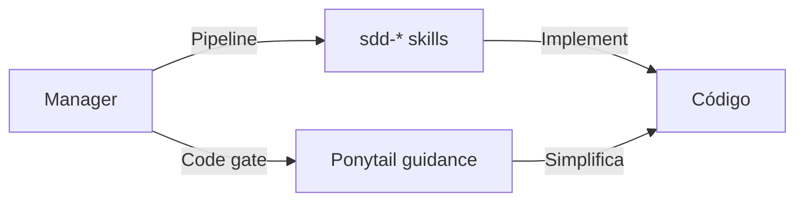
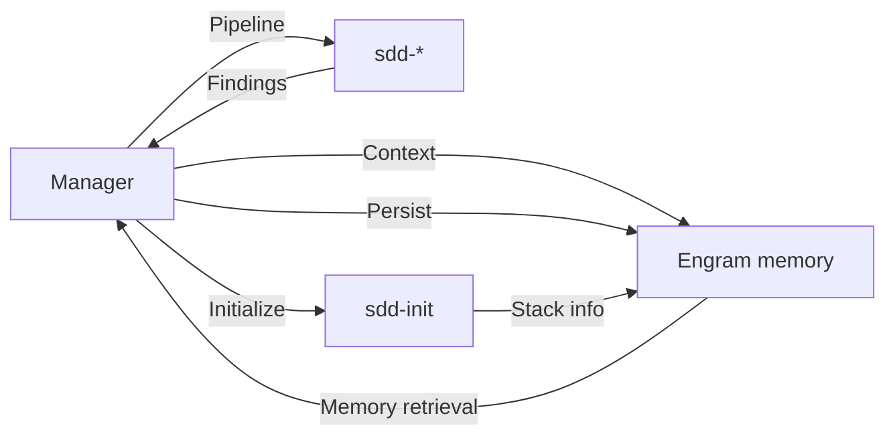

# SDD Agents Export Plan

> **Fecha:** 2026-06-17
> **Propósito:** Definir cómo se exportan los subagentes SDD, gentle-orchestrator y Ponytail al nuevo repositorio `proyecto-opencode-mem`.

---

## 1. ¿Qué agentes/subagentes se exportan?

| Agente | ¿Exportar? | Tipo de exportación | Perfil destino |
|--------|:----------:|---------------------|:--------------:|
| **Manager** (como skill) | ✅ Sí | SKILL.md sanitizado + config template | `full` |
| **gentle-orchestrator** (config) | ✅ Sí | Template de configuración | `full` |
| **sdd-init** | ✅ Sí | SKILL.md sanitizado | `full` / `sdd` |
| **sdd-explore** | ✅ Sí | SKILL.md sanitizado | `full` / `sdd` |
| **sdd-propose** | ✅ Sí | SKILL.md sanitizado | `full` / `sdd` |
| **sdd-spec** | ✅ Sí | SKILL.md sanitizado | `full` / `sdd` |
| **sdd-design** | ✅ Sí | SKILL.md sanitizado | `full` / `sdd` |
| **sdd-tasks** | ✅ Sí | SKILL.md sanitizado | `full` / `sdd` |
| **sdd-apply** | ✅ Sí | SKILL.md sanitizado | `full` / `sdd` |
| **sdd-verify** | ✅ Sí | SKILL.md sanitizado | `full` / `sdd` |
| **sdd-archive** | ✅ Sí | SKILL.md sanitizado | `full` / `sdd` |
| **sdd-onboard** | ✅ Sí | SKILL.md sanitizado | `full` / `sdd` |

---

## 2. ¿Qué se exporta como template?

| Componente | Template | Destino |
|------------|----------|---------|
| Manager prompt | Extracto de AGENTS.md | `templates/AGENTS.example.md` |
| gentle-orchestrator config | Config de opencode.json | `templates/opencode.example.json` |
| SDD subagents config | Config de opencode.json | `templates/opencode.example.json` |
| Ponytail Code Gate section | Sección de AGENTS.md | `templates/AGENTS.example.md` |

---

## 3. ¿Qué depende del runtime actual?

| Componente | Dependencia runtime | Notas |
|------------|:-------------------:|-------|
| Manager prompt | ✅ AGENTS.md | Se exporta como template sanitizado |
| gentle-orchestrator prompt | ✅ opencode.json | La config de subagent con permisos a sdd-* es específica del runtime |
| SDD executor override | ✅ opencode.json | `hidden: true`, `tools` específicos, `mode: subagent` |
| Permisos de subagentes | ✅ opencode.json | `sdd-*` sin `task: allow` — depende de la config |
| Ponytail Code Gate | ⚠️ AGENTS.md | Guidance-only. Funciona sin plugin. |

---

## 4. ¿Cómo se instala en `proyecto-opencode-mem`?

| Paso | Acción | Script |
|:----:|--------|--------|
| 1 | Copiar skills SDD a `skills/` | `install.ps1 -Components skills` |
| 2 | Configurar subagentes en opencode.json | Manual (template → real) |
| 3 | Copiar sección Ponytail a AGENTS.md | Manual (template → real) |
| 4 | Verificar instalación | `validate-install.ps1` |

---

## 5. ¿Cómo se testea?

| Test | Descripción |
|------|-------------|
| Skills SDD tienen frontmatter válido | Verificar YAML de cada SKILL.md |
| Skills SDD no tienen paths personales | Sanitization check |
| Config template incluye todos los subagentes | Verificar opencode.example.json |
| No hay referencia a gentle-ai en skills SDD | Grep "gentle-ai" en skills/ |
| Manager template menciona Ponytail como guidance | Verificar AGENTS.example.md |
| Los 10 skills SDD existen en skills/ | Directory listing |

---

## 6. ¿Qué perfiles incluyen SDD agents?

| Perfil | Incluye SDD agents | Notas |
|--------|:------------------:|-------|
| `core` | ❌ No | Solo Manager + Engram + Noise Gate |
| `full` | ✅ Sí | Todos los sdd-* + gentle-orchestrator config |
| `sdd` | ✅ Sí | Solo los sdd-* (sin Manager config) |
| `memory-enabled` | ❌ No | Solo Engram + memoria |
| `ponytail-code-gate` | ❌ No | Solo guidance de Ponytail |
| `gentle-alignment` | ❌ No | Solo documentación de gentle-ai |
| `ultra` | ✅ Sí | full + ponytail-code-gate |

---

## 7. ¿Cómo queda `sdd-init`?

`sdd-init` se exporta como:
- `skills/sdd-init/SKILL.md` — skill sanitizada
- `skills/sdd-init/references/init-details.md` — referencias
- Config template en `opencode.example.json`
- Documentación en este plan de exportación

`sdd-init` NO requiere el sistema externo gentle-ai para funcionar. Es un skill 100% OpenCode-nativo.

---

## 8. ¿Cómo se evita dependencia runtime con gentle-ai?

| Medida | Implementación |
|--------|----------------|
| Skills SDD no tienen triggers que mencionen gentle-ai | Los triggers usan "sdd init", "sdd explore", etc. |
| Skills SDD no referencian gentle-ai en instrucciones | Son skills OpenCode-nativos |
| Config de gentle-orchestrator no requiere gentle-ai externo | Es un subagente local |
| Ponytail section no menciona gentle-ai | Usa marker `opencode-architecture:ponytail-integration` |
| Tests verifican que no hay referencias a gentle-ai | `grep -r "gentle-ai" skills/` = 0 |

---

## 9. ¿Cómo se combina con Ponytail Code Gate?

En el perfil `full`:
- SDD agents proveen el pipeline de desarrollo
- Ponytail Code Gate (en AGENTS.md) provee simplificación de código
- Manager orquesta ambos

El flujo combinado:

---

## 10. ¿Cómo se combina con Engram memory-enabled?

`sdd-init` ya tiene integración con Engram: en modo `engram` o `hybrid`, persiste contexto y testing capabilities. El Manager decide qué más persistir.

---

## 11. Regla fundamental

> **`full` puede incluir Manager, SDD agents, Engram y Ponytail Code Gate.**
> **`full` NO incluye gentle-ai runtime.**
> **`gentle-alignment` es opcional y documental.**

---

*Fin de SDD-AGENTS-EXPORT-PLAN.md*
