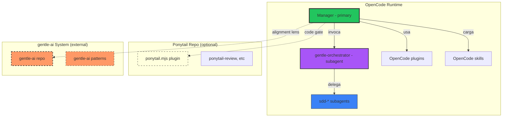

# gentle-ai vs gentle-orchestrator vs sdd-* — Frontera Arquitectónica

> **Estado:** ✅ BOUNDARY DEFINED
> **Fecha:** 2026-06-17
> **Propósito:** Definir la frontera entre gentle-ai (sistema externo), gentle-orchestrator (subagente local) y los subagentes sdd-* (pipeline SDD). Eliminar ambigüedad conceptual y establecer reglas de exportación.

---

## 1. Los 3 niveles

| Nivel | Sistema | Naturaleza | Runtime | Dependencia | Rol |
|-------|---------|:----------:|:-------:|:-----------:|-----|
| **N1 — gentle-ai** | Externo | Sistema open-source de referencia | ❌ Fuera de OpenCode | ❌ No depende de OpenCode | Benchmark, patrón, referencia arquitectónica |
| **N2 — gentle-orchestrator** | Local | Subagente de OpenCode | ✅ mode: subagent | ✅ Definido en opencode.json | Orchestrador SDD pipeline invocable por Manager |
| **N3 — sdd-*** | Local | Subagentes/skills de OpenCode | ✅ mode: subagent | ✅ Skills en disco | Ejecutores de fases SDD (init..archive) |

---

## 2. Regla fundamental

```
Manager may use local SDD/gentle-inspired subagents as workflow components,
but must not depend on the external gentle-ai runtime by default.
```

**Traducción:**
- Usar `gentle-orchestrator` y `sdd-*` está bien — son componentes locales de OpenCode.
- Depender del sistema externo `gentle-ai` (sus plugins, tools, configs) NO está bien.
- El Manager puede invocar `gentle-orchestrator` para tareas Medium/Large sin que eso signifique "integrar gentle-ai".

---

## 3. ¿Por qué usar `sdd-*` no significa integrar gentle-ai runtime?

| Argumento | Explicación |
|-----------|-------------|
| **Origen del patrón** | El pipeline SDD (explore→propose→spec→design→tasks→apply→verify→archive) está inspirado en gentle-ai, pero implementado como skills nativos de OpenCode |
| **Código** | Los skills `sdd-*` son archivos SKILL.md escritos para OpenCode, NO copias de código de gentle-ai |
| **Configuración** | `sdd-*` están configurados en `opencode.json` como subagentes nativos, NO como agentes de gentle-ai |
| **Dependencia** | Los skills `sdd-*` funcionan sin que gentle-ai esté instalado, disponible o configurado |
| **Actualizaciones** | Los skills `sdd-*` pueden modificarse sin coordinar con gentle-ai |

**Conclusión:** Usar `sdd-*` es usar patrones de gentle-ai implementados como OpenCode nativo. Es equivalente a usar un patrón de diseño aprendido de un libro sin tener el libro abierto.

---

## 4. ¿Por qué `gentle-orchestrator` no es "gentle-ai runtime"?

| Dimensión | gentle-orchestrator | gentle-ai (sistema externo) |
|-----------|:-------------------:|:---------------------------:|
| **Definido en** | `opencode.json` (subagent) | No está en OpenCode |
| **Prompt** | "SDD Pipeline subagent" | N/A — sistema separado |
| **Tools** | task/delegate a sdd-* | No expone tools en OpenCode |
| **Dependencia** | OpenCode skills nativos | No depende de OpenCode |
| **Se actualiza** | Editando SKILL.md | Independientemente |
| **Rol** | Coordinador de pipeline | Sistema de referencia externo |

**Conclusión:** `gentle-orchestrator` es un subagente de OpenCode que adopta el patrón de thin orchestrator de gentle-ai. No es el sistema external "gentle-ai" corriendo dentro de OpenCode.

---

## 5. ¿Qué se puede exportar al repo nuevo?

| Componente | Exportable | Perfil destino | Notas |
|------------|:----------:|:--------------:|-------|
| `sdd-init/SKILL.md` | ✅ Sí | `full` / `sdd` | Template sanitizado |
| `sdd-explore/SKILL.md` | ✅ Sí | `full` / `sdd` | Template sanitizado |
| `sdd-propose/SKILL.md` | ✅ Sí | `full` / `sdd` | Template sanitizado |
| `sdd-spec/SKILL.md` | ✅ Sí | `full` / `sdd` | Template sanitizado |
| `sdd-design/SKILL.md` | ✅ Sí | `full` / `sdd` | Template sanitizado |
| `sdd-tasks/SKILL.md` | ✅ Sí | `full` / `sdd` | Template sanitizado |
| `sdd-apply/SKILL.md` | ✅ Sí | `full` / `sdd` | Template sanitizado |
| `sdd-verify/SKILL.md` | ✅ Sí | `full` / `sdd` | Template sanitizado |
| `sdd-archive/SKILL.md` | ✅ Sí | `full` / `sdd` | Template sanitizado |
| `sdd-onboard/SKILL.md` | ✅ Sí | `full` / `sdd` | Template sanitizado |
| `gentle-orchestrator` config | ⚠️ Template | `full` / `sdd` | Depende de runtime. Template de config |
| `gentle-ai-activation-policy.md` | ✅ Sí | `gentle-alignment` | Solo documentación |
| `gentle-ai-alignment.md` | ✅ Sí | `gentle-alignment` | Solo documentación |

---

## 6. ¿Qué NO debe convertirse en dependencia obligatoria?

| Elemento | Razón |
|----------|-------|
| `gentle-orchestrator` como primary | Ya se corrigió. Debe mantenerse como subagent siempre. |
| `gentle-ai` plugin/skills como default | No deben instalarse como parte del perfil `full`. |
| `gentle-ai` en tool schemas | No debe haber MCP servers de gentle-ai en el kit. |
| `gentle-ai` en system prompt | No debe haber referencias a gentle-ai en el template de AGENTS.example.md (salvo como doc/lente). |

---

## 7. ¿Qué requiere aprobación futura?

| Decisión | Requiere aprobación | Riesgo si se hace sin aprobación |
|----------|:-------------------:|----------------------------------|
| gentle-ai runtime integration | ✅ Sí — C1..C8 | Dependencia externa, incompatibilidad, pérdida de control |
| gentle-orchestrator como primary | ✅ Sí — revertiría ADR-001 | Dos primaries ambiguos (problema ya resuelto) |
| sdd-* modificados para depender de gentle-ai externo | ✅ Sí | Los subagentes perderían su naturaleza OpenCode-nativa |
| Perfil `full` incluye gentle-ai runtime | ✅ Sí | El kit dejaría de ser auto-contenido |

---

## 8. ¿Qué debe incluir cada perfil?

### Perfil `full`

| Incluye | No incluye |
|---------|------------|
| Manager (como skill) | ❌ gentle-ai runtime |
| SDD subagents (10 skills) | ❌ gentle-ai plugins |
| Engram (plugin template) | ❌ Referencias a gentle-ai como dependencia |
| Ponytail Code Gate (guidance) | |
| Noise Gate (plugin template) | |
| Design Skills | |
| Regression harness | |

### Perfil `gentle-alignment`

| Incluye | No incluye |
|---------|------------|
| gentle-ai-alignment.md | ❌ Código runtime |
| gentle-ai-activation-policy.md | ❌ Plugins |
| GENTLE_AI_ALIGNMENT_PACK docs | ❌ Skills |
| Patrones transferibles | ❌ Dependencia de instalación |

---

## 9. Diagrama de frontera



---

## 10. Regla de oro

> **Si puedes eliminar gentle-ai del disco y OpenCode sigue funcionando, la frontera es correcta.**
>
> Si OpenCode necesita gentle-ai para operar, se rompió la frontera.

---

*Fin de gentle-sdd-boundary.md*
