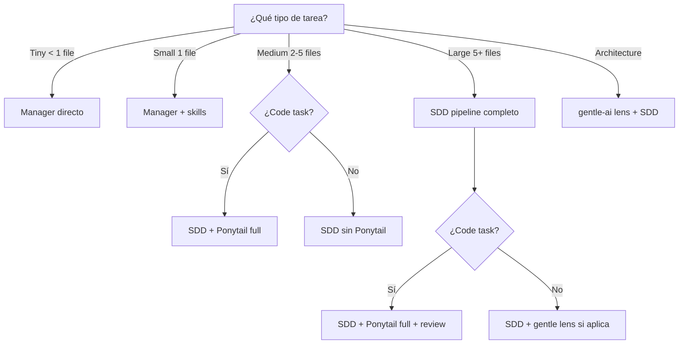

# Manager Delegation Rules

> **Estado:** ✅ RULES DEFINED
> **Fecha:** 2026-06-17
> **Propósito:** Definir cuándo el Manager ejecuta directamente, cuándo delega, a quién delega y bajo qué condiciones.

---

## 1. Tabla de delegación

| Tipo de tarea | Manager directo | Delegar a | Condición |
|---------------|:--------------:|-----------|-----------|
| **Pregunta simple** (ej: "qué es X") | ✅ Sí | — | Sin código, sin contexto de proyecto |
| **Resumen de estado** (ej: "cómo va Fase F") | ✅ Sí | — | Lectura de documentos, sin cambios |
| **Auditoría documental** (ej: "revisa si Y está documentado") | ✅ Sí | — | Solo lectura, sin implementación |
| **Diseño de arquitectura** (ej: "diseña API de payments") | ❌ No | `gentle-orchestrator` o `sdd-*` directo | Medium/Large structured task |
| **Implementación de código** (ej: "agrega logging a auth") | ❌ No | `sdd-init` → `sdd-*` → `sdd-apply` | Medium/Large code task |
| **Refactor** (ej: "refactoréa el módulo X") | ❌ No | `sdd-*` + Ponytail | Code task, modo full |
| **Code review** (ej: "revisá este diff") | ❌ No | Code Review phase + `ponytail-review` | Code task Medium+ |
| **Debugging** (ej: "el test Y falla") | ❌ No | Debugging phase + `@debug-gpt55` | Si hay subagente disponible |
| **Creación de repo instalable** (ej: "creá opencode-agent-runtime-kit") | ❌ No | SDD pipeline + gentle-ai lens | Large task cross-system |
| **Edición de README** | ✅ Sí | — | Documentación pura |
| **Memoria/Engram** (ej: "buscá qué decidimos sobre X") | ❌ No | `mem_context` | Siempre via Engram |
| **Guardar memoria** (ej: "guardá esta decisión") | ❌ No | `mem_save` (Manager decide qué) | Manager determina qué persiste |
| **Integración Ponytail** | ⚠️ Gate | Manager + guidance de AGENTS.md | Solo code tasks |
| **Integración gentle-ai** | ❌ No se integra | Solo alignment lens | Solo arquitectura/evaluación |
| **Creación de skill** (ej: "creá un skill para Y") | ❌ No | `skill-creator` subagent + gentle lens | Medium architectural task |
| **Creación de subagente** (ej: "creá un agente para Z") | ❌ No | SDD pipeline + gentle lens | Large task |
| **Creación de tests/harness** (ej: "agregá tests") | ❌ No | `sdd-*` pipeline | Medium/Large code task |

---

## 2. Reglas generales

| # | Regla | Fundamento |
|:-:|-------|------------|
| 1 | **Manager directo para Tiny/Simple** | La clasificación existe para evitar overhead innecesario |
| 2 | **Manager + mem_context para preguntas con memoria** | No adivinar contexto cuando Engram puede proveerlo |
| 3 | **Manager + SDD para Medium/Large** | El pipeline existe para tareas que lo necesitan |
| 4 | **Manager + `sdd-init` para arranque estructurado** | `sdd-init` existe y provee estructura |
| 5 | **Manager + Ponytail solo para code tasks** | Non-code tasks no se benefician de simplificación de código |
| 6 | **Manager + gentle-ai alignment lens solo para arquitectura/evaluación** | No runtime, no por defecto |
| 7 | **Manager siempre sintetiza final** | Ningún subagente responde al usuario como cierre |
| 8 | **Manager puede delegar a `gentle-orchestrator`** | Pero gentle-orchestrator NO puede llamar a Manager |
| 9 | **Si un subagente no está disponible, Manager ejecuta la fase** | El pipeline nunca se bloquea |
| 10 | **Manager decide qué guardar en Engram** | Subagentes pueden sugerir, Manager decide |

---

## 3. Matriz de decisión rápida

---

## 4. Casos borde

| Situación | Decisión | Fundamento |
|-----------|----------|------------|
| **Tarea Medium de código que el usuario pide "rápido, sin vueltas"** | Manager puede simplificar SDD (saltar explore si ya conoce el contexto) | Priorizar velocidad cuando el usuario lo pide explícitamente |
| **Tarea Small que involucra múltiples archivos** | Clasificar como Medium para evitar omisiones | Mejor sobre-clasificar que sub-clasificar |
| **Tarea de documentación que incluye ejemplos de código** | Ponytail aplica a los ejemplos de código, no al texto | Ponytail es code gate, no doc gate |
| **Debugging de un error crítico en producción** | Manager puede saltar SDD y aplicar directo si el fix es claro | Excepción de urgencia documentada |
| **Usuario pide "sin SDD" para tarea Large** | Manager acepta pero documenta el riesgo | El usuario decide, Manager advierte |
| **Tarea mixta (arquitectura + código)** | SDD completo + gentle lens en diseño + Ponytail en code | Ambas lentes aplican en distintas fases del mismo pipeline |

---

## 5. Lo que el Manager NUNCA delega

| Responsabilidad | Por qué |
|----------------|---------|
| Decisión final sobre diseño | El Manager es responsable de la calidad del output |
| Síntesis al usuario | El usuario recibe la respuesta del Manager |
| Quality gates finales | GPT-5.5 review, senior challenge |
| Clasificación de tarea | Sólo el Manager clasifica |
| Aprobación de cambios runtime | El Manager decide si un cambio es seguro |
| Persistencia en Engram | El Manager decide qué vale la pena guardar |

---

*Fin de manager-delegation-rules.md*
