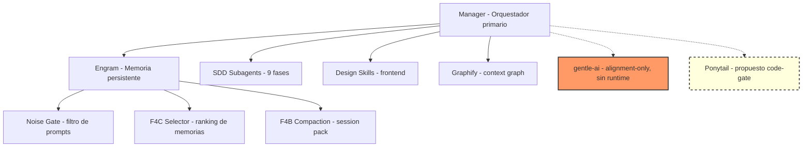

# Manager Extension Map — gentle-ai vs Ponytail vs Subsistemas

> **Fecha:** 2026-06-17
> **Propósito:** Mapa comparativo de todos los sistemas que interactúan con el Manager, su rol, dependencia runtime, y estado de integración.

---

## Tabla maestra

| Sistema | Rol | ¿Runtime default? | ¿Manager lo usa? | ¿Instalable futuro? | Riesgo | Decisión |
|---------|-----|-----------------:|-----------------:|--------------------:|--------|----------|
| **Manager** | Orquestador primario. Intake, diseño, SDD, QA, síntesis. | ✅ Sí — `mode: primary` | N/A (es el orquestador) | ✅ Sí — como skill en `agents/manager/SKILL.md` | 🟢 Bajo | Es el centro de la arquitectura |
| **Engram** | Memoria persistente cross-session con estructura. | ✅ Sí — MCP server activo | ✅ Sí — `mem_save`, `mem_search`, `mem_context`, `mem_session_summary` | ✅ Sí — plugin template + docs | 🟢 Bajo | Dependencia runtime activa |
| **Noise Gate** | Filtro de prompts antes de persistir en Engram. | ✅ Sí — embedido en `engram.ts` | ✅ Sí — plugin hook `chat.message` | ✅ Sí — plugin template | 🟢 Bajo | Dependencia runtime activa |
| **mem_context** | Tool read-only que recupera memorias rankeadas. | ✅ Sí — MCP tool | ✅ Sí — consulta antes de responder | ✅ Sí — documentación | 🟢 Bajo | Dependencia runtime activa |
| **F4B (Compaction)** | Contrato RECENT_SESSION_PACK para compactación. | ⚠️ PARTIAL — instalado, sin evento real | ✅ Sí — plugin hook `compacting` | ✅ Sí — plugin template | 🟡 Medio | Instalado, esperando evento |
| **F4C (Memory Selector)** | Guidance para ranking de memorias (0.5/0.3/0.2). | ✅ Sí — guidance activo en Manager | ✅ Sí — usa reglas de ranking en cada consulta | ✅ Sí — documentación | 🟢 Bajo | Guidance activo en runtime |
| **SDD subagents** | 9 subagentes especializados (explore..onboard). | ✅ Sí — `mode: subagent` | ✅ Sí — delega fases SDD | ✅ Sí — 9 skills exportables | 🟢 Bajo | Dependencia runtime activa |
| **Design Skills** | Skills de diseño frontend (frontend-design, design-md, etc.). | ⚠️ Bajo demanda — se cargan con `skill` tool | ✅ Sí — cuando hay tarea frontend | ✅ Sí — skills exportables | 🟢 Bajo | Bajo demanda, no default |
| **Graphify** | Proyecto context graph para entender relaciones. | ❌ No — skill invocable, no runtime default | ⚠️ Solo si existe `graphify-out/` y es útil | ✅ Sí — skill exportable | 🟢 Bajo | Opcional, bajo demanda |
| **gentle-ai** | Sistema externo de referencia estratégica. | ❌ No — NO es runtime de OpenCode | ❌ No — solo referencia en docs/alignment | ❌ No — no debe instalarse como runtime | 🟡 Medio | **alignment-only** |
| **Ponytail** | Sistema de reducción de over-engineering vía YAGNI/stdlib ladder. | ❌ No — no instalado localmente | ❌ No — no referenciado en Manager | ⏸️ Pendiente — propuesta code-gate | 🟡 Medio | **No implementado — propuesta creada** |

---

## Relaciones entre sistemas

---

## Matriz de dependencias runtime

| Sistema | Depende de Manager | Manager depende de él | Dependencia externa | Se activa siempre |
|---------|:------------------:|:---------------------:|:-------------------:|:-----------------:|
| Manager | N/A | N/A | OpenCode runtime | ✅ Siempre |
| Engram | ❌ No | ✅ Sí | Engram MCP server | ✅ Siempre |
| Noise Gate | ❌ No | ✅ Sí | Plugin engram.ts | ✅ Siempre |
| mem_context | ❌ No | ✅ Sí | Engram MCP | ✅ Siempre |
| F4B | ❌ No | ✅ Sí | Plugin engram.ts | ⚠️ Solo en compactación |
| F4C | ❌ No | ✅ Sí | Guidance en Manager | ✅ Siempre |
| SDD subagents | ❌ No | ✅ Sí (delegación) | 9 skills | ❌ Bajo demanda |
| Design Skills | ❌ No | ⚠️ Cuando hay UI | Skills | ❌ Bajo demanda |
| Graphify | ❌ No | ❌ Opcional | Graphify CLI/skill | ❌ Bajo demanda |
| **gentle-ai** | ❌ No | ❌ **No** | Externo | ❌ **Nunca** |
| **Ponytail** | ❌ No | ❌ **No (propuesto)** | Externo/plugin | ❌ **Code-gate propuesto** |

---

## Análisis de duplicación funcional

| Función | Manager | gentle-ai | Ponytail | ¿Overlap? |
|---------|---------|-----------|----------|:----------:|
| Orquestación | ✅ Primario | ⚠️ Subagente SDD | ❌ No aplica | ❌ No |
| Intake/Clasificación | ✅ Sí | ❌ No | ❌ No | ❌ No |
| SDD Pipeline | ✅ Controla | ⚠️ Puede ejecutar | ❌ No | ⚠️ Manager controla, gentle ejecuta |
| Code simplicity | ⚠️ Code Review phase | ❌ No | ✅ YAGNI/stdlib ladder | ❌ No — Ponytail complementa Review |
| Memory management | ✅ Engram | ✅ mem_* tools | ❌ No | ❌ No |
| Token reduction | ✅ Fase F | ❌ No | ⚠️ Reduce líneas de código (efecto secundario) | ❌ No — objetivos diferentes |
| Quality gates | ✅ Review + GPT-5.5 | ❌ No | ⚠️ ponytail-review | 🟡 Complementario |

---

## Decisión de boundaries

| Boundary | Estado | Regla |
|----------|--------|-------|
| Manager ↔ gentle-ai | 🟢 Clara | gentle-ai es alignment-only. No runtime. |
| Manager ↔ Ponytail | 🟡 Propuesta | Ponytail sería code-gate entre SDD Design y SDD Tasks. No implementado. |
| gentle-ai ↔ Ponytail | 🟢 No hay relación | Son sistemas independientes. No deben enlazarse. |
| Fase F ↔ Ponytail | 🟡 Alineación | Ponytail puede apoyar token reduction reduciendo código generado. No es sustituto. |

---

*Fin de manager-extension-map.md*
