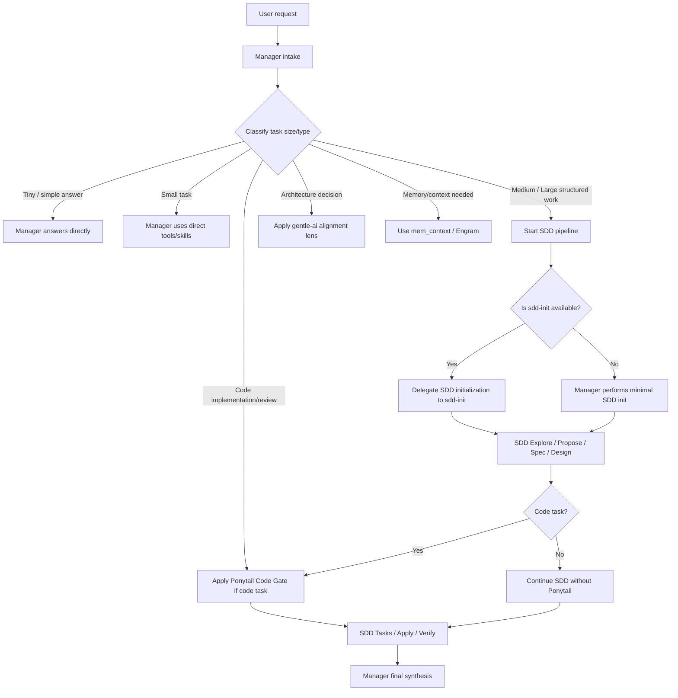

# Manager Routing Flow

> **Estado:** ✅ FLOW DEFINED
> **Fecha:** 2026-06-17
> **Propósito:** Documentar el flujo de decisión del Manager: cómo clasifica, rutea y delega cada tipo de solicitud.

---

## 1. Diagrama de ruteo

---

## 2. Explicación en lenguaje simple

**El Manager funciona como un jefe de proyecto:**

1. **Escucha el pedido** (intake) — entiende qué quiere el usuario.
2. **Clasifica** — decide si es algo rápido (Tiny/Small), algo complejo (Medium/Large), una decisión de arquitectura, código, o una pregunta de memoria.
3. **Decide el camino**:
   - **Respuesta directa** — para preguntas simples, el Manager responde ya.
   - **Pipeline SDD** — para tareas complejas, el Manager arranca el pipeline SDD:
     - Usa `sdd-init` si existe para preparar el contexto
     - Delega exploración, propuesta, especificación y diseño a subagentes especializados
     - Si la tarea es de código, activa Ponytail para evitar sobre-ingeniería
     - Delega implementación, verificación y archivado a subagentes
   - **Lente de arquitectura** — para decisiones de diseño, aplica el lente de gentle-ai como referencia.
   - **Memoria** — para preguntas que requieren contexto previo, busca en Engram.
4. **Sintetiza** — Toma los resultados de los subagentes y herramientas, y produce una respuesta coherente al usuario.

**El Manager nunca es el cuello de botella.** No hace el trabajo de los subagentes. Los coordina.

---

## 3. Matriz de ruteo

| Tipo de solicitud | Clasificación | Ruta | Subagente/Tool | Ponytail | gentle-ai lens |
|-------------------|:------------:|:----:|:--------------:|:--------:|:--------------:|
| "¿Qué es X?" | Tiny | Directo | — | ❌ | ❌ |
| "¿Cómo se usa Y?" | Small | Directo + skill | skill tool | ❌ | ❌ |
| "Agrega logging a auth" | Medium code | SDD | sdd-* + Ponytail | ✅ full | ❌ |
| "Diseña API de payments" | Large code | SDD | sdd-* + Ponytail | ✅ full | ❌ |
| "Revisa la arquitectura de auth" | Medium arch | SDD + gentle lens | sdd-* + gentile lens | ❌ | ✅ Sí |
| "¿Qué decidimos sobre X?" | Small memory | mem_context | mem_context | ❌ | ❌ |
| "Debuggea este error" | Medium code | SDD + debugging | sdd-* + debug | ✅ lite | ❌ |
| "Escribe DESIGN.md" | Small doc | Directo | — | ❌ | ❌ |
| "Crea skill nuevo" | Medium arch | SDD + gentle lens | sdd-* + skill-creator | ❌ | ✅ Sí |
| "Guarda esta decisión" | Tiny memory | mem_save | mem_save | ❌ | ❌ |
| "Haz debounce function" | Small code | SDD (lite) + Ponytail | sdd-* (lite) | ✅ full | ❌ |

---

## 4. Reglas de routing

| # | Regla | Excepción |
|:-:|-------|-----------|
| 1 | Tiny siempre directo | Si el usuario pide explícitamente SDD |
| 2 | Small puede ser directo o SDD ligero | Si hay riesgo de omisión de contexto |
| 3 | Medium/Large siempre SDD | Si el usuario pide explícitamente "sin SDD" |
| 4 | Code task siempre Ponytail | Si el usuario dice "no simplifiques" o "hazlo robusto" |
| 5 | Non-code task nunca Ponytail | Si hay componentes de código mixto (code + docs) |
| 6 | Arquitectura puede usar gentle-ai lens | Si el usuario no pide referencia externa |
| 7 | Memoria siempre via Engram | Si el usuario pregunta específicamente |
| 8 | Manager siempre sintetiza final | Nunca un subagente responde directamente al usuario |

---

*Fin de manager-routing-flow.md*
