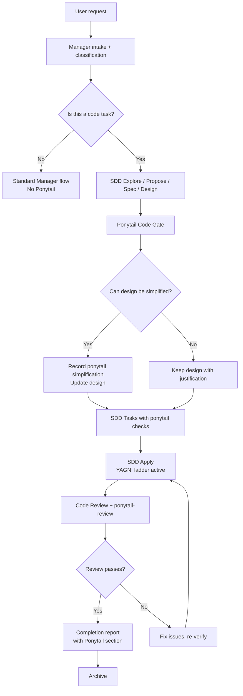
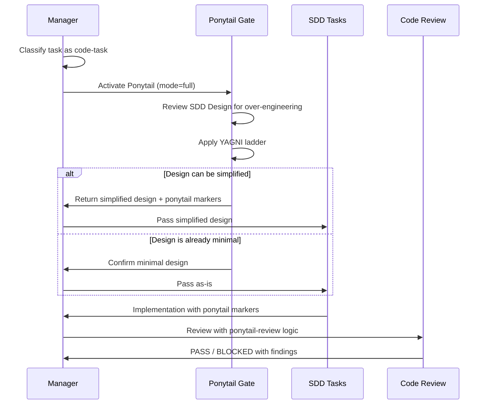

# Ponytail Manager Integration Proposal

> **Estado:** ⏸️ PROPUESTA — No aplicada. Pendiente de aprobación.
> **Fecha:** 2026-06-17
> **Propósito:** Proponer la integración de Ponytail en el Manager Protocol de OpenCode, documentando el diff conceptual, reglas de activación, exclusión, impacto en fases SDD, y rollback. **No modificar AGENTS.md real sin aprobación.**

---

## 1. Resumen de la propuesta

Agregar Ponytail como **Code Gate** formal entre SDD Design y SDD Tasks, activo solo cuando la tarea crea/modifica/revisa código. No es un plugin always-on. No es un sustituto de Code Review. Es un gate de simplificación controlado por el Manager.

---

## 2. Marker propuesto para AGENTS.md

```
<!-- opencode-architecture:ponytail-integration -->
```

Este marker identifica la sección de integración de Ponytail en AGENTS.md como propia de OpenCode Architecture, no de gentle-ai ni de Ponytail upstream.

---

## 3. Ubicación propuesta en AGENTS.md

Después de la sección `# Phase 2.5 — Graphify Context Gate` y antes de `# Phase 3 — Manager-Controlled Gentle-AI-Style SDD`.

### Sección propuesta:

```markdown
<!-- opencode-architecture:ponytail-integration -->

# Phase 2.6 — Ponytail Code Gate (optional)

When the task involves creating, modifying, reviewing, or refactoring code,
Manager MAY activate Ponytail as a simplification gate between SDD Design and SDD Tasks.

## Activation rules

Ponytail activates when the task is classified as:
- Medium or Large AND involves code
- Any refactor task
- Any code review task
- Any SDD Apply phase

Ponytail does NOT activate when:
- The task is documentation-only
- The task is search/audit only (no code changes)
- The task is conceptual/architectural discussion
- The task is Engram memory management without code
- The task is planning without implementation
- The task is educational explanation without code changes

## Mode selection

| Task type | Recommended mode |
|-----------|:----------------:|
| Tiny code change | off (too small to benefit) |
| Small code change | lite |
| Medium code change | full |
| Large code change | full |
| Refactor | full |
| Legacy code audit | ultra (only with explicit user request) |

## Exclusions (never simplify)

Ponytail's simplification ladder MUST NOT remove or reduce:
- Trust boundary validation
- Security controls
- Accessibility requirements
- Data loss prevention
- Error handling for critical paths
- Required tests (as defined by project policy)
- Public API contracts already defined
- Mandatory logging/tracing

## Integration with SDD phases

### SDD Design → Ponytail Gate
After SDD Design produces a technical design, Ponytail reviews it for:
- Unnecessary abstractions
- Over-engineered component splits
- Dependencies that could be replaced by stdlib
- Boilerplate that could be simplified

### Ponytail Gate → SDD Tasks
If Ponytail suggests simplifications:
1. Record the simplification with `ponytail:` marker
2. Update the design accordingly (or document why not)
3. Pass simplified design to SDD Tasks

### SDD Apply
During Apply, Ponytail rules guide implementation:
- Respect YAGNI ladder
- Mark intentional shortcuts with `ponytail:` comments
- Do not add abstractions not explicitly requested

### Code Review
After Apply, run `ponytail-review` logic:
- Review diff for remaining over-engineering
- Check that `ponytail:` markers are present where expected
- Verify no simplification crossed exclusion boundaries

## Completion Contract addition

Add to final report:
```markdown
### Ponytail
- Activation: applied / skipped / not applicable
- Mode: lite / full / ultra / off
- Simplifications: [list]
- Exceptions justified: [list]
- ponytail: markers count: [N]
- Estimated net lines avoided: [N]
- Review/audit used: [yes/no]
```
```

---

## 4. Diff conceptual (respecto a AGENTS.md actual)

| Aspecto | Actual | Con propuesta |
|---------|--------|---------------|
| Ponytail reference | ❌ No existe | ✅ Fase 2.6 optional |
| Code gate | ❌ No existe | ✅ Entre Design y Tasks |
| Reglas de activación | ❌ No existen | ✅ Code/non-code classification |
| Reglas de exclusión | ❌ No existen | ✅ 9 protecciones explícitas |
| Completion Contract | Sin sección Ponytail | ✅ Con sección Ponytail |
| Code Review | Sin ponytail-review | ✅ Con ponytail-review opcional |

---

## 5. Flujo Mermaid



### Flujo detallado del gate:



---

## 6. Reglas de activación detalladas

### Ponytail se activa cuando:

- **Creación de código**: new file, new function, new component, new API endpoint
- **Modificación de código**: edit, refactor, optimize, migrate
- **Refactor**: restructuring without changing behavior
- **Revisión de diff**: code review, PR review
- **Reducción de over-engineering**: task explicitly asks to simplify
- **Dependencia nueva propuesta**: any proposal to add a dependency
- **Abstracción nueva propuesta**: any proposal to add abstraction layer
- **SDD Apply**: implementation phase
- **PR/Review de código**: any code review activity

### Ponytail NO se activa cuando:

- **Documentación pura**: README, docs, comments, wikis
- **Búsqueda o auditoría documental**: grep/search without code changes
- **Conversación conceptual**: architecture discussion, design debate
- **Gestión de memoria Engram sin código**: mem_save, mem_search, mem_context
- **Planificación general sin implementación**: task breakdown, estimation
- **Entrevista, CV, LinkedIn, escritura o contenido**: non-code tasks
- **Explicación educativa sin code changes**: teaching concepts
- **Configuración de herramientas sin código**: setting up tools
- **Análisis de datos sin código**: reading/output only

### Excepciones de seguridad (nunca simplificar):

| Protección | Razon |
|------------|-------|
| Trust boundary validation | Datos de entrada no confiables deben validarse siempre |
| Security controls | Auth, authorization, encryption, secrets handling |
| Accessibility | ARIA labels, keyboard nav, screen reader support |
| Data loss prevention | Confirm before delete, backup, transaction safety |
| Error handling crítico | No try-catch vacíos, no ignore exceptions silenciosamente |
| Tests requeridos | Los tests definidos en SDD Tasks no son simplificables |
| Contratos públicos | API signatures, interfaces, types públicos no cambian |
| Trazabilidad obligatoria | Logging requerido por política del proyecto |

---

## 7. Impacto en SDD Design

| Antes | Después |
|-------|---------|
| SDD Design produce diseño técnico | SDD Design produce diseño + pasa por Ponytail Gate |
| No hay revisión de over-engineering | Ponytail revisa abstracciones innecesarias, dependencias, boilerplate |
| Diseño pasa directo a SDD Tasks | Diseño simplificado o confirmado como minimal pasa a SDD Tasks |
| Sin registro de simplificaciones | Simplificaciones registradas con `ponytail:` markers |

---

## 8. Impacto en SDD Tasks

| Antes | Después |
|-------|---------|
| Tasks reflejan diseño completo | Tasks pueden incluir simplificaciones de Ponytail |
| Sin verificación de YAGNI | Cada task verifica: ¿esto necesita existir? |
| Tasks pueden incluir abstracciones no solicitadas | Tasks excluyen abstracciones no justificadas |
| Sin markers de shortcut | Shortcuts marcados con `ponytail:` |

---

## 9. Impacto en SDD Apply

| Antes | Después |
|-------|---------|
| Apply sigue tasks al pie de la letra | Apply sigue tasks + respeta YAGNI ladder |
| Puede generar over-engineering | Ponytail guía implementación minimal |
| Sin markers de shortcut | Markers `ponytail:` en shortcuts intencionales |
| Sin verificación de exclusiones | Apply verifica que exclusiones no se simplificaron |

---

## 10. Impacto en Code Review

| Antes | Después |
|-------|---------|
| Review verifica requirement fit, bugs, edge cases | Mismas verificaciones + ponytail-review |
| Sin revisión de over-engineering específica | ponytail-review busca simplificaciones adicionales |
| Sin validación de markers | Verifica que `ponytail:` markers existen donde se espera |
| Sin auditoría de exclusiones | Verifica que ninguna exclusión fue violada |

---

## 11. Impacto en Completion Contract

Sección nueva a agregar:

```markdown
### Ponytail
- Activation: applied / skipped / not applicable
- Mode: lite / full / ultra / off
- Simplifications:
  - [list of simplifications applied]
- Exceptions justified:
  - [list of exceptions that were preserved]
- `ponytail:` markers count: [number]
- Estimated net lines avoided: [number or "not measured"]
- Review/audit used: [yes/no]
- Audit notes: [if ultra mode or full audit used]
```

---

## 12. Rollback

| Componente | Rollback |
|------------|----------|
| Marker en AGENTS.md | Remover `<!-- opencode-architecture:ponytail-integration -->` y su contenido |
| Completion Contract | Remover sección Ponytail |
| Reglas de activación | Volver al comportamiento anterior sin clasificación code/non-code |
| Ponytail skills | No se instalan por esta propuesta |
| Ponytail plugin | No se instala por esta propuesta |

**La propuesta no incluye instalación de plugin ni skills.** Solo documentación en AGENTS.md. El rollback es trivial: revertir cambios en AGENTS.md.

---

## 13. Tests requeridos

Ver `ponytail-integration-test-plan.md` para el plan completo.

Tests mínimos:
1. Ponytail code gate se activa para code tasks
2. Ponytail code gate se omite para non-code tasks
3. Completion Contract incluye sección Ponytail cuando aplica
4. No se eliminan seguridad/accesibilidad/validación
5. ponytail-review se propone en Code Review
6. Modo default recomendado no es ultra
7. La integración es reversible

---

*Fin de ponytail-manager-integration-proposal.md*
