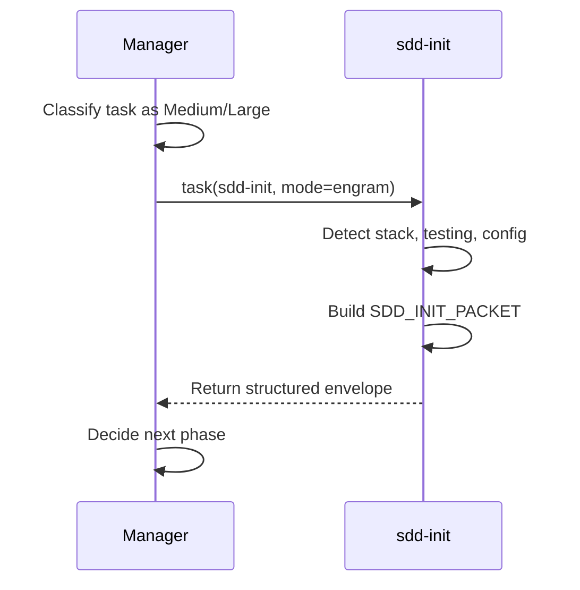

# sdd-init Role Specification

> **Estado:** ✅ EXISTS — Documentado y auditado
> **Fecha:** 2026-06-17
> **Propósito:** Definir el rol, uso y especificación de `sdd-init` como subagente/skill de inicialización del pipeline SDD.

---

## 1. Estado actual

| Indicador | Valor |
|-----------|:-----:|
| ¿Existe? | ✅ Sí |
| Rutas | `.codex/skills/sdd-init/SKILL.md`, `.config/opencode/skills/sdd-init/SKILL.md` |
| Config en opencode.json | ✅ Sí — `mode: subagent`, `hidden: true` |
| Tipo | Subagent + skill |
| Skill version | 3.0 (metadata: `gentleman-programming`) |
| Última modificación | 2026-05-29 |
| Prompt | "You are an SDD executor for the init phase, not the orchestrator. Do this phase's work yourself." |
| Delegation | `delegate_only: true` en metadata — se delega al subagente, no se ejecuta inline |

---

## 2. Rol real

`sdd-init` es el punto de entrada del pipeline SDD. Su función es **inicializar el contexto SDD** antes de que comiencen las fases de exploración, propuesta y diseño.

### ¿Qué hace?

1. **Detecta el stack real** del proyecto (package.json, go.mod, pyproject.toml, CI config, lint config).
2. **Detecta herramientas de testing** (test runner, coverage, linter, type checker, formatter).
3. **Resuelve Strict TDD** desde markers, config o detección fallback.
4. **Inicializa persistencia** según el modo:
   - `engram`: guarda contexto en Engram (no crea openspec/)
   - `openspec`: crea archivos en openspec/
   - `hybrid`: ambos
   - `none`: solo detecta y reporta
5. **Construye skill-registry** (`.atl/skill-registry.md`).
6. **Persiste testing capabilities** como artifact separado.
7. **Devuelve structured envelope** con status, summary, artifacts, next step.

### ¿Qué NO hace?

- ❌ No implementa código
- ❌ No modifica archivos sin autorización
- ❌ No toma decisiones finales
- ❌ No responde al usuario como cierre
- ❌ No explora el codebase en profundidad (eso es para `sdd-explore`)
- ❌ No propone cambios (eso es para `sdd-propose`)

---

## 3. Modo de invocación

`sdd-init` se invoca desde el Manager (o desde `gentle-orchestrator`) mediante `task(subagent_type: "sdd-init")`.



**Inputs que recibe:**
- Tamaño de tarea (Medium/Large)
- Modo de persistencia (engram/openspec/hybrid/none) — si no se especifica, detecta
- Contexto inicial del proyecto

**Outputs que produce (SDD_INIT_PACKET):**

```markdown
## SDD_INIT_PACKET

- Request summary: [descripción]
- Task type: [code / architecture / design / etc]
- Task size: [Medium / Large]
- Scope: [alcance detectado]
- Constraints: [restricciones detectadas]
- Known context: [stack, testing, config]
- Missing context: [lo que falta saber]
- Suggested SDD path: [init → explore → propose → ...]
- Required subagents: [sdd-explore, sdd-propose, etc]
- Risks: [riesgos detectados]
- Clarifying questions, if any:
- Next recommended step: [sdd-explore]
```

---

## 4. Cuándo usar `sdd-init`

| Situación | Usar sdd-init | Alternativa |
|-----------|:-------------:|-------------|
| Tarea Medium/Large en proyecto nuevo | ✅ Sí | Manager hace init mínimo |
| Tarea Medium/Large en proyecto conocido | ✅ Sí (confirma contexto) | Manager reusa init previo |
| Tarea Tiny/Small | ❌ No | Manager directo |
| Tarea Medium sin SDD completo | ❌ No | Manager + skills directamente |
| Primera vez en un proyecto | ✅ Sí (detecta stack) | Manager pregunta manualmente |
| Reporte de estado | ❌ No | mem_context o Manager directo |

---

## 5. Cuándo NO usar `sdd-init`

- La tarea es Tiny o Small (overhead innecesario)
- El proyecto ya fue inicializado en esta sesión
- El usuario explícitamente pide no usar SDD
- La tarea es puramente documental o de memoria
- `sdd-init` no está disponible (fallback: Manager hace init mínimo)

---

## 6. Riesgos

| Riesgo | Probabilidad | Impacto | Mitigación |
|--------|:-----------:|:-------:|------------|
| sdd-init detecta stack incorrecto | Baja | Medio | Manager verifica findings antes de continuar |
| sdd-init crea archivos no autorizados | Baja | Medio | Skill tiene `user-invocable: false` y executor override. Sin `edit` permission por defecto |
| sdd-init se usa en tareas Tiny | Baja | Bajo | Manager clasifica antes de invocar |
| Dependencia de sdd-init para todo SDD | Baja | Bajo | Manager tiene fallback (init mínimo manual) |

---

## 7. Exportabilidad

| Componente | ¿Exportar? | Destino en nuevo repo |
|------------|:----------:|-----------------------|
| `sdd-init/SKILL.md` | ✅ Sí | `skills/sdd-init/SKILL.md` |
| `sdd-init/references/` | ✅ Sí | `skills/sdd-init/references/` |
| Config en opencode.json | ⚠️ Template | Incluir en `templates/opencode.example.json` |
| SDD_INIT_PACKET especificación | ✅ Sí | Este documento |

---

## 8. Si no existiera: especificación template

> `sdd-init` EXISTE. Lo siguiente es solo referencia para el futuro repo.

Si en el futuro se necesitara crear `sdd-init` desde cero, la especificación sería:

```yaml
name: sdd-init
trigger: "sdd init, iniciar sdd, openspec init"
type: subagent + skill
mode: subagent
hidden: true
user-invocable: false
delegate_only: true
roles:
  - Detect stack, test runner, lint/type tools
  - Resolve Strict TDD mode
  - Initialize persistence (engram/openspec/hybrid)
  - Build skill-registry
  - Return SDD_INIT_PACKET
tools:
  - read (allow)
  - bash (allow) — solo para detectar herramientas
  - edit (deny) — no modifica archivos
  - write (deny) — no crea archivos sin autorización
output: SDD_INIT_PACKET structured envelope
```

---

*Fin de sdd-init-role-spec.md*
