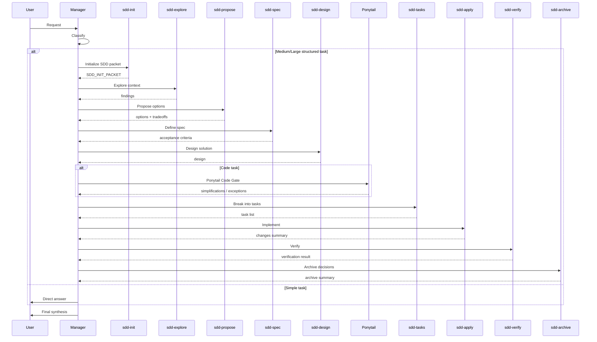
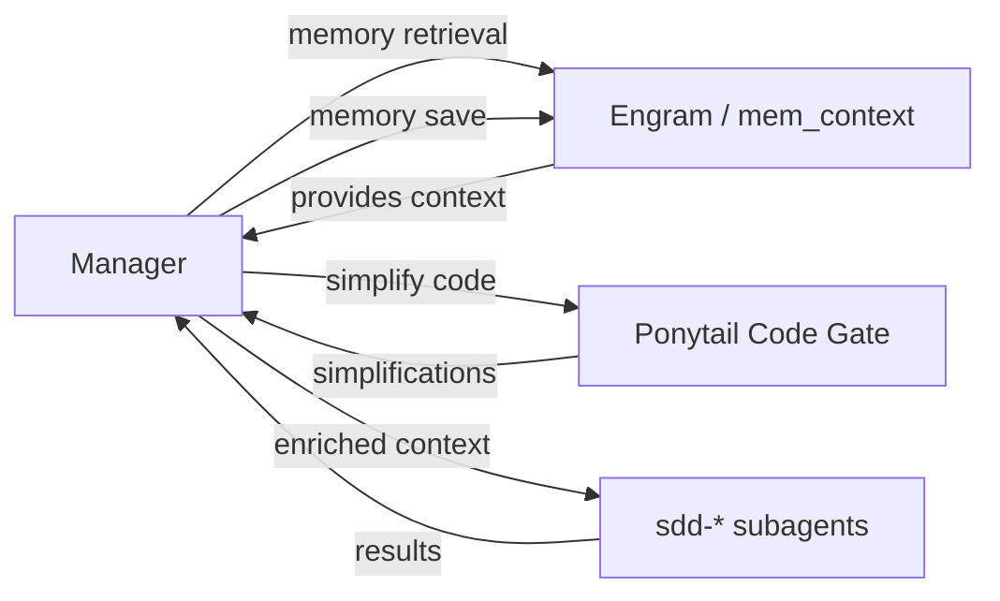

# SDD Pipeline Flow

> **Estado:** ✅ FLOW DEFINED
> **Fecha:** 2026-06-17
> **Propósito:** Documentar el flujo completo del pipeline SDD (Spec-Driven Development) incluyendo la interacción entre Manager, subagentes, Ponytail y Engram.

---

## 1. Diagrama de secuencia

---

## 2. Responsabilidades por fase

| Fase | Quién ejecuta | Quién decide | Output | ¿Modifica archivos? |
|------|:------------:|:------------:|--------|:-------------------:|
| **Init** | `sdd-init` | Manager | SDD_INIT_PACKET | ❌ Solo lectura |
| **Explore** | `sdd-explore` | Manager | Findings, affected areas | ❌ Solo lectura |
| **Propose** | `sdd-propose` | Manager (usuario aprueba) | Proposal with tradeoffs | ❌ Solo lectura |
| **Spec** | `sdd-spec` | Manager | Acceptance criteria | ❌ Solo lectura |
| **Design** | `sdd-design` | Manager (usuario aprueba) | Technical design | ❌ Solo lectura |
| **Ponytail Gate** | Manager + guidance | Manager | Simplifications | ❌ Solo evaluación |
| **Tasks** | `sdd-tasks` | Manager | Task list | ❌ Solo lectura |
| **Apply** | `sdd-apply` | Manager | Code changes | ✅ Sí |
| **Verify** | `sdd-verify` | Manager | Verification results | ❌ Solo lectura |
| **Archive** | `sdd-archive` | Manager | Archive summary | ⚠️ Puede crear archivos de spec |

---

## 3. Reglas del pipeline

### 3.1 ¿Quién decide avanzar?

**El Manager.** Cada subagente devuelve su resultado al Manager. El Manager decide si:
- Avanzar a la siguiente fase
- Volver a una fase anterior (si hay problemas)
- Pedir clarificación al usuario
- Detener el pipeline (si se descubre que no aplica)

Los subagentes NO deciden avanzar. Solo ejecutan y reportan.

### 3.2 ¿Quién sintetiza?

**El Manager siempre.** El usuario recibe la respuesta final del Manager, no de ningún subagente. El Manager:
- Toma el output de cada subagente
- Lo integra en una respuesta coherente
- Añade conclusiones, riesgos y próximos pasos
- Incluye el Completion Contract si aplica

### 3.3 ¿Qué subagente ejecuta cada fase?

Cada fase tiene un subagente dedicado:

| Fase | Subagente |
|------|-----------|
| Init | `sdd-init` |
| Explore | `sdd-explore` |
| Propose | `sdd-propose` |
| Spec | `sdd-spec` |
| Design | `sdd-design` |
| Tasks | `sdd-tasks` |
| Apply | `sdd-apply` |
| Verify | `sdd-verify` |
| Archive | `sdd-archive` |

### 3.4 ¿Cómo se evita que subagentes compitan con Manager?

1. **Mode: subagent** — todos los `sdd-*` están configurados como `mode: subagent` en `opencode.json`
2. **Hidden: true** — no aparecen como opciones de agente en la UI
3. **Executor override** — los skills dicen "you are the executor, not the orchestrator"
4. **No delegation** — los subagentes SDD tienen instrucciones explícitas de NO delegar ni llamar a otros agentes
5. **Return to Manager** — todos devuelven su resultado al Manager

### 3.5 ¿Cómo se evita loop entre Manager y gentle-orchestrator?

1. **Manager → gentle-orchestrator: permitido** — Manager puede invocar gentle-orchestrator para tareas Medium/Large
2. **gentle-orchestrator → Manager: PROHIBIDO** — el prompt de gentle-orchestrator dice explícitamente "MUST NOT call Manager"
3. **gentle-orchestrator → sdd-*: permitido** — puede delegar fases a subagentes
4. **sdd-* → anyone: PROHIBIDO** — los subagentes SDD no delegan ni llaman a nadie
5. **Manager → Manager: no hay loop** — Manager siempre sintetiza y responde

### 3.6 ¿Qué pasa si falta un subagente?

| Subagente faltante | Comportamiento |
|--------------------|----------------|
| `sdd-init` | Manager hace init mínimo (detecta stack por su cuenta) |
| `sdd-explore` | Manager explora directamente |
| `sdd-propose` | Manager propone directamente |
| `sdd-spec` | Manager escribe spec directamente |
| `sdd-design` | Manager diseña directamente |
| `sdd-tasks` | Manager descompone en tareas |
| `sdd-apply` | Manager implementa directamente |
| `sdd-verify` | Manager verifica directamente |
| `sdd-archive` | Manager archiva directamente |

**Principio:** El pipeline nunca se bloquea por falta de un subagente. El Manager es el fallback de cada fase.

### 3.7 ¿Cómo se combinan Engram y Ponytail dentro del flujo?

- **Antes del pipeline:** Manager puede consultar Engram para contexto relevante
- **Durante Design → Tasks:** Ponytail simplifica si es code task
- **Durante Apply:** Manager puede guardar decisiones en Engram
- **Al finalizar:** Manager decide qué aprendizajes persistir en Engram

---

## 4. Anti-patrones del pipeline

| Anti-patrón | Problema | Solución |
|-------------|----------|----------|
| Manager ejecuta todas las fases en tareas Medium/Large | Se infla, pierde eficiencia | Delegar a subagentes |
| Subagente responde directamente al usuario | El usuario pierde el hilo | Manager siempre sintetiza |
| Pipeline salta fases sin justificación | Se pierde calidad | Manager decide qué saltar, con justificación |
| Subagente modifica archivos sin autorización | Riesgo de cambios no deseados | Todos los subagentes tienen permisos controlados |
| Manager no verifica output de subagentes | Errores pasan desapercibidos | Manager siempre revisa antes de avanzar |

---

*Fin de sdd-pipeline-flow.md*
