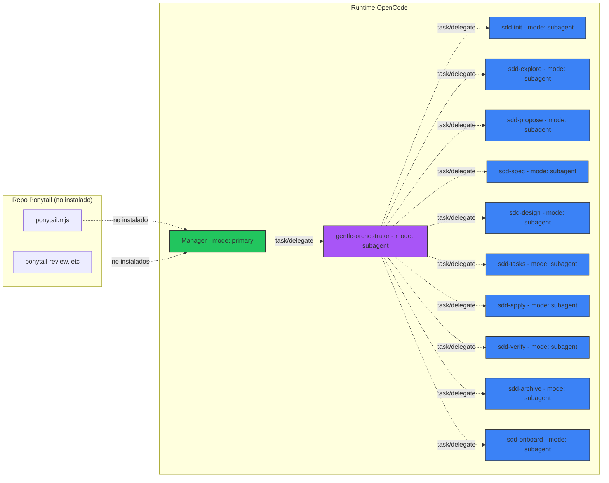

# SDD Subagents — Runtime Inventory

> **Estado:** ✅ INVENTORY COMPLETE
> **Fecha:** 2026-06-17
> **Auditoría:** Runtime real (read-only) de todos los subagentes SDD, gentle-orchestrator y relacionados.

---

## 1. Tabla maestra

| Nombre | Existe en runtime | Tipo | Ruta(s) | Discoverable por OpenCode | Rol probable | Estado |
|--------|:----------------:|:----:|---------|:-------------------------:|--------------|:------:|
| **gentle-orchestrator** | ✅ Sí | Subagent (primary config en opencode.json) | `opencode.json` `agents.gentle-orchestrator` | ✅ Sí — `mode: subagent` | SDD Pipeline coordinator. Invocable por Manager para tareas Medium/Large. No es primary. | ✅ Subagent activo |
| **sdd-init** | ✅ Sí | Subagent + skill | `.codex/skills/sdd-init/SKILL.md`, `.config/opencode/skills/sdd-init/SKILL.md` | ✅ Sí — `hidden: true`, `mode: subagent` | Inicializa SDD context: detecta stack, testing, modo de persistencia. Output: SDD_INIT_PACKET | ✅ Subagent + skill |
| **sdd-explore** | ✅ Sí | Subagent + skill | `.codex/skills/sdd-explore/SKILL.md`, `.config/opencode/skills/sdd-explore/SKILL.md` | ✅ Sí — `hidden: true`, `mode: subagent` | Explora codebase, entiende comportamiento actual, identifica áreas afectadas | ✅ Subagent + skill |
| **sdd-propose** | ✅ Sí | Subagent + skill | `.codex/skills/sdd-propose/SKILL.md`, `.config/opencode/skills/sdd-propose/SKILL.md` | ✅ Sí — `hidden: true`, `mode: subagent` | Convierte diseño aprobado en propuesta estructurada de cambio | ✅ Subagent + skill |
| **sdd-spec** | ✅ Sí | Subagent + skill | `.codex/skills/sdd-spec/SKILL.md`, `.config/opencode/skills/sdd-spec/SKILL.md` | ✅ Sí — `hidden: true`, `mode: subagent` | Define comportamiento testeable con Given/When/Then | ✅ Subagent + skill |
| **sdd-design** | ✅ Sí | Subagent + skill | `.codex/skills/sdd-design/SKILL.md`, `.config/opencode/skills/sdd-design/SKILL.md` | ✅ Sí — `hidden: true`, `mode: subagent` | Diseño técnico: componentes, interfaces, data flow | ✅ Subagent + skill |
| **sdd-tasks** | ✅ Sí | Subagent + skill | `.codex/skills/sdd-tasks/SKILL.md`, `.config/opencode/skills/sdd-tasks/SKILL.md` | ✅ Sí — `hidden: true`, `mode: subagent` | Descompone diseño en tareas de implementación pequeñas | ✅ Subagent + skill |
| **sdd-apply** | ✅ Sí | Subagent + skill | `.codex/skills/sdd-apply/SKILL.md`, `.config/opencode/skills/sdd-apply/SKILL.md` | ✅ Sí — `hidden: true`, `mode: subagent` | Implementa cambios tarea por tarea | ✅ Subagent + skill |
| **sdd-verify** | ✅ Sí | Subagent + skill | `.codex/skills/sdd-verify/SKILL.md`, `.config/opencode/skills/sdd-verify/SKILL.md` | ✅ Sí — `hidden: true`, `mode: subagent` | Valida implementación contra spec y tests | ✅ Subagent + skill |
| **sdd-archive** | ✅ Sí | Subagent + skill | `.codex/skills/sdd-archive/SKILL.md`, `.config/opencode/skills/sdd-archive/SKILL.md` | ✅ Sí — `hidden: true`, `mode: subagent` | Sincroniza delta specs, archiva metadata de cambios, registra en Engram | ✅ Subagent + skill |
| **sdd-onboard** | ✅ Sí | Subagent + skill | `.codex/skills/sdd-onboard/SKILL.md`, `.config/opencode/skills/sdd-onboard/SKILL.md` | ✅ Sí — `hidden: true`, `mode: subagent` | Guía al usuario por un ciclo SDD completo usando su codebase real | ✅ Subagent + skill |
| **Ponytail plugin** | ❌ No | Plugin (.mjs) | Solamente en repo: `ponytail/.opencode/plugins/ponytail.mjs` | ❌ No en runtime | Enforcement automático de reglas YAGNI / stdlib | ❌ No instalado |
| **Ponytail command skills** | ❌ No | Command skills | Solamente en repo: `ponytail/.opencode/command/ponytail-*.md` | ❌ No en runtime | Comandos: ponytail, ponytail-review, ponytail-audit, ponytail-debt, ponytail-help | ❌ No instalados |
| **gentle-logo.tsx** | ✅ Sí | TUI plugin | `~/.config/opencode/tui-plugins/gentle-logo.tsx` | ✅ Sí | Decoración visual del logo gentle-ai en la UI | ✅ Instalado |

---

## 2. Respuestas a preguntas clave

### 2.1 ¿Existe `gentle-orchestrator`?

**Sí.** Está definido en `opencode.json` como `mode: subagent`. No es primary. Su prompt define:
- "You are the SDD Pipeline subagent, not a primary agent."
- Puede delegar a `sdd-*` subagents via task tool.
- Debe devolver un compact envelope JSON al Manager.
- Anti-loop guardrails: no llama a Manager, no ejecuta inline.

### 2.2 ¿Existe `sdd-init`?

**Sí.** `sdd-init` existe como:
- Subagent en `opencode.json` (mode: subagent, hidden: true)
- Skill en `.codex/skills/sdd-init/SKILL.md`
- Skill en `.config/opencode/skills/sdd-init/SKILL.md`

Su rol es **inicializar SDD context**: detectar stack, testing, modo de persistencia. Output estructurado que incluye `status`, `executive_summary`, `artifacts`, `next_recommended`, `risks`. NO implementa código. NO modifica archivos sin autorización.

### 2.3 ¿Qué otros `sdd-*` existen?

**Los 10 del pipeline SDD completo:**
1. `sdd-init` — inicialización
2. `sdd-explore` — exploración
3. `sdd-propose` — propuesta
4. `sdd-spec` — especificación
5. `sdd-design` — diseño
6. `sdd-tasks` — tareas
7. `sdd-apply` — implementación
8. `sdd-verify` — verificación
9. `sdd-archive` — archivado
10. `sdd-onboard` — onboarding

Todos son mode: subagent, hidden: true, con executor override (no delegan, ejecutan su fase inline).

### 2.4 ¿OpenCode puede descubrirlos?

**Sí.** Todos están registrados en `opencode.json` dentro del bloque `agents:`. OpenCode los descubre automáticamente al iniciar. Son `hidden: true`, lo que significa que no aparecen en la UI como opciones de agente, pero el Manager y `gentle-orchestrator` pueden invocarlos via task/delegate.

### 2.5 ¿Cuáles están documentados pero no instalados?

**Ninguno.** Todos los `sdd-*` están instalados y registrados. Ponytail (plugin y skills) está documentado pero no instalado en runtime.

### 2.6 ¿Cuáles son exportables al futuro repo?

| Subagente | Exportable como | Notas |
|-----------|----------------|-------|
| `sdd-init` | SKILL.md | ✅ Sí — template exportable |
| `sdd-explore` | SKILL.md | ✅ Sí — template exportable |
| `sdd-propose` | SKILL.md | ✅ Sí — template exportable |
| `sdd-spec` | SKILL.md | ✅ Sí — template exportable |
| `sdd-design` | SKILL.md | ✅ Sí — template exportable |
| `sdd-tasks` | SKILL.md | ✅ Sí — template exportable |
| `sdd-apply` | SKILL.md | ✅ Sí — template exportable |
| `sdd-verify` | SKILL.md | ✅ Sí — template exportable |
| `sdd-archive` | SKILL.md | ✅ Sí — template exportable |
| `sdd-onboard` | SKILL.md | ✅ Sí — template exportable |
| `gentle-orchestrator` | Config template | ⚠️ Depende del runtime — documentar cómo configurarlo |

### 2.7 ¿Hay duplicados o nombres ambiguos?

| Situación | Detalle |
|-----------|---------|
| Skills duplicados | Cada `sdd-*` existe en `.codex/skills/` y `.config/opencode/skills/`. No es duplicación problemática — OpenCode los descubre desde ambas rutas. Pero puede causar confusión si tienen versiones diferentes. |
| `gentle-orchestrator` ambigüedad | El nombre sugiere "gentle-ai" pero es un subagente local de OpenCode, no un componente del sistema gentle-ai externo. |
| `gentle-logo.tsx` | TUI plugin decorativo. No afecta lógica. Nombre puede sugerir dependencia con gentle-ai. |

### 2.8 ¿Hay riesgo de que un subagente compita con Manager como primary?

**No.** Todos los `sdd-*` tienen `mode: subagent` explícito. `gentle-orchestrator` también tiene `mode: subagent`. Ninguno es primary. Manager es el único `mode: primary`.

El riesgo existía en la arquitectura anterior (Fase B0) cuando `gentle-orchestrator` era primary. Eso fue corregido en Fase D/G.

---

## 3. Mapa de descubrimiento

---

*Fin de sdd-subagents-runtime-inventory.md*
